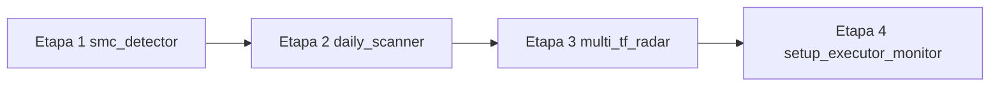

# PERFECTION ROADMAP V43

**Proiect:** Apollo Trading AI Agent  
**Branch activ:** `cursor/v36-3-radar-live-sync`  
**Versiune țintă:** V43 — Dynamic POI & Structural Integrity  
**Owner:** Поковнику  
**Creat:** 2026-06-11  
**Status global:** Etapa 1 — DONE | Etapa 2 — DONE | Etapa 3 — DONE | **V43 COMPLET**

---

## Viziune

Perfecționarea sistemului **modular, etapă cu etapă**, fără regresii între straturi. Fiecare etapă are un singur modul responsabil, criterii de acceptare clare și verificare pe VPS înainte de trecerea la următoarea.

**Principiu central:** POI Daily nu este doar un FVG Premium/Discount — trebuie să fie **valid structural** (în Active Dealing Range) și **atingut live** înainte ca LTF să vâneze execuția.

**Separare arhitecturală (V43.0):** `smc_detector.py` este **detector pasiv** — calculează ADR, validează POI, emite semnale (`preserve_stored_poi`, `poi_zombie`, `structural_breach`). **Nu scrie în JSON.** Persistența și lifecycle-ul stărilor aparțin `daily_scanner.py` (Etapa 2).

### State Machine operațional (daily_scanner — Etapa 2+)

| Stare | Condiție |
|-------|----------|
| `WAITING_D1_PULLBACK` | Preț în aer — așteaptă intrarea în POI Daily |
| `MONITORING` | Preț în POI — așteaptă CHoCH 4H/1H (Radar) |
| `READY` | Preț în POI + CHoCH LTF confirmat — gata de execuție |

**Fără stări hibride** în detector (ex. `MONITORING_REVERSAL` eliminat). Breach structural = semnal boolean `structural_breach` pe `TradeSetup`.



---

## Legendă status

| Simbol | Semnificație |
|--------|--------------|
| `[ ]` | Neînceput |
| `[~]` | În lucru |
| `[x]` | Finalizat |
| `[!]` | Blocat / necesită decizie |

---

## Etapa 1: SMC Detector — Dynamic POI & Active Dealing Range Container

**Modul:** [`smc_detector.py`](smc_detector.py)  
**Status:** `[x]` DONE (V43.0)  
**Versiune:** V43.0  
**Dependințe:** V42.5 Leg Authority, V16.1 P/D FVG, V40 Structural Range

### Livrat V43.0

| Componentă | Descriere |
|------------|-----------|
| `ActiveDealingRange` | Container live post-leg: `container_low/high`, `current_swing_high/low`, LH/HL/LL |
| `build_active_dealing_range()` | Recalculează ADR la fiecare scan D1 |
| `poi_conflicts_with_continuation()` | Anti-zombie: SHORT dacă `poi_bottom > LH`, LONG dacă `poi_top < HL` |
| `should_preserve_stored_poi()` | Semnal pasiv — păstrează POI dacă preț inside ADR (JSON write în Etapa 2) |
| `compute_structural_breach()` | E1-T7: `structural_breach=True` când close sparge LH (SHORT) sau LL (LONG) |
| `resolve_d1_poi()` | Orchestrator stateless: preserve → detect → synthetic ADR clip |
| `detect_fvg()` | Scan trunchiat în ADR pentru `strategy_type=continuation` |
| `_build_v246_synthetic_fvg()` | Clip Equilibrium la limitele ADR |
| `scan_for_setup()` | Wire ADR + `resolve_d1_poi()` + `structural_breach` pe `TradeSetup` |
| `audit_d1_poi_from_monitoring.py` | E1-T8: ADR display, breach warning, `V43_ADR_CONFLICT` |

### Task-uri Etapa 1

| ID | Task | Fișier | Status |
|----|------|--------|--------|
| E1-T1 | Dataclass `ActiveDealingRange` | `smc_detector.py` | `[x]` |
| E1-T2 | `build_active_dealing_range()` post-leg swings | `smc_detector.py` | `[x]` |
| E1-T3 | `poi_conflicts_with_continuation()` | `smc_detector.py` | `[x]` |
| E1-T4 | `detect_fvg()` — rescan in-range + audit fields | `smc_detector.py` | `[x]` |
| E1-T5 | `_build_v246_synthetic_fvg()` — clip la ADR | `smc_detector.py` | `[x]` |
| E1-T6 | Wire ADR în `scan_for_setup()` | `smc_detector.py` | `[x]` |
| E1-T7 | Semnal `structural_breach = True` la încălcare LH/LL | `smc_detector.py` | `[x]` |
| E1-T8 | Audit: ADR display + `V43_ADR_CONFLICT` | `scripts/audit_d1_poi_from_monitoring.py` | `[x]` |

### Criterii de acceptare Etapa 1

- [x] BTCUSD: POI vechi ~87k respins; POI nou in-range (ex. ~70–74k) sau synthetic sub LH — logică V43 in-range + audit script.
- [x] GBPJPY / USDJPY: fără regresie — filtrul ADR aplicat doar la `strategy_type=continuation`.
- [x] GBPNZD reversal: V43 **nu** aplică filtrul continuation (ADR informativ).
- [x] Audit: `--symbol BTCUSD` afișează ADR High/Low + breach + V43_ADR_CONFLICT (VPS live recomandat).
- [x] **Nu** auto-flip bias în detector — doar semnale pasive (`poi_zombie`, `preserve_stored_poi`, `structural_breach`).

### Out of scope Etapa 1 (mutat Etapa 2)

- Tranziții status scanner (`WAITING_D1_PULLBACK` → `MONITORING` → `READY`).
- Persistență ADR / `structural_breach` în JSON.
- Post-TP flip REVERSAL → CONTINUATION (→ E2-T6).

---

## Etapa 2: Scanner & State Lifecycle

**Modul:** [`daily_scanner.py`](daily_scanner.py)  
**Status:** `[x]` DONE  
**Versiune:** V43.1  
**Dependințe:** Etapa 1 completă + V42.7 POI gate

### Problema

Setup-urile pot rămâne în `WAITING_D1_PULLBACK` sau trec prematur în `MONITORING`/`READY` fără ca prețul să fi **atingut efectiv** zona POI live. JSON-ul poate păstra POI stale (drift vs recalc V42.5).

### Obiective

1. Tranziție controlată: `WAITING_D1_PULLBACK` → `MONITORING` **doar** când prețul intră în `[poi_bottom, poi_top]`.
2. Persistă câmpuri ADR în `monitoring_setups.json`: `adr_lh`, `adr_ll`, `adr_hl`, `poi_v43_source`, `structural_breach`.
3. Re-hydrate POI la fiecare daily scan dacă ADR s-a schimbat (piața vie).
4. Consumă `should_preserve_stored_poi()` — nu rescrie JSON când semnalul V43 = preserve.
5. Consumă `structural_breach` — acțiune lifecycle (fără status hibrid).
6. `_apply_v427_poi_status_gate()` — downgrade `READY` → `WAITING_D1_PULLBACK` dacă prețul iese din POI.
7. Soft TTL (V40.3): setup-uri >4 zile fără atingere POI → review / archive.

### Task-uri Etapa 2

| ID | Task | Status |
|----|------|--------|
| E2-T1 | Gate `WAITING_D1_PULLBACK` → `MONITORING` la touch POI | `[x]` |
| E2-T2 | Persist ADR + `poi_v43_source` + `structural_breach` în JSON save path | `[x]` |
| E2-T3 | Macro re-hydrate POI când `POI_DRIFT` sau ADR shift; respectă `preserve_stored_poi` | `[x]` |
| E2-T4 | Fix path bias fallback fără `poi_top`/`poi_bottom` | `[x]` |
| E2-T5 | Logging structurat `[V43.1 LIFECYCLE]` per simbol | `[x]` |
| E2-T6 | **Post-TP Evolution Engine** — flip `reversal` → `continuation` după TP structural + BOS expansiune D1 | `[x]` |

#### E2-T6: Post-TP Evolution Engine (specificație SMC)

Implementare nativă în `daily_scanner.py`:

1. **Trigger:** trade REVERSAL închis la TP structural; preț sparge zid structural (BOS expansiune Daily confirmat).
2. **Flip strategie:** `strategy_type`: `reversal` → `continuation` în JSON.
3. **Mitigare POI:** vechiul POI marcat mort/utilizat.
4. **Rehidratare:** `build_active_dealing_range()` + `resolve_d1_poi()` pe noul impuls.

**Out of scope E2-T6:** flip prematur la breach LH/LL — consumă `structural_breach` fără auto-flip (Etapa 2 definește acțiunea).

### Criterii de acceptare Etapa 2

- [x] Niciun setup nu trece în `MONITORING` cu prețul în afara POI Daily.
- [x] GBPNZD: POI rescris la recalc live, fără drift JSON vs leg V42.5.
- [x] POI sticky: JSON neschimbat când `preserve_stored_poi=True`.
- [x] Post-TP: după TP+BOS, strategy flip + POI nou în JSON.

---

## Etapa 3: TF Radar Confirmations

**Modul:** [`multi_tf_radar.py`](multi_tf_radar.py)  
**Status:** `[x]` DONE  
**Versiune:** V43.2  
**Dependințe:** Etapa 2 completă

### Obiective

1. LTF CHoCH doar când prețul live ∈ `[poi_bottom, poi_top]` + Premium/Discount ADR corect.
2. Purge definitiv JSON la `structural_breach=True`.
3. Entry 1H permis doar după aliniere 4H în POI validat.
4. Logging `[🛰️ RADAR PURGE]` / `[🛰️ RADAR ALLOW]`.

### Task-uri Etapa 3

| ID | Task | Status |
|----|------|--------|
| E3-T1 | Gate strict POI box — `daily_zone_validated` doar în caseta POI | `[x]` |
| E3-T2 | Purge JSON la `structural_breach` — setup mort eliminat definitiv | `[x]` |
| E3-T3 | Validare Premium/Discount ADR (adr_lh/ll/hl) înainte de scan LTF | `[x]` |
| E3-T4 | Entry 1H blocat până la CHoCH/BOS 4H aliniat în POI | `[x]` |
| E3-T5 | Logging structurat `[🛰️ RADAR PURGE]` / `[🛰️ RADAR ALLOW]` | `[x]` |

### Criterii de acceptare Etapa 3

- [x] Radarul nu scanează CHoCH LTF cu prețul în afara POI Daily.
- [x] `structural_breach=True` → setup eliminat din JSON, fără scan.
- [x] LONG doar în Discount ADR; SHORT doar în Premium ADR.
- [x] EXECUTE_NOW_1H blocat fără aliniere 4H.

---

## Etapa 4: Executor Gates

**Modul:** [`setup_executor_monitor.py`](setup_executor_monitor.py)  
**Status:** `[x]` DONE  
**Versiune:** V43.3  
**Dependințe:** Etapa 3 completă

### Obiective

1. SL live: tightest pivot 1H/4H (trigger TF = nearest pivot).
2. TP macro: `adr_lh` (SHORT) / `adr_ll` (LONG) din JSON; fallback V40.8.
3. Eliminare cale legacy `status=READY` — singur trigger `EXECUTE_NOW`.
4. Fără spread/news guards (decizie Покovник).

### Task-uri Etapa 4

| ID | Task | Status |
|----|------|--------|
| E4-T1 | `_resolve_execute_now_sl()` — tightest 1H/4H + nearest pe trigger TF | `[x]` |
| E4-T2 | `_resolve_execute_now_tp()` — ADR adr_lh/adr_ll + fallback V40.8 | `[x]` |
| E4-T3 | Eliminare flux legacy `status==READY` | `[x]` |
| E4-T4 | Curățenie `_execute_entry()` mort + header V43.3 | `[x]` |

### Criterii de acceptare Etapa 4

- [x] EXECUTE_NOW recalculează TP la adr_lh/adr_ll când present în JSON.
- [x] Setup fără ADR → fallback V40.8 funcțional.
- [x] `status=READY` fără EXECUTE_NOW → zero ordine.
- [x] RR net ≥ 2.0 via `_final_safety_check` neschimbat.
- [x] `py_compile setup_executor_monitor.py` OK.

---

## Ordine de implementare (strictă)

```
Etapa 1  →  commit V43.0  [DONE]
Etapa 2  →  test lifecycle JSON        →  commit V43.1
Etapa 3  →  test radar block/allow     →  commit V43.2
Etapa 4  →  test executor dry-run      →  commit V43.3  [DONE]
```

---

## Jurnal progres

| Data | Etapă | Acțiune | Rezultat |
|------|-------|---------|----------|
| 2026-06-11 | — | Roadmap creat | `PERFECTION_ROADMAP_V43.md` |
| 2026-06-11 | 1 | V43.0 ADR Gate E1-T1…T6 | `smc_detector.py` |
| 2026-06-11 | 1 | E1-T7 structural_breach + E1-T8 audit ADR | Etapa 1 DONE |
| 2026-06-11 | 2 | E2-T1…T6 lifecycle + post-TP evolution | `daily_scanner.py` V43.1 DONE |
| 2026-06-11 | 3 | E3-T1…T5 POI gate + purge + H1/H4 align | `multi_tf_radar.py` V43.2 DONE |
| 2026-06-11 | 4 | E4-T1…T4 SL/TP ADR + READY removed | `setup_executor_monitor.py` V43.3 DONE |

---

## Referințe

- Audit POI: `scripts/audit_d1_poi_from_monitoring.py`
- Commit V42.7 POI gate: `ccae339`
- `V43_ADR_GATE_VERSION = "43.0"` în `smc_detector.py`

---

*Actualizează acest fișier la fiecare task finalizat.*
