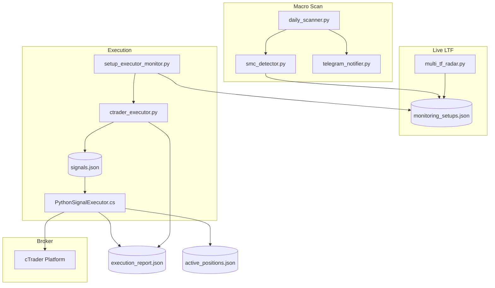

# SYSTEM_MAP.md — Master Ledger & Architecture Map

**Project:** Glitch in Matrix — trading-ai-agent apollo  
**Owner:** ФорексГод  
**Last updated:** 2026-06-23 (V44.0)  
**Purpose:** Single reference for autonomous pipeline topology, recent critical patches, and anti-regression rules. Read this before modifying radar, executor, cBot, or Telegram flows.

---

## Autonomous Pipeline (High Level)



| Stage | Responsibility | Must NOT |
|-------|----------------|----------|
| Daily scan | Structural bias, POI, MONITORING/READY cards | Block execution on AI score |
| Radar | 4H/1H CHoCH, POI gate, EXECUTE_NOW arming | Use 4H CHoCH birth as 1H chronology anchor |
| Executor | EXECUTE_NOW consume, multi-entry, BE protect | Send fake BE success without cBot confirm |
| cBot | Order open/modify/close, last-line guards | Binary 1-position block on scale-in |

---

## 1. Project Directory Tree (Critical Files)

```
trading-ai-agent apollo/
│
├── CORE PYTHON — Autonomous Engine
│   ├── daily_scanner.py          # Macro Daily scanner; writes monitoring_setups.json; info-only Telegram cards
│   ├── smc_detector.py           # SMC logic: CHoCH, FVG, POI, reversal/continuation classification
│   ├── multi_tf_radar.py         # Live 4H+1H radar; POI gate; V43.8 mitigation touch chronology
│   ├── setup_executor_monitor.py # Live EXECUTE_NOW consumer; multi-entry V42.2; Liquidity Sniper BE
│   ├── ctrader_executor.py       # Signal writer + risk validation; V43.9 modify_stop_loss_confirmed()
│   ├── unified_risk_manager.py   # SUPER_CONFIG limits; max 2 positions/symbol (Python layer)
│   ├── telegram_notifier.py      # Premium alerts, scan cards, CHoCH alerts; V43.9 no manual buttons
│   ├── ai_probability_analyzer.py # ML score display; cosmetic only at Telegram layer
│   ├── strategy_optimizer.py     # Regenerates learned_rules.json (blackout hours, pair stats)
│   └── chart_generator.py        # Daily/4H/1H chart PNGs for Telegram
│
├── CBOT C# — cTrader Last Defense
│   ├── PythonSignalExecutor.cs       # Production cBot: ExecuteSignal, MODIFY_SL, max-positions guard
│   └── PythonSignalExecutor_VPS.cs   # VPS mirror — keep in sync with .cs above
│
├── SUPPORT / DAEMONS
│   ├── auto_scanner_daemon.py    # Scheduled morning scan wrapper
│   ├── ctrader_sync_daemon.py    # Position/account sync from cTrader
│   ├── signal_confirmation_monitor.py # execution_report.json watcher (logging)
│   ├── watchdog_monitor.py       # Process health / restart
│   ├── news_calendar_utils.py    # Liquidity Sniper T-2 BE window helpers
│   └── telegram_bot_handler.py   # Interactive /commands (NOT scan Execute buttons)
│
├── CONFIG — Single Sources of Truth
│   ├── SUPER_CONFIG.json         # Risk %, max_positions_per_symbol=2, scale-in, paths (Python + cBot ref)
│   ├── pairs_config.json         # 16-pair scan list, priorities
│   ├── trading_config.json       # Legacy limits (superseded by SUPER_CONFIG for risk)
│   └── learned_rules.json        # ML blackout hours, pair win rates; -25 at 19:00 UTC
│
├── RUNTIME JSON — Live State (do not commit secrets)
│   ├── monitoring_setups.json    # All active setups: radar flags, EXECUTE_NOW, multi-entry state
│   ├── signals.json              # Outbound queue to cBot (array append, atomic write)
│   ├── execution_report.json     # cBot → Python handshake (EXECUTED / MODIFIED / REJECTED)
│   ├── active_positions.json     # cBot export ~10s; duplicate guard + BE ITM check
│   ├── account_info.json         # Open position count, balance sync
│   └── trade_history.json        # Closed trades, daily P&L
│
├── data/                         # Caches, DB backups, telegram dedup locks
├── logs/                         # multi_tf_radar.log, executor logs, daemon stdout
├── scripts/                      # One-off utilities (preview layouts, verify setups)
└── archive/                      # Historical docs/backups — not runtime
```

### Critical File Roles (Detail)

| File | Role in Autonomous Pipeline |
|------|----------------------------|
| **`multi_tf_radar.py`** | Satellite live scanner on 4H + 1H inside Daily POI. Validates `_evaluate_v43_daily_zone()`, tracks `poi_first_touch_time` via `_track_mitigation_touch()`, applies `_apply_h1_chronology_guard()` (V43.8). Writes radar_* keys and EXECUTE_NOW to JSON. |
| **`setup_executor_monitor.py`** | Polls `monitoring_setups.json` for EXECUTE_NOW. Runs `_liquidity_sniper_be_protect_open_positions()` at T-2 news. Multi-entry: `PARTIAL_OPEN` → E2 scale-in. Calls `ctrader_executor.execute_trade()` and `modify_stop_loss_confirmed()`. |
| **`ctrader_executor.py`** | Builds signals, enqueues to `signals.json`. V43.9: `modify_stop_loss_confirmed()` atomic write + 35s poll of `execution_report.json`. Fire-and-forget remains for market orders via queue worker. |
| **`telegram_notifier.py`** | `format_setup_alert()` + Daily chart for scan. V44.0: `send_4h_choch_alert()` = single `send_photo` with 4H PNG + HTML caption (no W1). V43.9: scan info-only, no manual buttons. |
| **`daily_scanner.py`** | Morning/scheduled macro scan across 16 pairs. SMART MERGE into `monitoring_setups.json`. V15.1 dedup skips re-Telegram for unchanged MONITORING. Calls `send_setup_alert(..., charts_mode='daily_only')`. |
| **`PythonSignalExecutor.cs`** | cBot brain: reads `signals.json` ~10s. Handler order: **MODIFY_SL → CLOSE → max-positions guard → new order**. `MaxPositionsPerSymbol=2`, TF scale-in check (1H vs 4H labels). Writes `execution_report.json`. |
| **`PythonSignalExecutor_VPS.cs`** | Identical logic for Windows VPS deployment path. **Must stay synced** with production `.cs`. |
| **`SUPER_CONFIG.json`** | Risk 5%, max 2 positions/symbol, scale-in E2 7.5%, VPS paths. Read by `UnifiedRiskManager`. |
| **`monitoring_setups.json`** | Live setup state: direction, POI, `radar_*`, `EXECUTE_NOW`, `entry1_filled`, `multi_entry_pending`, `poi_first_touch_time`, `radar_1h_choch_stale`. |
| **`learned_rules.json`** | Generated by `strategy_optimizer.py`. Blackout periods (e.g. 19:00 UTC −25 pts). Used by `ai_probability_analyzer.py` — **display only**. |

---

## 2. Critical Change History (Last 48 Hours)

### V43.4 — AI Score Optimization & Premium Layout

| Area | Specification |
|------|---------------|
| **AI / ML score** | Cosmetic/informative on Telegram (`telegram_notifier.py`: *"informativ, nu blochează execuția"*). Does **not** gate EXECUTE_NOW or radar arming. |
| **Blackout hours** | `learned_rules.json` → `blackout_periods`. `ai_probability_analyzer.py` applies **−25 points** at flagged hours (19:00 UTC confirmed working). **Do not remove or bypass** without re-running `strategy_optimizer.py`. |
| **Layout** | Bitcoin prices without spurious decimals; neutral swap lines via `pip_utils.format_swap_line()`. Scan card Block 3 reads live `radar_*` from JSON (V43.6/V43.7). |

**Commits context:** ML lookup aliases, CHoCH lifecycle wiring, scan card radar sync.

---

### V43.8 — Ghost Trigger Fix (POI Touch Anchor)

**Problem:** 1H CHoCH from history (e.g. GBPJPY 21 Jun) passed guard when anchor was 4H CHoCH birth (18 Jun), firing false "SNIPER ENTRY READY" with Entry/SL/TP = 0.

**Fix — chronology anchor:**

```text
VALID 1H CHoCH  ⟺  h1_choch_time > max(poi_first_touch_time, h4_fvg_first_touch_time)
INVALID (STALE) ⟺  h1_choch_time <= mitigation_touch_anchor
```

| Component | Implementation |
|-----------|----------------|
| `_track_mitigation_touch()` | Rising edge POI+P/D → set `poi_first_touch_time`; reset on POI exit; optional `h4_fvg_first_touch_time` |
| `_resolve_mitigation_touch_anchor()` | Replaces `_resolve_h4_anchor_time()` — **no** `h4_structure_locked_at`, **no** `tf_4h.choch_time` |
| `_apply_h1_chronology_guard()` | Requires `daily_zone_validated`; STALE → empty 1H TF, `radar_1h_choch_stale=True`, no Telegram 1H alert |
| Legacy JSON | In POI without timestamp → set `now()` → historical 1H instantly STALE |
| Flush keys | `poi_first_touch_time`, `h4_fvg_first_touch_time` in batch sync preserve list |

**User-visible STALE behavior:** Scan card shows `1H: Waiting pullback + FVG`; no price table at 0.000; no ghost SNIPER alert.

---

### V43.9 — BE Handshake & cTrader Multi-Entry Guard

#### A. Break-Even confirmation (Python)

| Before | After |
|--------|-------|
| `modify_stop_loss()` → queue → Telegram success on enqueue | `modify_stop_loss_confirmed()` → atomic write → poll `execution_report.json` 35s |
| cBot duplicate guard blocked MODIFY_SL before handler | MODIFY_SL handler runs **first** in C# |

**Telegram BE rules (`setup_executor_monitor.py`):**

- `Status == MODIFIED` → dedup + "LIQUIDITY SNIPER — BE PROTECT" success message
- REJECTED / NO_POSITION / TIMEOUT → **no dedup** + "BE Modification Failed!" with reason

#### B. cBot guard refactor (C#)

```text
ExecuteSignal order:
  1. MODIFY_SL   (never hits duplicate guard)
  2. CLOSE
  3. MaxPositionsPerSymbol guard (default 2)
  4. SL/TP zero guard → market order
```

| Guard | Logic |
|-------|-------|
| **Max count** | `CountBotPositions(symbol) >= 2` → REJECT |
| **Scale-in TF** | When count == 1: parse `StrategyTag` / label for `_1H_` vs `_4H_`; reject duplicate TF layer; allow 1H + 4H pair |
| **Labels** | `D1_EXECUTE_NOW_V42.2_{DIR}_{1H\|4H}_E{1\|2}` from executor |

**Deploy note:** C# changes require **recompile + reattach cBot** on cTrader. Python restart alone is insufficient.

---

### V43.9 UX — Manual Telegram Buttons Removed

| Removed | Retained |
|---------|----------|
| `_send_action_buttons()` method | Setup text card + Daily chart photo |
| "What would you like to do?" message | Autonomous EXECUTE_NOW via radar + executor |
| Inline keyboard: Execute / Skip / Close | CHoCH alerts, BE alerts, scan report |

**Scan flow ends after:** `format_setup_alert()` text → Daily chart caption. No third message.

---

### V44.0 — 4H CHoCH Alert: Photo + Caption Only

**Problem:** Live radar 4H CHoCH alerts arrived as separate text message; W1 chart was optional noise; 4H chart caption was minimal or missing in production flow.

**Fix — single Telegram message:**

| Step | Behavior |
|------|----------|
| Primary | `chart_generator.create_4h_chart()` → `send_photo(png, caption=HTML alert)` |
| Caption | Full alert: CHoCH confirmat, symbol, direction, strategy, W1 bias (text only), Entry/SL/TP/RR block, footer |
| Removed | `df_w1` parameter, W1 chart render, primary `send_message()` before photo |
| Fallback | If chart render or `send_photo` fails → `send_message(caption)` so radar never blocks |

**Call site:** `multi_tf_radar._maybe_send_choch_alerts()` → `send_4h_choch_alert(setup, df_4h×300)` only.

---

## 3. Strict Safety Rules (Anti-Regression for Composer / Agents)

### Temporal / Cross-TF Logic

1. **Always** compare absolute ISO timestamps via `_parse_radar_dt()` in `multi_tf_radar.py`.
2. **Never** use bar index age or `choch_bars_ago` alone for 1H validity vs current mitigation cycle.
3. **Never** reintroduce `_resolve_h4_anchor_time()` or anchor 1H to `h4_structure_locked_at` / `radar_4h_choch_time` for chronology guard.
4. 1H valid only if: `daily_zone_validated` **and** `h1_time > mitigation_touch_anchor` (strict).

### Telegram / UX

5. **Forbidden:** inline `reply_markup` / Execute-Skip-Close buttons on automated scan or radar alert paths.
6. **Forbidden:** Telegram success for BE/SL modify without cBot `MODIFIED` confirmation.
7. AI score, W1 bias flags, blackout −25: **display only** — must not block execution.

### Execution / cBot

8. Python `max_positions_per_symbol: 2` (`SUPER_CONFIG.json`) and cBot `MaxPositionsPerSymbol: 2` must stay aligned.
9. MODIFY_SL and CLOSE handlers must remain **before** the max-positions guard in `ExecuteSignal()`.
10. Any edit to `PythonSignalExecutor.cs` **must** be mirrored in `PythonSignalExecutor_VPS.cs`.

### JSON / State

11. Do not wipe `poi_first_touch_time`, `multi_entry_pending`, or `execute_now_alert_sent` during batch sync without preserve-list update.
12. `radar_1h_choch_stale=True` must keep `radar_1h_choch_detected=False` in `_update_setup_with_radar()`.

### Deploy Checklist After Code Change

| Change type | Required action |
|-------------|-----------------|
| Python only (`multi_tf_radar`, `setup_executor_monitor`, `daily_scanner`) | Restart affected daemon / watchdog |
| C# cBot | Rebuild in cTrader, reattach algo, verify log shows V43.9 handler order |
| `learned_rules.json` | Regenerate via `strategy_optimizer.py`, do not hand-edit blackout without audit |

---

## Quick Reference — Key Functions (Do Not Break)

| Function | File | Contract |
|----------|------|----------|
| `_parse_radar_dt()` | multi_tf_radar.py | ISO → UTC datetime |
| `_track_mitigation_touch()` | multi_tf_radar.py | POI touch anchor lifecycle |
| `_resolve_mitigation_touch_anchor()` | multi_tf_radar.py | max(poi_touch, h4_fvg_touch) |
| `_apply_h1_chronology_guard()` | multi_tf_radar.py | STALE if h1 <= anchor |
| `modify_stop_loss_confirmed()` | ctrader_executor.py | Returns `{ok, status, reason}` |
| `_liquidity_sniper_be_protect_open_positions()` | setup_executor_monitor.py | BE only after MODIFIED |
| `send_setup_alert()` | telegram_notifier.py | Text + Daily chart; no buttons |
| `send_4h_choch_alert()` | telegram_notifier.py | 4H photo + HTML caption; text fallback |
| `ExecuteSignal()` | PythonSignalExecutor.cs | MODIFY_SL → CLOSE → guard → order |

---

## Version Lineage (Recent)

```
V43.4  AI cosmetic + layout + blackout 19:00 UTC
V43.7  H4 anchor guard (superseded by V43.8)
V43.8  POI touch anchor — ghost 1H fix
V43.9  BE handshake + cBot max-2 scale-in + Telegram button purge
V44.0  4H CHoCH alert — mandatory 4H chart as photo+caption (no W1)
```

---

*This document is the Master Ledger. Update the "Last updated" date and Version Lineage when landing new radar/executor/cBot patches.*
