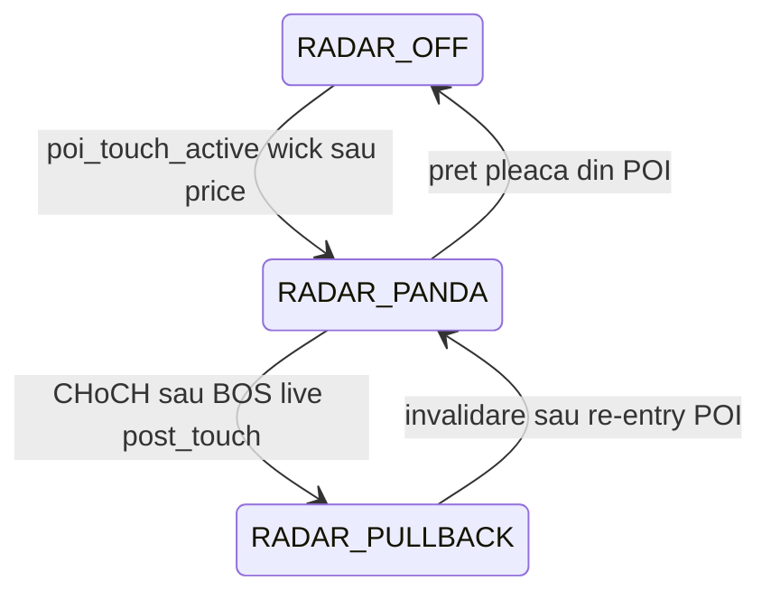

# Audit alerte Telegram CHoCH / BOS — Glitch in Matrix

> **Proiect:** Apollo / Glitch in Matrix  
> **Data audit:** 2026-07-01  
> **Baseline cod investigat:** commit `fa5432e` (V46 POI Premium/Discount entry)  
> **Fișiere analizate:** [`multi_tf_radar.py`](../multi_tf_radar.py), [`telegram_notifier.py`](../telegram_notifier.py), [`smc_detector.py`](../smc_detector.py), [`daily_scanner.py`](../daily_scanner.py)  
> **Scop:** diagnostic alerte haotice (GBPUSD, AUDJPY, EURUSD) + **specificații exacte** pentru curățarea fluxului Telegram  
> **Status:** **IMPLEMENTAT V47** (cod + Faza 4b SMC) — deploy VPS după review  
> **Versiune:** 1.2

**Documente înrudite:** [MULTI_TF_RADAR_AUDIT_V45.md](MULTI_TF_RADAR_AUDIT_V45.md) · [SMC_DETECTOR_AUDIT_IMPLEMENTATION_PLAN.md](SMC_DETECTOR_AUDIT_IMPLEMENTATION_PLAN.md) Faza 4

### Mapare prompt → secțiuni (acest document)

| # | Cerință user (reguli stricte) | Secțiune backlog | Fișiere țintă la execuție |
|---|------------------------------|------------------|---------------------------|
| **1** | Activare radar la touch POI Daily — eliminare alerte zombi | [P0-0](#p0-0--activare-radar-la-touch-poi-daily-eliminare-alerte-zombi) | `multi_tf_radar.py` |
| **2** | Poartă încășădată 4H → 1H | [P0-1](#p0-1--poartă-încășădată-4h--1h) | `multi_tf_radar.py` |
| **3** | Flux dinamic CHoCH / BOS cascaded entry | [P0-2](#p0-2--flux-dinamic-alerte-tf-radar-choch--bos-cascaded-entry) | `multi_tf_radar.py`, `telegram_notifier.py`, Faza 4b SMC |
| **4** | Paritate grafice 1H + caption V46 | [P1-1](#p1-1--paritate-grafice-1h-photo--caption), [P1-2](#p1-2--caption-1h-v46-premiumdiscount) | `telegram_notifier.py` |

---

## 1. Rezumat executiv

| Problemă observată (Telegram / chart) | Cauză root în cod | Severitate |
|---------------------------------------|-------------------|------------|
| Alertă **1H CHoCH** fără chart (GBPUSD, AUDJPY) | `send_1h_choch_alert`: text obligatoriu, chart opțional fără fallback | **P1** |
| Alertă **1H** înainte sau fără **4H** | `_maybe_send_choch_alerts`: 1H și 4H sunt **independente**; execuția cere 4H, alertele nu | **P0** |
| „4H CHoCH CONFIRMAT” pe structură **veche** la primul touch POI | Rising edge `radar_4h_choch_detected` false→true la intrare POI; CHoCH poate avea -26b+ | **P0 — alerte zombi** |
| Titlu mereu „CHoCH” chiar la `strategy_type=CONTINUATION` | Caption hardcodat; nu distinge CHoCH vs BOS LTF | **P0** |
| Text 1H „FVG 1H” vs V46 „Premium/Discount 60–80%” | `send_1h_choch_alert` neactualizat față de V46 | **P1** |
| GBPUSD etichetat REVERSAL, chart arată continuity | Daily `_resolve_d1_leg`: REVERSAL până la ≥1 BOS post-leg; nu e BOS raportat ca CHoCH LTF | **P2 — labeling Daily** |

**Verdict:** alertele Telegram nu respectă fluxul instituțional **POI Daily → 4H structural → 1H sniper → retrace 60–80%**. Pipeline-ul de execuție (V46) e mai strict decât pipeline-ul de notificare.

---

## 2. Flux instituțional țintă (confirmat user)

```mermaid
stateDiagram-v2
    direction LR
    OutsidePOI: OUTSIDE_POI_radar_OFF
    Panda: MONITORING_panda
    Wait4H: WAITING_4H_CHOCH
    WaitPullback: WAITING_4H_PULLBACK_60_80
    Execute: EXECUTE_NOW
    Wait1H: WAITING_1H_after_4H

    OutsidePOI --> Panda: wick sau body atinge POI Daily
    Panda --> Wait4H: scan 4H activ, asteptam break LIVE
    Wait4H --> WaitPullback: CHoCH sau BOS 4H confirmat IN panda
    WaitPullback --> Execute: POI + retrace 60-80% + P/D ADR
    WaitPullback --> Wait1H: optional 1H dupa 4H locked
    Wait1H --> Execute: 1H POI-PD 60-80% cu 4H aliniat
    Panda --> OutsidePOI: pret pleaca din POI fara structura
```



**Reguli de aur:**

1. Radar LTF = **întrerupător**: OFF în afara POI; ON la touch POI.
2. Alertă 4H = doar break **live** în starea de pândă (nu din istoric).
3. Alertă 1H = **doar după** 4H confirmat / locked.
4. Execuție = CHoCH **sau** BOS post-touch POI (cascadă), ambele cu retrace 60–80% pe impulsul propriu.

---

## 3. Flux implementat astăzi (cod `fa5432e`)

### 3.1 Unde se trimit alertele

| Eveniment | Funcție trigger | Funcție Telegram | Call site unic |
|-----------|-----------------|------------------|----------------|
| CHoCH 4H rising edge | `_maybe_send_choch_alerts` | `send_4h_choch_alert` | `multi_tf_radar._update_setup_with_radar` |
| CHoCH 1H rising edge | `_maybe_send_choch_alerts` | `send_1h_choch_alert` | idem |

`setup_executor_monitor.py` **nu** trimite alerte CHoCH (doar `send_execute_now_blocked_alert`).

### 3.2 Condiții alertă 4H (actual)

```python
# multi_tf_radar.py ~L2011-2024 — simplificat
now_4h and not prev_4h_choch and dir_4h_ok and not h4_choch_alert_sent
```

**Lipsesc:** verificare stare pândă activă, verificare CHoCH post-`poi_first_touch_time`, verificare „live” vs istoric.

### 3.3 Condiții alertă 1H (actual)

```python
# multi_tf_radar.py ~L2028-2036 — simplificat
now_1h and not prev_1h_choch and dir_1h_ok and not h1_choch_alert_sent
and daily_zone_validated and poi_first_touch_time
# FĂRĂ: radar_4h_choch_detected, h4_structure_locked
```

### 3.4 Reset dedup (actual)

| Flag | Reset la POI touch nou? |
|------|-------------------------|
| `h1_choch_alert_sent` | **Da** — `_track_mitigation_touch` pop |
| `h4_choch_alert_sent` | **Nu** — setat o dată, niciodată resetat |

### 3.5 CHoCH vs BOS la detectare

- **`smc_detector.detect_choch_and_bos`:** tipuri separate; BOS nu e convertit în CHoCH.
- **Radar V45.1:** PAS 2 BOS-as-CHoCH eliminat; `choch_detected=True` doar pentru CHoCH real.
- **`_allow_bos_4h = False` hardcodat** — BOS 4H nu deschide poarta de alertă/execuție LTF.
- **Telegram:** titlu 4H mereu „CHoCH CONFIRMAT” indiferent de `strategy_type` sau semnal real.

---

## 4. Case studies (screenshot-uri 2026-07-01)

### 4.1 GBPUSD + AUDJPY — alerte 1H fără chart @ 10:00

**Ce s-a văzut:** mesaj text „SNIPER ENTRY READY — CHoCH 1H Confirmat”, footer „Așteptăm pullback în FVG 1H”, **fără** imagine.

**Explicație cod:**

- `send_1h_choch_alert` trimite `send_message` apoi încearcă `_create_1h_chart` + `send_photo` separat.
- Dacă render eșuează sau `send_photo` returnează false → **zero fallback**, utilizatorul vede doar text.
- Alerta 1H **nu verifică** dacă 4H a alertat deja.

**Aliniere strategie:** pe chart 4H GBPUSD, zona POI (purple) e clară; utilizatorul aștepta **4H CHoCH + chart** înainte de 1H.

### 4.2 EURUSD — alertă 4H cu chart @ 10:10

**Ce s-a văzut:** photo 4H + caption „4H CHoCH CONFIRMAT”, Strategy **CONTINUATION**, SELL, W1 BULLISH COUNTER, text V46 Premium/Discount 60–80%.

**Observații:**

- Chart arată drop bearish apoi bounce — CHoCH bearish aliniat SELL poate fi **corect algoritmic** dacă e ultimul CHoCH bearish din fereastră.
- Titlul „CHoCH” e **misleading** pentru CONTINUATION (Daily BOS path).
- Nu apare vârsta CHoCH (`choch_bars_ago`) — imposibil de validat vizual dacă e break live sau istoric rescanat la POI entry.

### 4.3 GBPUSD — „reversal” vs continuity

Alerta 1H **nu afișează** `strategy_type`. Eticheta REVERSAL provine probabil din **Daily scan** (`strategy_type=reversal` când `_resolve_d1_leg` nu găsește încă ≥1 BOS post-leg CHoCH pe D1). Nu e același lucru cu alerta LTF CHoCH.

---

## 5. Gap matrix — așteptat vs actual

| # | Regulă instituțională | Cod actual | Gap |
|---|----------------------|------------|-----|
| G1 | Radar OFF în afara POI | Scan LTF doar când `daily_zone_validated`; dar rising edge poate marca CHoCH vechi la primul ciclu în POI | **Zombi alert** |
| G2 | Alertă 4H doar pe break live în pândă | Orice rising edge `radar_4h_choch_detected` | **Zombi alert** |
| G3 | Reset `h4_choch_alert_sent` la intrare POI | Flag permanent | **Dedup stricat** |
| G4 | 4H înainte de 1H (alerte) | Independent | **Desincronizare** |
| G5 | BOS post-CHoCH = a doua intrare validă | `_allow_bos_4h=False` | **Continuity blocată** |
| G6 | Caption distinct CHoCH vs BOS | Titlu generic CHoCH | **Labeling greșit** |
| G7 | 1H photo + caption ca 4H | Text + photo opțional | **Paritate lipsă** |
| G8 | Caption 1H V46 Premium/Discount | Text FVG 1H vechi | **Copy stale** |

---

## 6. Fix backlog P0 / P1 / P2 — specificații V47

> **Reguli stricte** împotriva alertelor zombi și a desincronizării.  
> **Acest capitol = contract de implementare.** Codul de producție se modifică **doar după** aprobarea explicită a acestui document.  
> Fișiere țintă: [`multi_tf_radar.py`](../multi_tf_radar.py), [`telegram_notifier.py`](../telegram_notifier.py), Faza 4b din [SMC_DETECTOR_AUDIT_IMPLEMENTATION_PLAN.md](SMC_DETECTOR_AUDIT_IMPLEMENTATION_PLAN.md).

### Reguli obligatorii (rezumat executabil)

1. **State machine POI:** radar OFF în afara POI; ON la wick/body touch; alertă 4H **doar** pe break live **în panda**; **interzis** CHoCH/BOS din istoric; reset `h4_choch_alert_sent = False` la intrare POI.
2. **Gate 4H→1H:** `send_1h_choch_alert` **exclusiv** dacă `radar_4h_choch_detected == True` **SAU** `h4_structure_locked == True`.
3. **Cascadă CHoCH/BOS:** `allow_bos_trigger=True`; Intrarea 1 = CHoCH (alertă inversare); Intrarea 2 = BOS (alertă continuare); ambele → pândă retrace 60–80% V46.
4. **Paritate 1H:** photo + caption complet ca 4H; caption V46 Premium/Discount — **fără** text FVG 1H.

---

### P0-0 — ACTIVARE RADAR LA TOUCH POI DAILY (Eliminare Alerte Zombi)

> **Regula #1 din prompt** — State Machine / întrerupător anti-zombi.

**Fișier:** `multi_tf_radar.py`  
**ID backlog:** `P0-0`  
**Prioritate:** critică

#### Comportament cerut — State Machine

Radarul LTF funcționează ca **întrerupător**, nu ca scanner permanent al istoricului:

| Stare | Condiție | Comportament radar alerte |
|-------|----------|---------------------------|
| `RADAR_OFF` | Preț/wick **în afara** POI Daily | **NU** scanează 4H/1H pentru alerte; **NU** evaluează CHoCH/BOS din istoric; **NU** trimite Telegram structural |
| `RADAR_PANDA` | Wick sau body atinge POI Daily | Radar **APRINS** → `MONITORING_panda` / `WAITING_4H_CHOCH`; începe urmărirea structurii **de la momentul touch-ului** |
| `RADAR_PULLBACK` | CHoCH sau BOS 4H confirmat **în panda** | Urmărește retrace 60–80% pe impulsul break-ului live |



#### Reguli stricte anti-zombi

1. **Interzis:** declanșarea alertelor pe baza unui CHoCH/BOS cu `index` sau `candle_time` **anterior** `poi_first_touch_time` (sau `poi_wick_touched_at`).
2. **Permis:** alertă 4H doar dacă break-ul structural se confirmă **live** (`choch_bars_ago <= N_live`, propunere **≤ 3 bare 4H** doar pentru **alertă**, nu pentru EXECUTE V46) **ȘI** `break_time > poi_touch_anchor`.
3. **`prev_4h_choch` rising edge insuficient** — înlocuit cu:
   - `radar_panda_active == True`
   - `structural_break_post_poi == True` (CHoCH sau BOS nou detectat după touch)
   - `not h4_choch_alert_sent` pentru ciclul POI curent

#### RESET DEDUP la intrare POI

La **rising edge POI touch** (primul ciclu `in_poi` false→true sau re-intrare după ieșire):

```python
# Obligatoriu la intrare în zonă POI Daily
setup['h4_choch_alert_sent'] = False
setup['h1_choch_alert_sent'] = False   # deja parțial în _track_mitigation_touch
setup.pop('radar_4h_choch_detected', None)  # forțează re-evaluare curată
setup.pop('radar_1h_choch_detected', None)
setup['radar_panda_active'] = True
setup['poi_radar_armed_at'] = datetime.now(timezone.utc).isoformat()
```

**Câmp JSON nou recomandat:** `poi_radar_armed_at` — ancoră pentru validarea „live in panda”.

#### Criterii de acceptare P0-0

- [ ] Setup în afara POI: **zero** alerte CHoCH/BOS Telegram timp de N scan-uri.
- [ ] Setup intră POI cu CHoCH vechi -26b în istoric: **zero** alertă până la break nou post-touch.
- [ ] Break live la -1b..-3b după touch POI: alertă 4H trimisă o singură dată.
- [ ] Re-intrare POI după ieșire: dedup resetat, poarta deschisă.

---

### P0-1 — POARTĂ ÎNCĂSĂDATĂ 4H → 1H

> **Regula #2 din prompt** — interzis total alerte 1H independente.

**Fișier:** `multi_tf_radar.py` — `_maybe_send_choch_alerts`  
**ID backlog:** `P0-1`

#### Regulă strictă

**Interzis total** trimiterea alertelor 1H în mod independent.

`send_1h_choch_alert` poate fi apelată **EXCLUSIV** dacă:

```python
h4_gate_open = (
    setup.get('radar_4h_choch_detected') is True
    or setup.get('h4_structure_locked') is True
)
# ȘI direcția 4H aliniată cu Daily bias (macro_dir)
# ȘI toate condițiile P0-0 (break post-POI, panda activ)
```

Dacă `h4_gate_open` este False → **skip** 1H alert, log:

```
[V47 H1 GATE] {symbol}: 1H CHoCH alert blocat — asteptam confirmare 4H
```

#### Criterii de acceptare P0-1

- [ ] GBPUSD/AUDJPY scenario: fără alertă 1H dacă `h4_choch_alert_sent=False` și `h4_structure_locked=False`.
- [ ] După alertă 4H sau lock 4H: 1H poate alerta la rising edge propriu post-POI.

---

### P0-2 — FLUX DINAMIC ALERTE TF RADAR (CHoCH / BOS Cascaded Entry)

> **Regula #3 din prompt** — modifică Faza 4b: **NU** bloca execuția doar pe CHoCH; `allow_bos_trigger` **TREBUIE True**.

**Fișiere:** `multi_tf_radar.py`, `telegram_notifier.py`  
**ID backlog:** `P0-2`  
**Impact documentație:** Faza **4b** din [SMC_DETECTOR_AUDIT_IMPLEMENTATION_PLAN.md](SMC_DETECTOR_AUDIT_IMPLEMENTATION_PLAN.md) — **de actualizat** (vezi secțiunea 7)

#### Schimbare față de V45.1 / V46

| Regulă veche (Faza 4b / V45) | Regulă nouă (V47 alerte + execuție) |
|------------------------------|-------------------------------------|
| `allow_bos_trigger=False` — CHoCH 4H obligatoriu | `allow_bos_trigger=True` pentru **Intrarea 2** |
| Un singur tip alertă „CHoCH CONFIRMAT” | Două tipuri distincte CHoCH vs BOS |
| BOS nu deschide pândă execuție | BOS post-CHoCH/post-touch deschide pândă retrace 60–80% |

#### Intrări succesive (4H)

| Intrare | Semnal structural | Condiție | Alertă Telegram | Execuție V46 |
|---------|-------------------|----------|-----------------|--------------|
| **1 — CHoCH** | Primul break post-touch POI | Primul CHoCH aliniat Daily bias după `poi_radar_armed_at` | `🔄 4H INVERSARE STRUCTURĂ (CHoCH)` | Retrace 60–80% pe impuls CHoCH |
| **2 — BOS** | Continuare după CHoCH ratat sau confirmat | BOS aliniat, `index > last_choch_post_poi.index` (sau primul BOS dacă CHoCH absent dar continuity Daily) | `⚡ 4H STRUCTURĂ CONFIRMATĂ (BOS)` | Retrace 60–80% pe impuls BOS |

**Ambele** intrări:

- Activează pândă execuție pe retragerile **proprii** (impuls CHoCH sau impuls BOS).
- Respectă POI Daily + P/D ADR la `EXECUTE_NOW`.
- **Nu** reintroduc gate ≤3 bare pentru EXECUTE (V46 rămâne valid).

#### Implementare `multi_tf_radar.py` (specificație)

1. **`_allow_bos_4h`:** derive from setup, default **True** în panda post-touch (nu hardcodat False).
2. **`analyze_timeframe`:** reintroduce cale BOS pentru **alertă + zone entry**, distinctă de CHoCH:
   - `signal_type: 'CHoCH' | 'BOS'` pe `TimeframeAnalysis`
   - Impuls ancorat pe break-ul semnalului activ (CHoCH sau BOS)
3. **`_maybe_send_choch_alerts`:** redenumit conceptual `_maybe_send_structural_alerts`:
   - Branch CHoCH → `send_4h_choch_alert(..., signal_type='CHoCH')`
   - Branch BOS → `send_4h_bos_alert(..., signal_type='BOS')` sau parametru comun
4. **Dedup separat:** `h4_choch_alert_sent`, `h4_bos_alert_sent` (reset ambele la POI entry P0-0).

#### Caption Telegram 4H (propus)

**CHoCH:**
```
🔄 4H INVERSARE STRUCTURĂ (CHoCH) — Pregătire Entry
{symbol} {direction}
⏳ Așteptăm pullback Premium/Discount 60–80% în POI Daily...
📍 Break @ {price} | CHoCH -{bars_ago}b post-POI touch
```

**BOS:**
```
⚡ 4H STRUCTURĂ CONFIRMATĂ (BOS) — Continuare
{symbol} {direction}
⏳ Așteptăm pullback Premium/Discount 60–80% pe impuls BOS...
📍 Break @ {price} | BOS -{bars_ago}b post-POI touch
```

#### Criterii de acceptare P0-2

- [ ] CONTINUATION Daily: BOS 4H post-touch generează alertă BOS, nu CHoCH.
- [ ] REVERSAL Daily: primul semnal post-touch = CHoCH cu alertă inversare.
- [ ] Ambele semnale duc la `_build_v46_choch_entry_analysis` (sau echivalent BOS) cu retrace 60–80%.

---

### P1-1 — PARITATE GRAFICE 1H (Photo + Caption)

> **Regula #4 din prompt (partea grafic)** — repară `_create_1h_chart`; alertă 1H = Fotografie + Caption ca 4H.

**Fișier:** `telegram_notifier.py`  
**ID backlog:** `P1-1`

#### Problema

`send_1h_choch_alert` vs `send_4h_choch_alert`:

| | 4H (V44) | 1H (V15) |
|---|----------|----------|
| Delivery | `send_photo(caption=HTML)` | `send_message` apoi photo separat |
| Fallback | Da — text dacă chart fail | **Nu** |
| Error handling | Log + fallback | Silent skip |

#### Specificație fix

1. Refactor `send_1h_choch_alert` să folosească **același pattern** ca 4H:
   - Generează chart **înainte** de trimitere
   - `send_photo(chart, caption=full_html_caption)`
   - Dacă chart fail → `send_message(caption)` cu warning în log
2. Repară `_create_1h_chart` / `chart_generator.create_1h_chart`:
   - Log explicit: `[1H CHART FAIL] {symbol}: {reason}`
   - Validare `df_1h` minim 50 bare
3. Elimină `time.sleep(2)` între text și photo — un singur mesaj rich.

#### Criterii de acceptare P1-1

- [ ] GBPUSD 1H alert: utilizator primește **întotdeauna** photo+caption sau text fallback complet.
- [ ] Zero cazuri „text only” fără log de warning server.

---

### P1-2 — CAPTION 1H V46 (Premium/Discount)

> **Regula #4 din prompt (partea text)** — elimină „FVG 1H”; afișează Premium/Discount 60–80% în POI Daily.

**Fișier:** `telegram_notifier.py`  
**ID backlog:** `P1-2`

#### Text de înlocuit

**Elimină:**
```
⏳ Așteptăm pullback în FVG 1H — Entry/SL/TP la semnal EXECUTE NOW.
⚡ EXECUTE în curs... așteptăm pullback final în FVG 1H.
```

**Înlocuiește cu:**
```
⏳ Așteptăm pullback Premium/Discount 60–80% în POI Daily (confirmare 1H sniper)...
```

Header propus:
```
🎯 SNIPER 1H READY — structură 4H confirmată
📍 1H CHoCH @ {price}  (sau 1H BOS @ {price} dacă P0-2 activ)
🎯 Strategy: {strategy_type}
```

#### Criterii de acceptare P1-2

- [ ] Niciun mesaj Telegram 1H nu conține „FVG 1H” ca zonă de entry.
- [ ] Aliniere copy cu V46 și alerta 4H.

---

### P1-3 — Observabilitate și audit script

**Fișier nou:** `scripts/audit_choch_alerts.py`  
**ID backlog:** `P1-3`

Replay `monitoring_setups.json` + log simulat:

- Ar fi trimis alertă 4H/1H? (da/nu + motiv)
- CHoCH pre/post `poi_first_touch_time`
- `h4_gate_open` pentru 1H

---

### P2 — Daily strategy labeling (GBPUSD REVERSAL vs continuity)

**ID backlog:** `P2-1`

- Afișează în alerte atât `strategy_type` cât și `d1_signal_type` din JSON.
- Log `[V42.5 LEG]` în caption când REVERSAL dar utilizatorul vede continuity pe chart.

---

## 7. Actualizare Faza 4b — SMC Implementation Plan (la implementare)

**Document:** [SMC_DETECTOR_AUDIT_IMPLEMENTATION_PLAN.md](SMC_DETECTOR_AUDIT_IMPLEMENTATION_PLAN.md)

### Text de înlocuit (secțiunea 4b — patch-uri)

**Elimină / marchează deprecated:**
```
Post-touch: allow_bos_trigger=False — CHoCH 4H obligatoriu.
EXECUTE_NOW blocat fără CHoCH 4H post-touch.
```

**Înlocuiește cu (V47):**
```
Post-touch POI Daily:
  - Intrarea 1: CHoCH 4H obligatoriu ca prim break structural (alertă INVERSARE).
  - Intrarea 2: BOS 4H valid post-CHoCH sau post-touch (allow_bos_trigger=True) — alertă CONTINUARE.
  - Execuție: ambele semnale → retrace Premium/Discount 60–80% pe impulsul activ (V46).
  - Alerte Telegram: doar breaks LIVE în starea RADAR_PANDA (anti-zombi P0-0).
  - Alertă 1H: exclusiv după h4_structure_locked sau radar_4h_choch_detected (P0-1).
```

### Flux țintă actualizat (state diagram Faza 4)

```
WaitingD1 → Monitoring_panda (POI touch, reset dedup)
Monitoring_panda → Alert_CHoCH_4H (break CHoCH live)
Monitoring_panda → Alert_BOS_4H (break BOS live, intrare 2)
Alert_* → EXECUTE (POI + retrace 60-80%)
Monitoring_panda → Alert_1H (doar după gate 4H)
```

---

## 8. Ordine de implementare recomandată

| Ordine | ID | Motiv |
|--------|-----|-------|
| 1 | **P0-0** | Oprește alertele zombi — impact imediat asupra încrederii Telegram |
| 2 | **P0-1** | Blochează 1H înainte de 4H |
| 3 | **P0-2** | Cascadă CHoCH/BOS + caption corect |
| 4 | **P1-1 + P1-2** | Paritate UX 1H/4H |
| 5 | **P1-3** | Regression script |
| 6 | **P2-1** | Claritate Daily labeling |

---

## 9. Checklist validare post-implementare (VPS)

```bash
# După deploy V47
python3 scripts/audit_choch_alerts.py --symbol GBPUSD
python3 scripts/audit_choch_alerts.py --symbol EURUSD
python3 multi_tf_radar.py --symbol GBPUSD  # un ciclu, verifică log [V47]
```

**Manual:**

1. Setup **în afara POI** → confirmă zero mesaje Telegram CHoCH/BOS.
2. Preț intră POI cu CHoCH vechi pe chart → **fără** alertă până la break nou.
3. Break 4H live → alertă cu chart + caption CHoCH sau BOS corect.
4. Doar după pasul 3 → alertă 1H cu chart + caption V46.
5. Retrace 60–80% în POI → EXECUTE_NOW (V46 neschimbat).

---

## 10. Gate de aprobare înainte de execuție

- [ ] User a revizuit secțiunea **6** (P0-0 … P1-2) și confirmă regulile 1–4
- [ ] User aprobă explicit mesajele Telegram propuse (caption CHoCH / BOS / 1H)
- [ ] User confirmă: „execută V47” → abia atunci se modifică codul de producție

**Până la bifarea de mai sus:** doar acest document se editează; **zero** patch-uri în `multi_tf_radar.py` / `telegram_notifier.py`.

---

## 11. Istoric document

| Versiune | Data | Autor | Notă |
|----------|------|-------|------|
| 1.0 | 2026-07-01 | Audit Composer | Document inițial + backlog P0/P1/P2 cu reguli stricte anti-zombi |
| 1.1 | 2026-07-01 | Audit Composer | Mapare 1:1 prompt→secțiuni; gate aprobare pre-execuție |
| 1.2 | 2026-07-01 | Implementare V47 | P0-0..P1-2 în multi_tf_radar + telegram_notifier |
