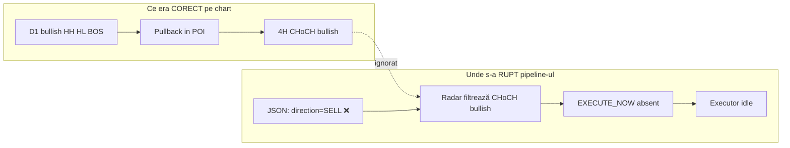

# Handoff: Executor nu mai execută — diagnostic complet + prompt pentru agent

**Data:** 2026-07-20  
**Branch:** `cursor/v36-3-radar-live-sync` (commit V61: direction guard 4H)  
**Scop:** Document de consultare cu un agent extern — tot ce rămâne de investigat și reparat  
**Problema raportată:** Tranzacții valide (GBPCAD, EURGBP, AUDUSD etc.) **nu s-au executat**; executorul **nu a mai dat o tranzacție de mult**.

---

## 1. Rezumat executiv (30 secunde)

| Fapt | Detaliu |
|------|---------|
| **Simptom** | Setup-uri corecte pe chart (ex. GBPCAD long post-POI + CHoCH 4H) executate manual, **zero execuție automată** |
| **Cauză probabilă #1** | `monitoring_setups.json` are **direction/bias greșit** (GBPCAD = SELL în JSON, chart = LONG) → radar ignoră CHoCH 4H valid |
| **Cauză probabilă #2** | Setup-urile **nu primesc niciodată** `EXECUTE_NOW=True` (stuck `MONITORING`, fără `poi_touch_latched`, fără radar fields) |
| **Cauză probabilă #3** | `setup_identity_lock` / `strategy_locked` **blochează actualizarea** bias-ului D1 la rescan |
| **V61 (recent)** | Blochează alerte/execuții pe direcție opusă — **corect**, dar amplifică problema dacă JSON e deja greșit |
| **Executor** | Probabil **sănătos dar inactiv** — nu primește semnale; verifică Deep Sleep + `EXECUTE_NOW` absent |

**Prioritate absolută:** Găsește de ce JSON ≠ clasificare SMC reală, apoi de ce radarul nu armează `EXECUTE_NOW`.

---

## 2. Strategia W→D→4H (canon — ce TREBUIE să facă sistemul)

```
Daily Scanner (D1)
  → bias + POI (FVG/OB) + direction LONG/SHORT
  → monitoring_setups.json (status MONITORING / WAITING_D1_PULLBACK)

Radar 4H (multi_tf_radar.py, la 5–30s)
  → preț atinge POI Daily → poi_touch_latched + radar_panda_active
  → CHoCH 4H în direcția bias D1, STRICT după primul touch POI
  → retrace 60–80% (Premium pentru SHORT, Discount pentru LONG)
  → EXECUTE_NOW=True + flush JSON

Executor (setup_executor_monitor.py, la 5s)
  → citește EXECUTE_NOW
  → V42.3: 4H CHoCH aliniat cu D1 (live)
  → V40.8: SL 4H + TP D1 structural
  → Sentinel: RR≥2, SL min/max, capital ≤5.1%
  → ctrader_executor → signals.json

cBot (PythonSignalExecutor.cs, la 10s)
  → market order pe cTrader
```

**Regula de aur:** Fără `EXECUTE_NOW=True` în JSON, executorul **nu face nimic** — indiferent cât de bun e setup-ul pe chart.

---

## 3. Caz golden confirmat: GBPCAD (BULLISH, nu bearish)

### Citire chart (TradingView — confirmat de user)

**Daily:**
- HH, HL, BOS în sus → structură **bullish**
- Pullback profund în zona POI (demand / FVG Daily — dreptunghi mov)
- Long manual: entry în discount/POI, TP spre HH

**4H:**
- Preț intră în POI Daily
- **CHoCH bullish** post-touch
- Retest → entry long (W→D→4H textbook)

### Ce avea JSON-ul (backup local `monitoring_setups_backup_20260401_124650.json`)

| Câmp | JSON (GREȘIT) | Corect (chart) |
|------|---------------|----------------|
| `direction` | sell | buy / LONG |
| `d1_bias_direction` | bearish | bullish |
| `strategy_type` | reversal | continuation |
| `status` | MONITORING | — |
| `EXECUTE_NOW` | absent | True după CHoCH 4H |
| `poi_touch_latched` | absent | True |
| `h4_structure_locked` | absent/false | True post-CHoCH |

### Contradicție audit vs JSON

`scripts/audit_structural_classification.py` pe cache D1:
- GBPCAD → **`bullish CONTINUATION`**

JSON → **sell reversal bearish**.

**Concluzie:** Scanner/audit calculează corect (bullish), dar JSON păstrează identitate veche greșită.

---

## 4. Pipeline complet — toate gate-urile care pot bloca execuția

### Strat 1: Scanner D1 (`daily_scanner.py` + `smc_detector.py`)

| Gate | Unde | Efect |
|------|------|-------|
| `_resolve_d1_leg` | smc_detector | bias + reversal/continuation |
| V40 range lock | filter_internal_range_signals | strip semnale în range |
| V58 macro gates | scan_for_setup | respinge REVERSAL prematur |
| V61 coerce | _coerce_d1_bias_to_major_structure | forțează bearish în range (ATEN�ție: nu corectează SELL→LONG) |
| W+D sync | evaluate_w_d_sync | WAITING_W_D_SYNC |
| **`setup_identity_lock`** | _apply_setup_identity_lock | **păstrează direction veche până la breach structural** |
| **`strategy_locked: true`** | save_monitoring_setups | poate împiedica refresh bias |

### Strat 2: Radar 4H (`multi_tf_radar.py`)

| Gate | Log tipic | Efect |
|------|-----------|-------|
| POI touch | — | fără latch → nu armă EXECUTE_NOW |
| CHoCH 4H aliniat D1 | `[4H DIRECTION MISMATCH SKIP]` | ignoră CHoCH opus (GBPCAD: bullish ignorat când JSON=SHORT) |
| Post-POI anchor | V50/V55 | CHoCH trebuie după poi_first_touch_time |
| Retrace 60–80% | `[V46]` | WAITING_4H_PULLBACK dacă off-band |
| P/D guard | `[V36.5 P/D BLOCK EXECUTE]` | LONG trebuie Discount, SHORT Premium |
| RR shield | `[V37.7 RR SHIELD]` | RR entry→TP < 2.0 |
| W+D soft sync | `[W+D SOFT SYNC]` | skip arm |
| REVERSAL + BOS-only | `[V31.0 REVERSAL GUARD]` | no EXECUTE |
| structural_breach | `[RADAR BREACH]` | clear EXECUTE_NOW |

### Strat 3: Executor (`setup_executor_monitor.py`)

| Gate | Log / câmp | Efect |
|------|------------|-------|
| **Deep Sleep** | data/deep_sleep_state.json | **skip TOT** — daily loss limit |
| Lipsă trigger | — | fără EXECUTE_NOW → skip |
| Position guard | WAITING_POSITION_CLOSE | simbol+direcție deja deschis |
| V42.3 alignment | last_rejection_reason | 4H ≠ D1 live |
| V40.8 SL/TP | abort | SL lipsă sau TP D1 lipsă |
| Sentinel Guard#1–4 | abort | RR, SL cap, capital, h4_structure_locked |
| Spread / live data | defer retry | păstrează EXECUTE_NOW |
| Risk manager | abort | max positions, duplicate |
| **V40.9 cooldown** | execute_now_blocked_at | **30 min fără re-arm** după abort |

### Strat 4: cBot (`PythonSignalExecutor.cs`)

| Gate | Efect |
|------|-------|
| MaxPositionsPerSymbol | respinge |
| processed_signals.txt dedup | skip duplicate SignalId |
| Port 8010 / simbol broker | date indisponibile upstream |

---

## 5. De ce executorul „nu mai dă tranzacții de mult”

Ipoteze ordonate (de verificat pe VPS):

### A) Zero `EXECUTE_NOW` în JSON (cel mai probabil)
- Toate setup-urile stuck `MONITORING` fără radar latch
- Radar rulează dar nu armează (bias greșit, POI, P/D, retrace)
- **Verificare:** `grep EXECUTE_NOW monitoring_setups.json` pe VPS

### B) Deep Sleep activ
- Daily loss limit atins → executor skip complet
- **Verificare:** `cat data/deep_sleep_state.json`, log `[DEEP SLEEP]`

### C) Toate setup-urile cu `last_rejection_reason` + cooldown 30min
- Executor a primit EXECUTE_NOW dar a abortat repetat
- **Verificare:** câmp `execute_now_blocked_at` per setup

### D) Procese oprite pe VPS
- multi_tf_radar.py / setup_executor_monitor.py / cBot nu rulează
- **Verificare:** systemd / screen / task scheduler

### E) Supra-gating cumulativ
- Multe fix-uri V40–V61 = lanț lung; un singur gate fail = zero execuții luni de zile

---

## 6. Ce a rezolvat V61 (deja implementat — commit 9b6208d)

| Fix | Fișier |
|-----|--------|
| normalize_structural_direction + h4_structural_direction_ok | radar_gates.py |
| Guard strict 4H + log `[4H DIRECTION MISMATCH SKIP]` | multi_tf_radar.py |
| _coerce_d1_bias_to_major_structure (range bearish) | smc_detector.py |
| Test: Daily SHORT + 4H bullish CHoCH → alert blocked | tests/test_4h_alert_gates.py |
| Audit actualizat sec. 12 | docs/SMC_DETECTOR_REVERSAL_CONTINUITY_AUDIT.md |

**V61 NU rezolvă:** JSON stale, identity lock, POI latch, executor Deep Sleep.

---

## 7. TODO-uri rămase (din plan — de executat)

### P0 — Diagnostic VPS (read-only, obligatoriu înainte de cod)

```bash
# 1. Snapshot setup-uri problematice
python3 -c "
import json
data = json.load(open('monitoring_setups.json'))
for s in data.get('setups', []):
    if s.get('symbol') in ('GBPCAD','EURGBP','AUDUSD','EURUSD','USDJPY'):
        print('===', s['symbol'], '===')
        for k in ['status','direction','strategy_type','d1_bias_direction',
                  'EXECUTE_NOW','execute_now_blocked_at','last_rejection_reason',
                  'poi_touch_latched','radar_panda_active','poi_first_touch_time',
                  'radar_4h_choch_detected','radar_4h_choch_direction',
                  'h4_structure_locked','pd_guard_passed','w_d_aligned',
                  'structural_breach','setup_identity_locked','strategy_locked',
                  'major_structure_floor','major_structure_ceiling']:
            print(f'  {k}: {s.get(k)}')
"

# 2. Audit structural vs JSON
python3 scripts/audit_structural_classification.py --cache --symbol GBPCAD EURGBP AUDUSD

# 3. Deep sleep?
cat data/deep_sleep_state.json 2>/dev/null || echo 'no deep sleep file'

# 4. Ultimele semnale
tail -20 processed_signals.txt
tail -50 logs/setup_executor*.log  # path VPS

# 5. Grep blocaje recente
grep -E 'EXECUTE_NOW|DIRECTION MISMATCH|P/D BLOCK|DEEP SLEEP|ABORT|Sentinel' logs/*.log | tail -100
```

### P1 — Investigare identity lock / JSON desync

**Fișiere cheie:**
- `daily_scanner.py`: `_apply_setup_identity_lock()`, `_d1_identity_snapshot()`, `strategy_locked`
- `tests/test_setup_identity_lock.py`

**Întrebări:**
1. GBPCAD are `setup_identity_locked=True` cu direction=sell veche?
2. Rescan daily schimbă direction în memorie dar merge-ul o rescrie cu old?
3. `_IDENTITY_BOUND_KEYS` include `direction` / `d1_bias_direction`?

### P2 — Test golden GBPCAD

Adaugă în `tests/test_d1_leg_invalidation.py` sau fișier nou:
- Input: D1 cu HH+HL+BOS bullish, pullback în POI
- Expected: `direction=LONG`, `strategy_type=continuation`, `d1_bias=bullish`
- Apoi simulare radar: POI touch + CHoCH 4H bullish → `EXECUTE_NOW=True`

### P3 — Fix V62 (după confirmare root cause)

| Root cause | Fix propus |
|------------|------------|
| Identity lock păstrează SELL greșit | Allow direction flip când `macro_trend_from_swings` + HH/HL contradict locked identity |
| strategy_locked blochează rescan | Refresh direction/strategy la fiecare daily scan dacă structura D1 s-a schimbat |
| POI latch nu se activează | Debug `_track_mitigation_touch` — wick vs body, D1/H4 anchor |
| P/D prea strict post-latch | Revizuire V52 latch path |
| Executor Deep Sleep | Reset manual + fix daily loss calc |
| h4_structure_locked false la exec | Verifică V19.14b auto-set |

### P4 — Logging operațional

Adaugă (minimal):
- `[D1 BIAS DRIFT] {symbol}: JSON={dir} audit={audit_dir}` când diferă
- `[EXECUTE PIPELINE] {symbol}: gate_failed={reason}` — un singur log per ciclu radar

---

## 8. Simboluri de referință

| Simbol | Așteptare user | JSON backup | Audit script | Notă |
|--------|----------------|-------------|--------------|------|
| **GBPCAD** | LONG (bullish POI + CHoCH 4H) | SELL reversal | bullish continuation | **Caz golden — JSON inversat** |
| **EURGBP** | SELL (similar GBPCAD?) | SELL reversal | de verificat | Test W+D sync blocking |
| **AUDUSD** | SELL | BUY continuation | de verificat | Mismatch user vs JSON |

---

## 9. Fișiere relevante (index rapid)

| Fișier | Rol |
|--------|-----|
| `smc_detector.py` | D1 bias, _resolve_d1_leg, V40/V58/V61 |
| `daily_scanner.py` | Scrie monitoring_setups.json, identity lock |
| `multi_tf_radar.py` | EXECUTE_NOW arming, toate gate-urile 4H |
| `radar_gates.py` | normalize direction, post-POI |
| `setup_executor_monitor.py` | Consumă EXECUTE_NOW, Sentinel, Deep Sleep |
| `ctrader_executor.py` | signals.json |
| `PythonSignalExecutor.cs` | cBot cTrader |
| `monitoring_setups.json` | **Sursa adevărului runtime** |
| `scripts/audit_structural_classification.py` | Audit bias fără JSON |
| `docs/SMC_DETECTOR_REVERSAL_CONTINUITY_AUDIT.md` | Audit REVERSAL vs CONTINUATION |
| `tests/test_4h_alert_gates.py` | Teste direction guard |
| `tests/test_setup_identity_lock.py` | Teste identity lock |
| `tests/test_w_d_sync.py` | EURGBP W+D blocking |

---

## 10. Prompt șablon pentru agent (copy-paste)

```
Context: Trading bot W→D→4H (Glitch in Matrix). Executorul nu mai execută tranzacții de luni de zile. Setup-uri valide (GBPCAD long: D1 bullish pullback în POI + CHoCH 4H bullish) executate manual dar nu automat.

Branch: cursor/v36-3-radar-live-sync (V61 direction guard deja implementat).

Problema confirmată:
- monitoring_setups.json avea GBPCAD direction=SELL/bearish/reversal
- Chart + audit_structural_classification.py = bullish CONTINUATION
- Radar caută CHoCH bearish → ignoră CHoCH bullish valid → EXECUTE_NOW never set
- Executor inactiv pentru că nu primește EXECUTE_NOW (nu e neapărat stricat)

Task:
1. Pe VPS: extrage monitoring_setups.json + loguri pentru GBPCAD, EURGBP, AUDUSD
2. Confirmă root cause: identity lock / strategy_locked / JSON merge vs clasificare live
3. Fix MINIM în daily_scanner.py + smc_detector.py:
   - Direction/bias trebuie să reflecte macro swings (HH/HL bullish → LONG continuation)
   - Identity lock NU trebuie să păstreze direction inversată când structura D1 e clar bullish
4. Test golden GBPCAD: D1 bullish + POI + 4H CHoCH → EXECUTE_NOW=True
5. Verifică Deep Sleep + procese active pe VPS
6. NU adăuga gate-uri noi — simplifică dacă e supra-gated
7. pytest tests/ -q + py_compile

Referință completă: docs/EXECUTOR_EXECUTION_HANDOFF_V62.md
Referință audit: docs/SMC_DETECTOR_REVERSAL_CONTINUITY_AUDIT.md sec. 7 + 12
```

---

## 11. Diagramă — unde s-a rupt GBPCAD



---

## 12. Criterii de succes (definition of done)

- [ ] GBPCAD în JSON = LONG / bullish / continuation când chartul arată HH+HL+pullback POI
- [ ] După POI touch + CHoCH 4H aliniat → `EXECUTE_NOW=True` în JSON
- [ ] Executor consumă semnalul → entry în signals.json → cBot execută
- [ ] Test golden GBPCAD trece în pytest
- [ ] Log `[D1 BIAS DRIFT]` apare dacă JSON ≠ audit (opțional dar util)
- [ ] Minim 1 tranzacție live executată automat pe setup valid (validare VPS)

---

*Document generat pentru consultare agent. Revino cu promptul final derivat din secțiunea 10.*

---

## 13. V62 — Implementat (2026-07-20)

| Fix | Fișier |
|-----|--------|
| `resolve_authoritative_d1_bias()` — sursă unică bias D1 | smc_detector.py |
| `macro_authority_supports_direction()` | smc_detector.py |
| V62 coerce: macro bullish → nu bearish reversal pe pullback | smc_detector.py |
| `_rehydrate_stored_macro_bias()` — JSON SELL → BUY când audit zice bullish | daily_scanner.py |
| `_macro_authority_allows_identity_flip()` — GBPCAD-class flip on pullback | daily_scanner.py |
| `[V62 MACRO FLIP]` / `[D1 BIAS DRIFT]` / `[V62 REHYDRATE]` logs | daily_scanner.py |
| daily_bias_map folosește authoritative bias (nu doar determine_daily_trend) | daily_scanner.py |
| Teste GBPCAD golden + rehydrate + alert LONG+bullish CHoCH | tests/ |

**Pe VPS după deploy:** verifică GBPCAD `direction=buy`, rulează daily scan + radar, confirmă `EXECUTE_NOW` când POI+CHoCH 4H bullish.

