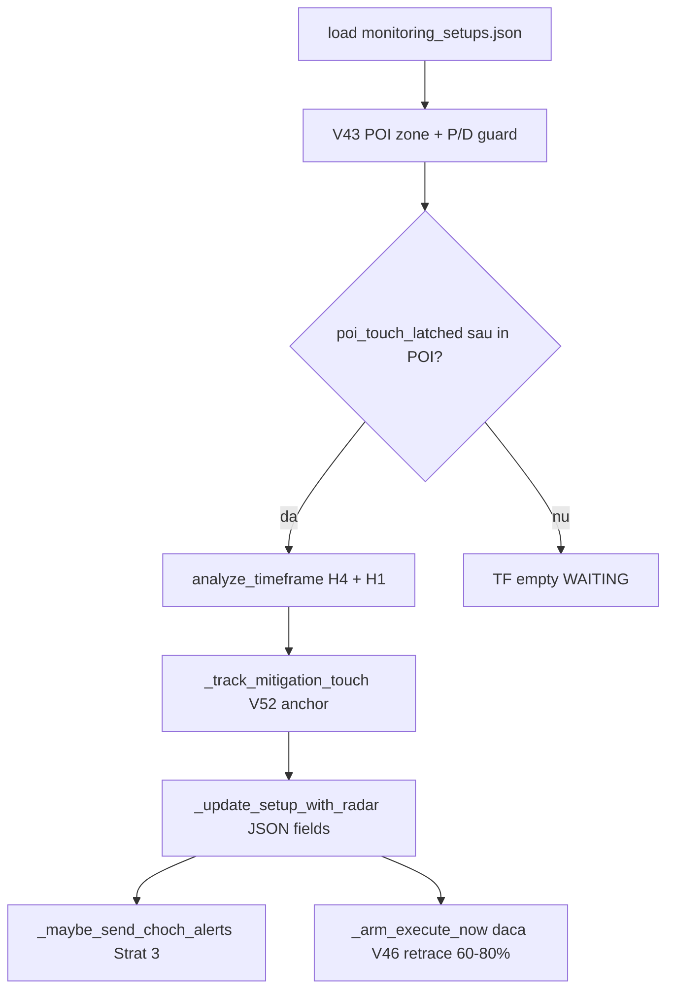

# Glitch in Matrix / Apollo — Starea Sistemului & Gap-uri față de Manifest

> **Autor:** audit Composer · **Branch:** `cursor/v36-3-radar-live-sync` · **Data:** 2026-07-08  
> **Scop:** document de referință instituțională — ce rulează acum, ce contrazice filosofia ForexGod, ce trebuie editat (și ce NU).

---

## 1. Manifestul sacru (rezumat operațional)

Lanțul de transmisie obligatoriu:

```
D1 POI (Scanner) → POI Latch (Radar) → CHoCH Alert + Chart (Telegram) → Retrace 60–80% → EXECUTE_NOW → Broker
```

| Strat | Fișier principal | Misiune |
|-------|------------------|---------|
| **1 — Daily Scanner** | `daily_scanner.py` | O dată/zi: bias D1, strategy_type, caseta POI → JSON |
| **2 — Multi-TF Radar** | `multi_tf_radar.py` | Loop: latch POI, panda, CHoCH 4H→1H pe bias, fără reset anchor |
| **3 — Releu alerte** | `multi_tf_radar.py` + `telegram_notifier.py` + `chart_generator.py` | Post-POI CHoCH → Telegram + PNG cu linia CHoCH |
| **4 — Executor** | `setup_executor_monitor.py` | EXECUTE_NOW + gărzi live → ordin broker |

**Reguli de fier (Strat 2):**
- Touch POI (preț sau wick) → `poi_touch_latched = True`, panda ON.
- Prețul poate ieși din casetă; **interzis** reset CHoCH / mutare anchor în viitor (V52.2).
- CHoCH LTF strict pe direcția bias Daily.

**Reguli de fier (Strat 3):**
- CHoCH post-POI confirmat → alertă obligatorie + chart anotat.
- Secvență: **4H alertă → apoi 1H** (cascadă, nu simultan haotic).

**Reguli de fier (Strat 4):**
- Nu intră la break; intră la retrace **60–80%** pe impulsul CHoCH (`EXECUTE_NOW`).
- OHLC live, spread guard, risc 5%.

---

## 2. Arhitectura actuală (cum rulează codul azi)

### 2.1 Strat 1 — Daily Scanner

**Fișier:** `daily_scanner.py`

| Aspect | Stare actuală |
|--------|-----------------|
| Scan zilnic 16 perechi | ✅ Activ |
| Output | `monitoring_setups.json` — bias, POI box, strategy_type, SL/TP scan |
| Telegram la scan | ✅ Card text + **doar chart Daily** (`charts_mode='daily_only'` ~L652–657) |
| Charts 4H/1H la scan | ❌ Intenționat OFF — V15/V43.9: LTF vine la confirmare CHoCH (Strat 3) |

**Contract JSON relevant:** `direction`, `strategy_type`, `daily_fvg_*` / POI bounds, `entry_price`, `stop_loss`, `take_profit`, `status`.

---

### 2.2 Strat 2 — Multi-TF Radar

**Fișier:** `multi_tf_radar.py` (+ helpers `poi_utils.py`, `radar_gates.py`)

#### Flux per ciclu (`analyze_setup` → `_update_setup_with_radar`)



#### State machine POI (`_track_mitigation_touch` ~L471–577)

| Key | Rol |
|-----|-----|
| `poi_touch_latched` | Zăvor persistent post-prim-touch |
| `poi_first_touch_time` | Ancoră cronologică (V52.2 retroactiv via `resolve_poi_touch_anchor`) |
| `radar_panda_active` | Panda ON — scan LTF activ chiar după ieșire din casetă (V49) |
| `h4_choch_alert_sent` / `h4_bos_alert_sent` | Dedup alerte per ciclu POI — reset la intrare POI nouă |

**V52.2 (retroactive POI anchor):** ✅ Implementat — CHoCH post-POI poate fi detectat în `analyze_timeframe` chiar dacă touch-ul istoric e anterior ciclului curent.

**Selecție structurală (`analyze_timeframe` ~L1450–1506):**
- `_filter_structural_post_poi` — elimină CHoCH pre-anchor.
- `_v47_pick_structural_signal` — CHoCH prioritar, BOS ca intrare 2 dacă `allow_bos_trigger`.
- Direction guard — CHoCH contrar bias ignorat.

**V46 EXECUTE (Strat 2 → 4):** `_arm_execute_now` (~L2476+) — cere POI latched + retrace 60–80% + aliniere LTF. **Fără** gate ≤3 bare (corect față de manifest).

---

### 2.3 Strat 3 — Releu alerte & chart

**Declanșator:** `multi_tf_radar._maybe_send_choch_alerts` (~L2372–2474)

**Telegram:** `telegram_notifier.send_4h_structural_alert` / `send_1h_choch_alert` (~L403–631)

**Chart:** `chart_generator.create_4h_chart` / `create_1h_chart` → `create_daily_chart` (mplfinance, dark theme)

#### Gates actuale pe alertă 4H (`_v47_4h_alert_ok` ~L2388–2406)

1. `radar_panda_active` — panda ON  
2. `tf_4h.choch_detected` + direcție = macro bias  
3. `_v47_break_post_poi_touch` — break după anchor POI ✅ (aliniat manifest)  
4. **`_v47_live_alert_bars_ok('4H', bars_ago)` — ≤ 3 bare** ⚠️ **CONFLICT manifest**  
5. `_retrace_is_alert_valid` — retrace între −5% și 200%  
6. `not h4_choch_alert_sent` — dedup  

**Poartă 1H (V50):** 1H alertă doar dacă `h4_choch_alert_sent` sau `h4_bos_alert_sent` (~L2434–2448).

#### Chart generator (~L126–127 `chart_generator.py`)

```text
# NO annotations - clean chart with only candles!
# Removed: FVG zones, CHoCH markers, Entry/SL/TP lines
```

**`send_4h_structural_alert`** construiește setup cu `h4_choch=None` (~L489) — linia CHoCH **nu se desenează**.

---

### 2.4 Strat 4 — Executor Monitor

**Fișier:** `setup_executor_monitor.py`

| Aspect | Stare |
|--------|-------|
| Citește `monitoring_setups.json` | ✅ |
| Reacționează la `EXECUTE_NOW=True` | ✅ |
| SL/TP live din OHLC broker (`require_live=True`) | ✅ (post-V48/V52 cleanup) |
| Spread guard, dedup, risk 5% | ✅ |
| Nu trimite alerte CHoCH | ✅ (corect — Strat 3) |

---

## 3. Diagnostice: ce funcționează vs ce e rupt

### ✅ Aliniat manifestului

| Zonă | Detaliu |
|------|---------|
| Scanner → JSON | Bias, POI, strategy_type scrise o dată/zi |
| POI latch V49 | Panda rămâne ON după ieșire din casetă |
| V52 anchor | Retroactiv, fără mutare anchor în viitor |
| Post-POI filter detecție | `_filter_structural_post_poi` în radar |
| Cascadă 4H→1H alerte | Gate V50 pe `h4_*_alert_sent` |
| V46 EXECUTE | Retrace 60–80%, fără cap 3 bare |
| Executor live-only | Broker OHLC obligatoriu la EXECUTE_NOW |

### ⚠️ Gap-uri față de manifest (de reparat)

| # | Simptom | Cauză root | Fișiere |
|---|---------|------------|---------|
| **G1** | EURJPY: CHoCH 4H vizibil în radar/TV, **zero alertă/chart Telegram** | V52 deblochează **detecția**; V47/V50 blochează **releul** la `bars_ago > 3` — skip **silențios** | `multi_tf_radar.py` L2402–2403, `radar_gates.py` L49–55 |
| **G2** | Chart trimis = doar lumânări, **fără linie CHoCH** | Anotații eliminate din `chart_generator`; `h4_choch=None` la trimitere | `chart_generator.py` L126–127, `telegram_notifier.py` ~L474–497 |
| **G3** | Card scan „⏳ 4H waiting” deși radar detectează CHoCH | `ltf_choch_confirmed_for_card` folosește același cap ≤3b | `radar_gates.py` L84–86, L105–107 |
| **G4** | Istoric: alerte „haotice” cu CHoCH vechi (-17b) | Pre-V50: bypass `or rising` pe `prev_*_choch` — alertă la primul false→true indiferent de vârstă | Eliminat în V50 (`3ee1377`) — corect anti-zombi, dar fără înlocuitor post-V52 |
| **G5** | Zero log când alertă blocată | `_maybe_send_choch_alerts` returnează fără mesaj | `multi_tf_radar.py` L2388–2432 |
| **G6** | BOS path: `break_time = tf_4h.choch_time` chiar pentru BOS | Posibil gate post-POI greșit pe BOS | `multi_tf_radar.py` L2394 |

### ❌ Nu e bug (confuzie frecventă)

| Percepție | Realitate |
|-----------|-----------|
| „Sweep-ul a șters `ltf_choch_*` din radar” | Importurile erau moarte în `multi_tf_radar.py`; logica trăiește în `telegram_notifier.py` + `radar_gates.py` |
| „Scannerul nu trimite 4H” | By design (`daily_only`) — Strat 3 livrează 4H |
| „Dead code sweep a rupt lanțul” | Sweep-ul a eliminat balast; ruptura e **V50 gate ≤3b** vs **V52 detecție post-POI** |

---

## 4. Ce trebuie editat în cod (plan conform manifestului)

Prioritizare: **P0 = lanț sacru**, **P1 = vizibilitate**, **P2 = polish / dead code fără risc**.

---

### P0 — Reconectare Strat 3 la Strat 2 (alertă + chart obligatorii post-POI)

#### P0-A: Elimină hard-block ≤3 bare pe **trimitere alertă**

**Fișier:** `multi_tf_radar.py`  
**Loc:** `_v47_4h_alert_ok()` ~L2402–2403; condiție 1H ~L2459–2460

**Acțiune:**
- Scoate `_v47_live_alert_bars_ok` din path-ul de **send** (4H și 1H).
- Păstrează: `post_poi` + direcție + panda + dedup + `_retrace_is_alert_valid`.
- `bars_ago` rămâne în **caption** Telegram (informativ, ca screenshot GBPUSD `-17b post-POI`).

**Anti-zombi corect (manifest):** `v47_break_post_poi_touch` + V52 anchor — **nu** vârsta în bare.

**Nu reintroduce:** `or rising` pe `prev_*_choch` (cauza haosului Pre-V50).

#### P0-B: Log explicit la skip (zero skip-uri tăcute)

**Fișier:** `multi_tf_radar.py`  
**Loc:** după evaluarea `_v47_4h_alert_ok`, ~L2421

**Acțiune:** dacă `tf_4h.choch_detected` && `not h4_choch_alert_sent` && `not _v47_4h_alert_ok()`:

```text
[V52 ALERT SKIP] {sym}: post_poi={bool} bars={n} retrace={pct} reason={...}
```

#### P0-C: Auto-trimitere la prima confirmare post-POI (dedup o dată per ciclu POI)

**Regulă:** când `analyze_timeframe` returnează CHoCH post-POI valid + direcție OK → `_maybe_send_choch_alerts` **trebuie** să trimită sau să logheze motiv.

**Dedup existent:** `h4_choch_alert_sent` resetat la intrare POI (~L529–530) — păstrat.

---

### P1 — Chart cu linia CHoCH (Strat 3 complet)

#### P1-A: Propagă break price în generator

**Fișier:** `telegram_notifier.py`  
**Loc:** `send_4h_structural_alert` ~L474–497; `send_1h_choch_alert` ~L599–617

**Acțiune:**
- Pasează `break_px` din `tf_data.choch_price` / `radar_4h_choch_price`.
- Extinde `SimpleNamespace` sau dict setup cu `choch_break_price`, `choch_bar_index` (opțional).

#### P1-B: Desenează linia CHoCH

**Fișier:** `chart_generator.py`  
**Loc:** după L124, înainte de save

**Acțiune minimă manifest:**

```python
if getattr(setup, 'choch_break_price', None):
    ax.axhline(setup.choch_break_price, color='#ff9800', linestyle='--', linewidth=1.2, label='CHoCH')
```

Opțional P1+: marcaj vertical la bara break, zonă FVG POI (fără supraîncărcare).

#### P1-C: Aliniază cardul scan cu radar live

**Fișier:** `radar_gates.py`  
**Loc:** `ltf_choch_confirmed_for_card` L84–86, L105–107

**Acțiune:** elimină `v47_live_alert_bars_ok` din confirmare card **sau** folosește cap separat informativ (ex. 72b). Cardul trebuie să reflecte același adevăr ca alerta.

---

### P1-D: Fix BOS break_time

**Fișier:** `multi_tf_radar.py` ~L2390–2394

**Acțiune:** pentru `sig == 'BOS'`, folosește timestamp-ul BOS-ului (bar index BOS), nu `tf_4h.choch_time`.

---

### P2 — Dead code sweep 2 (sigur, fără atingere lanț)

Din `docs/POST_V52_DEAD_CODE_SWEEP.md` — **doar** după P0/P1:

| Element | Fișier | Sigur? |
|---------|--------|--------|
| Direction assertion guard paranoid L1556–1574 | `multi_tf_radar.py` | ⚠️ Doar după test — nu e pe calea alertă |
| `all_setups` param mort în `run_scan` | `multi_tf_radar.py` | ✅ |
| `_execute_now_block_alert_keys` orphan load | `setup_executor_monitor.py` | ✅ dacă dedup e 100% în `telegram_notifier` |
| Audit script callers vechi `detect_fvg(..., current_price)` | scripturi | ✅ separat de producție |

**Interzis fără audit manifest:** `_track_mitigation_touch`, V52 anchor, `_filter_structural_post_poi`, `_arm_execute_now`, `_maybe_send_choch_alerts` (except P0 edits), executor live path.

---

## 5. Matrice conformitate manifest

| Cerință manifest | Cod actual | După P0/P1 |
|------------------|------------|------------|
| D1 POI → JSON | ✅ | ✅ |
| POI latch persistent | ✅ V49/V52 | ✅ |
| CHoCH post-POI detectat | ✅ V52 | ✅ |
| Alertă Telegram la CHoCH post-POI | ❌ blocat ≤3b | ✅ |
| Chart PNG cu linie CHoCH | ❌ anotații off | ✅ |
| Cascadă 4H → 1H | ✅ V50 gate | ✅ |
| EXECUTE 60–80% retrace | ✅ V46 | ✅ |
| Executor live broker | ✅ V48 | ✅ |
| Zero skip tăcut Strat 3 | ❌ | ✅ P0-B |

---

## 6. Verificare post-implementare

### Comenzi

```bash
# Compilare
python3 -m py_compile multi_tf_radar.py telegram_notifier.py chart_generator.py radar_gates.py

# Eligibilitate alertă pe JSON VPS
python3 scripts/audit_choch_alerts.py --symbol EURJPY

# Replay structural post-POI
python3 scripts/audit_choch_alerts.py --symbol EURJPY --replay
```

### Scenarii manuale (checklist)

- [ ] Setup intră POI → `poi_touch_latched=True`, `radar_panda_active=True`
- [ ] CHoCH 4H post-POI la -15…-30b → **alertă 4H + PNG** cu linie la break price
- [ ] Caption arată `-Nb post-POI` fără a bloca trimiterea
- [ ] După alertă 4H → 1H poate declanșa cascada
- [ ] Retrace 60–80% → `EXECUTE_NOW` (fără alertă duplicată CHoCH)
- [ ] Ieșire din POI **nu** resetează anchor / CHoCH detectat
- [ ] Log `[V52 ALERT SKIP]` apare doar când post_poi/retrace/direcție e invalid — nu la vârstă bare

---

## 7. Cronologie utilă (de ce „mergea înainte”)

| Commit / versiune | Efect |
|-------------------|-------|
| **V47** (2026-07-01) | Introduce alerte structurale + cap ≤3b + bypass `or rising` |
| **V50** (2026-07-02) | Elimină `or rising`; gate 1H pe `h4_*_alert_sent`; post-POI filter în detecție |
| **V52.2** | Retroactive POI anchor — repară **detecția** EURJPY-style |
| **Sweep post-V52** | Elimină balast; **nu** atinge lanțul POI→alertă |

Screenshot GBPUSD 1H cu `-17b post-POI` = era **Pre-V50** (rising edge bypass). Post-V50 + V52 fără P0 = detecție da, releu nu.

---

## 8. Concluzie

Motorul Apollo (Straturi 1, 2, 4) este **aproape complet aliniat** manifestului Glitch in Matrix. Ruptura critică este **Stratul 3**: gate-ul V47 ≤3 bare și lipsa anotației CHoCH pe chart contrazic obligația „Ochii Utilizatorului”.

**Ordinea de implementare recomandată:**
1. **P0-A/B** — alertă post-POI fără cap 3b + logging  
2. **P1-A/B** — linie CHoCH pe PNG  
3. **P1-C/D** — card + BOS timestamp  
4. **P2** — restul dead code sweep (balast pur)

Orice edit viitor trece prin întrebarea: *„Păstrează lanțul D1 POI → Latch → Alert+Chart → Retrace → Broker intact?”* — dacă nu, nu merge în commit.

---

## 9. Implemented — Strat 3 P0/P1 (2026-07-08)

| Gap | Fix | Fișier |
|-----|-----|--------|
| G1 | Eliminat `_v47_live_alert_bars_ok` din path trimitere alertă 4H/1H | `multi_tf_radar.py` |
| G5 | Log explicit `[V52 ALERT SKIP]` cu post_poi, bars, retrace, reason | `multi_tf_radar.py` |
| G2 | `choch_break_price` + `axhline` CHoCH portocaliu pe PNG | `telegram_notifier.py`, `chart_generator.py` |
| G3 | Card confirmă post-POI fără bar-age / lock obligatoriu | `radar_gates.py` |

**Verificare locală:**
```bash
python3 -m py_compile multi_tf_radar.py telegram_notifier.py chart_generator.py radar_gates.py
python3 tests/test_ltf_choch_card.py
python3 scripts/audit_choch_alerts.py --symbol EURJPY  # pe VPS cu monitoring_setups.json
```

**Checklist EURJPY live:** consolă `[V47] 4H CHoCH alert trimis` + Telegram PNG cu linie CHoCH; EXECUTE_NOW doar la retrace 60–80%.

---

*Document viu — actualizează după P0/P1 cu secțiune „Implemented” și hash commit.*
