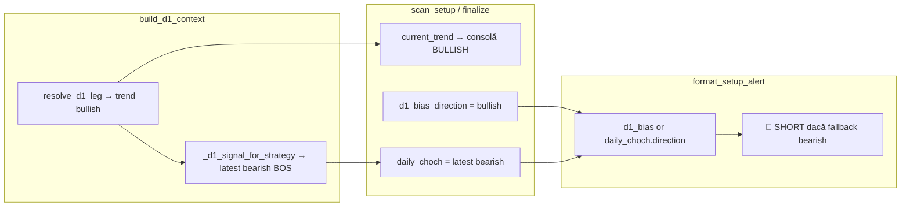

# Glitch in Matrix — V71 D1 structură + sincronizare Telegram (raport complet)

**Perioadă:** 2026-10-08 — 2026-10-09  
**Branch:** `cursor/v36-3-radar-live-sync`  
**Commit-uri relevante (deja push):** `734e9f0` (V70 POI), `ad089a0` (V71 structură D1)  
**Fix sincronizare consolă/Telegram:** implementat local; **commit separat** dacă nu a fost încă push-uit

---

## 1. Problema inițială (audit read-only)

### Simptome
- **MARKET_REPORT:** ~15/16 perechi 🔴 SHORT — skew statistic imposibil.
- **USDCAD:** grafic Daily clar **bullish** (HH/HL, break peste high anterior); bot raporta **🔴 SHORT · D1 BEARISH BOS · W1 BULLISH nealiniat**.
- POI Daily vechi (~1.386–1.391) cu preț live ~1.425 — zonă decuplată de preț.

### Concluzie audit (fără patch inițial)
Document: [`GLITCH_MATRIX_D1_BIAS_SETUP_DIAGNOSTIC.md`](GLITCH_MATRIX_D1_BIAS_SETUP_DIAGNOSTIC.md)

| Întrebare | Răspuns |
|-----------|---------|
| Există `default bearish` global? | **Nu** — eșec → `neutral`. |
| De ce atâtea SHORT? | Pipeline **V67/V68/V69**: leg bearish „înghețat”, **Rule 2** Major LH/HL, filtrare range intern, macro override condiționat. |
| V70 POI a stricat bias-ul? | **Nu** — V70 atinge doar FVG/POI/JSON, nu `build_d1_context`. |
| Telegram inventează SHORT? | **Nu** — citește `direction` / `d1_bias_direction` din setup; problema era **sursa** D1 greșită sau **desincronizată**. |

---

## 2. Implementare V71 — lifecycle structural Glitch (prompt utilizator)

### Obiectiv
- CHoCH D1 cu **body-close** → flip instant al bias-ului (fără ghost legs).
- Fără **Rule 2** (internal pullback pe Major LH/HL).
- Fără stripping CHoCH/BOS în **macro range**.
- Trend D1 = **ultimul CHoCH/BOS valid** (cronologic).
- Documentat flux: D1 → POI → **4H CHoCH în POI** → așteptare D1 BOS (în `scan.py`; confirmarea 4H exista deja în scanner).

### Fișiere modificate (commit `ad089a0`)

| Fișier | Schimbări |
|--------|-----------|
| [`smc_detector/core_structure.py`](../smc_detector/core_structure.py) | **V71** `detect_choch_and_bos`: eliminat Rule 2; CHoCH imediat la body-close confirmat. `filter_internal_range_signals` → **passthrough** (liste nealterate). |
| [`smc_detector/d1_leg.py`](../smc_detector/d1_leg.py) | `_resolve_pure_d1_matrix` rescris: ultim eveniment CHoCH/BOS → trend + strategy; fără ghost leg / range lock / reclaim. `_coerce_leg_with_boundary_gate` → passthrough. |
| [`smc_detector/d1_authority.py`](../smc_detector/d1_authority.py) | Eliminat override macro **V68** când `leg_choch is None`. |
| [`smc_detector/scan.py`](../smc_detector/scan.py) | Docstring lifecycle Glitch V71. |
| [`tests/test_d1_bias_canonical.py`](../tests/test_d1_bias_canonical.py) | Teste realiniate la „trend = ultim semnal”; `test_usdcad_not_stuck_bearish_on_full_history`. |
| [`tests/test_d1_leg_invalidation.py`](../tests/test_d1_leg_invalidation.py) | Ajustări V71. |
| [`docs/GLITCH_MATRIX_D1_BIAS_SETUP_DIAGNOSTIC.md`](GLITCH_MATRIX_D1_BIAS_SETUP_DIAGNOSTIC.md) | Secțiune §13 remediere V71. |

### Rezultate pe cache local (post-V71)
- **USDCAD:** `trend=bullish`, strategy `continuation`/`reversal` după date — **nu mai bearish blocat**.
- **Panel 16 simboluri:** ~**8 bullish / 8 bearish** (înainte ~12 bearish).

---

## 3. Defect critic: consolă BULLISH vs Telegram SHORT (2026-10-09)

### Ce a raportat utilizatorul
**Consolă (corect):**
```
[V28.0 BIAS] USDCAD: D1 BULLISH CHoCH valid
[W1 INFO] USDCAD: BULLISH - ALINIAT cu D1
USDCAD | REV BULLISH | WAITING_W_ZONE
[V10.2] USDCAD LONG ...
```

**Telegram (greșit):**
```
USDCAD · 🔴 SHORT
D1: BEARISH BOS
W1: BULLISH ⚠️ nealiniat
CONT (BOS)
```

### Cauză tehnică (root cause)

Două straturi:

#### A) Desincronizare în `build_d1_context` (pre-fix sync)
După `_resolve_d1_leg()` (trend **bullish**), codul vechi apela:
- `_classify_d1_strategy()`
- `_d1_signal_for_strategy()` → înlocuia `latest_signal` cu **ultimul BOS post-leg** ( uneori **bearish**, din leg vechi)
- `D1AuthContext.trend` rămânea **bullish**, dar `latest_signal` devenea **bearish BOS**

`scan_setup.py` folosea:
- `current_trend = d1_ctx.trend` → consolă **BULLISH**
- `latest_signal = d1_ctx.latest_signal` → obiect **bearish** pe câmpul greșit numit `daily_choch`

#### B) Fallback periculos în Telegram
[`telegram_notifier.py`](../telegram_notifier.py) — `format_setup_alert`:
```python
raw_dir = getattr(setup, 'd1_bias_direction', None) or setup.daily_choch.direction
```
Dacă `d1_bias_direction` lipsea sau era falsy → **direction = daily_choch.direction** (bearish) → 🔴 SHORT, BEARISH BOS, W1 „nealiniat”.

**Important:** cardul Telegram folosește obiectul `TradeSetup` din `_deferred_tg_cards` (la scan), **nu** JSON-ul salvat după `save_monitoring_setups` — deci bug-ul era pe obiectul setup + authority, nu pe merge JSON.

### Diagramă flux (înainte de fix)



---

## 4. Remediere sincronizare (edit local post-`ad089a0`)

### Fișiere modificate

| Fișier | Schimbări |
|--------|-----------|
| [`smc_detector/d1_authority.py`](../smc_detector/d1_authority.py) | **Eliminat** `_classify_d1_strategy` + `_d1_signal_for_strategy` + rescrieri reversal pe `leg_choch` din `build_d1_context`. Păstrat output direct din `_resolve_d1_leg`; `current_trend = latest.direction`. |
| [`daily_scanner.py`](../daily_scanner.py) | Nou: `_sync_setup_from_d1_context(setup, d1_auth_cache[symbol])` după setup găsit și înainte de queue Telegram. `_setup_d1_trend`: **nu** preferă `daily_choch` dacă contrazice `d1_bias_direction`. `_trade_setup_to_monitoring_dict`: direction via `_setup_d1_trend`. |
| [`telegram_notifier.py`](../telegram_notifier.py) | Nou: `_canonical_d1_trend(setup)` (aceeași logică). `format_setup_alert`: fără `or daily_choch` ca prim fallback; chip REV/CONT aliniat la `d1_signal_type`. |
| [`smc_detector/scan_finalize.py`](../smc_detector/scan_finalize.py) | Warning `[V71 SYNC]` dacă `latest_signal.direction ≠ current_trend`. |

### Comportament așteptat după fix
- Consolă, **TradeSetup**, **monitoring_setups.json** și **Telegram** folosesc aceeași autoritate: `d1_auth_cache` / `build_d1_context`.
- USDCAD: **🟢 LONG**, **D1 BULLISH CHoCH** (sau BOS dacă strategy continuation), **W1 BULLISH ✅**.

### Teste rulate (local)
- `tests/test_d1_bias_canonical.py` — pass  
- `tests/test_d1_leg_invalidation.py` — pass  
- `tests/test_market_report_format.py` — pass  

---

## 5. Cronologie evenimente

| Dată | Eveniment |
|------|-----------|
| 2026-10-08 | Audit read-only bias SHORT masiv; doc diagnostic. |
| 2026-10-08 | Analiză chart USDCAD: utilizator corect — nu bearish leg vizual; cod leg matrix conservator. |
| 2026-10-09 | Implementare **V71** structură (Rule 2 off, last signal wins). Commit **`ad089a0`**. |
| 2026-10-09 | Scan VPS: consolă BULLISH, Telegram încă SHORT → identificat drift authority vs Telegram fallback. |
| 2026-10-09 | Fix sync authority + `_sync_setup_from_d1_context` + `_canonical_d1_trend` (local, commit pending dacă user cere). |

---

## 6. Ce trebuie făcut pe VPS

1. **Pull** branch `cursor/v36-3-radar-live-sync` (minim `ad089a0` + commit sync dacă există).
2. **Rulează daily scanner** după reset monitoring (sau așteaptă scan programat).
3. Verifică pentru USDCAD:
   - consolă: `BULLISH`, `LONG`
   - Telegram: 🟢 LONG, D1 BULLISH + tip CHoCH/BOS consistent
   - `monitoring_setups.json`: `"direction": "buy"`, `"d1_bias_direction": "bullish"`
4. Card Telegram **19:11** din screenshot poate fi **scan vechi** (pre-V71 / pre-sync) — compară ora mesajului cu ora log-ului `16:40`.

---

## 7. Referințe cod (puncte de ancorare)

| Responsabilitate | Locație |
|------------------|---------|
| Autoritate D1 unică | `SMCDetector.build_d1_context()` → `d1_authority.py` |
| Detectare CHoCH/BOS | `core_structure.detect_choch_and_bos()` |
| Rezolvare trend | `d1_leg._resolve_pure_d1_matrix()` |
| Scan → TradeSetup | `scan_setup._scan_through_poi_validation` → `scan_finalize._scan_finalize_trade_setup` |
| Normalizare trend setup | `daily_scanner._setup_d1_trend()` |
| Sync înainte de Telegram | `daily_scanner._sync_setup_from_d1_context()` |
| Card Telegram | `telegram_notifier.format_setup_alert()` |
| JSON monitoring | `daily_scanner._trade_setup_to_monitoring_dict()` → `save_monitoring_setups()` |

---

## 8. Lecții / design rules (pentru configurări viitoare)

1. **Un singur snapshot D1** per symbol per scan: `D1AuthContext` → setup → JSON → Telegram (fără re-interpretări paralele).
2. **Nu rescrie `latest_signal`** după ce `trend` e stabilit, decât dacă păstrezi aceeași `direction`.
3. **Nu folosi** `daily_choch.direction` ca fallback pentru UI dacă câmpul poate conține BOS opus trendului canonic.
4. **Câmpul `daily_choch` pe TradeSetup** este legacy naming — conține CHoCH **sau** BOS; UI trebuie să citească `d1_bias_direction` + `d1_signal_type`.
5. După schimbări structurale majore, **invalidare / rescan** JSON vechi; altfel MARKET_REPORT poate arăta mix vechi+nou până la merge.

---

*Document generat pentru handoff și prompt de configurare sistem. Actualizează secțiunea 4 dacă commit-ul sync primește un SHA nou.*
