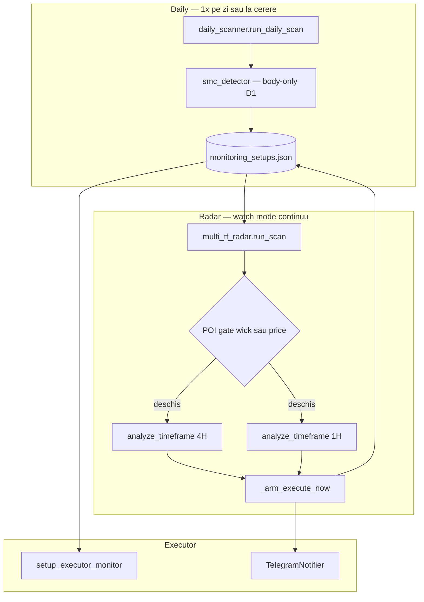

# Audit Multi-TF Radar — Glitch in Matrix V45

> **Proiect:** Apollo / Glitch in Matrix  
> **Fișier principal:** [`multi_tf_radar.py`](../multi_tf_radar.py) (~3.115 linii)  
> **Integrare:** [`daily_scanner.py`](../daily_scanner.py), [`monitoring_setups.json`](../monitoring_setups.json), [`setup_executor_monitor.py`](../setup_executor_monitor.py)  
> **Baseline cod:** commit `b09dbcb` (V45 SMC + radar POI wick)  
> **Data audit:** 2026-06-30  
> **Scop document:** review în echipă — cum rulează radarul, sincronizarea cu Daily, conformitate strategie, ce îmbunătățim

---

## 1. Rezumat executiv

| Întrebare | Răspuns scurt |
|-----------|---------------|
| **Rulează din 10 în 10 secunde?** | **Nu fix.** Default VPS = **30s**. **10s** doar când există pullback activ pe 4H/1H. **5s** când prețul e la <10 pips de FVG LTF. |
| **Așteaptă confirmări în sync cu Daily?** | **Parțial.** Radar citește macro din JSON (Daily scrie). POI gate radar = **wick + preț**; scanner lifecycle = **preț only** → pot fi desincronizați. |
| **Respectă strategia Glitch V45?** | **Da** — Trigger A+B post-CHoCH; PAS 2 blocat (V45.1); POI wick scanner sync. |
| **Verdict general** | **Production-ready** — P0 implementat; P1 observabilitate opțional. |

---

## 2. Rolul radarului în arhitectură

Radarul **nu** recalculează bias-ul Daily (REVERSAL/CONTINUITY). Asta e treaba `daily_scanner.py` + `smc_detector.py`.

Radarul face:
1. Citește setup-uri active din `monitoring_setups.json`
2. Verifică dacă **wick/preț Daily** intersectează **POI** → intră în **pândă** (scan 4H + 1H)
3. Caută **CHoCH/BOS + FVG** pe LTF aliniat cu direcția Daily
4. Armează **`EXECUTE_NOW`** când trigger live + guards trec
5. Scrie înapoi în JSON (`radar_*`, `EXECUTE_NOW`, timestamps)
6. Trimite alerte Telegram (CHoCH rising edge, EXECUTE o singură dată per setup)



---

## 3. Cum pornește și la ce interval rulează

### Entry point

```bash
python3 multi_tf_radar.py --watch --interval 30
```

| Argument | Default | Efect |
|----------|---------|-------|
| `--watch` | off | Loop continuu; fără el = un singur scan |
| `--interval` | **30** secunde | Interval de bază (nu 10!) |
| `--symbol` | toate active | Filtrează un simbol |
| `--all` | — | **Parametru misleading** — nu schimbă comportamentul efectiv în mod clar |

### Interval adaptiv (V25.2)

Funcție: `_compute_adaptive_interval()` — linii ~2998–3040

| Condiție | Interval | Scop |
|----------|----------|------|
| Orice setup cu `radar_*_distance_pips < 10` | **5s** | Sniper — preț aproape de FVG LTF |
| Orice setup cu status `WAITING` + `PULLBACK` pe 4H/1H | **10s** | Pullback activ — refresh mai rapid |
| Altfel | **base_interval** (30s default) | Normal |

**Important:** intervalul adaptiv citește JSON-ul din **ciclul anterior** — primul ciclu după start folosește mereu 30s.

### Verdict polling

- **30s baseline** e rezonabil pentru POI Daily (wick touch e eveniment de lumânare D1).
- **10s** la pullback LTF e util — nu e excesiv.
- **5s** la <10 pips de FVG e agresiv dar justificat pentru sniper entry.
- Dacă echipa vrea „10s fix peste tot”, trebuie schimbat `--interval 10` sau logica adaptivă — **nu e comportamentul actual**.

---

## 4. Lifecycle complet — stări și tranziții

### 4.1 Scanner (`daily_scanner.py`)

Funcție: `_apply_v431_lifecycle_gates()` — linii ~1452–1486

| Status curent | Condiție | Status nou |
|---------------|----------|------------|
| `WAITING_D1_PULLBACK` | preț în POI | `MONITORING` |
| `MONITORING` | preț ieșit din POI | `WAITING_D1_PULLBACK` (+ reset chei radar) |
| `READY` | preț ieșit din POI | `WAITING_D1_PULLBACK` |
| orice (fără fill) | `structural_breach=True` | `INVALIDATED` |

**POI scanner:** `_price_in_daily_poi()` — **doar preț punctual** în `[poi_bottom, poi_top]`, nu wick Daily.

### 4.2 Radar — stări LTF (`PullbackStatus`)

Enum linii ~384–391:

| Status | Semnificație |
|--------|--------------|
| `WAITING_4H_CHOCH` / `WAITING_1H_CHOCH` | POI închis sau fără structură LTF |
| `WAITING_4H_PULLBACK` / `WAITING_1H_PULLBACK` | CHoCH + FVG există, preț nu e în zonă sau trigger expirat |
| `EXECUTE_NOW_4H` / `EXECUTE_NOW_1H` | Preț în FVG + trigger live ≤3 bare |

Radar **nu** folosește direct string-urile `MONITORING` / `WAITING_D1_PULLBACK` — folosește `daily_zone_validated`, `radar_*_status`, `radar_verdict`.

### 4.3 EXECUTE_NOW — armare și dezarmare

**Armare:** `_arm_execute_now()` ~2078  
**Update complet:** `_update_setup_with_radar()` ~2182  

| Eveniment | Efect |
|-----------|-------|
| Trigger live + guards OK | `EXECUTE_NOW=True`, flush JSON instant, Telegram 1× |
| Preț iese din FVG LTF | `_clear_execute_now_only` |
| LTF dezaliniat vs D1 (V42.3) | force disarm |
| RR shield < 2.0 | blocare EXECUTE |
| Executor respinge | `execute_now_blocked_at` — cooldown 30 min |
| `TRADE_OPEN` / `entry1_filled` | clear signal |

---

## 5. Gates strategice (detaliu)

### 5.1 POI Daily — V45 wick + preț

Funcție: `_evaluate_v43_daily_zone()` — linii ~153–222

```python
in_poi_wick  = wick D1 (high/low ultima bară) ∩ caseta POI
in_poi_price = preț live ∈ [poi_bottom, poi_top]
in_poi       = in_poi_wick OR in_poi_price
validated    = in_poi   # P/D NU e inclus aici
```

| Gate | Blochează scan 4H/1H? | Blochează EXECUTE? |
|------|----------------------|-------------------|
| POI (`validated`) | **Da** — H4/H1 goale dacă POI închis | Indirect (fără scan → fără trigger) |
| P/D ADR | **Nu** | **Da** — `_pd_guard_passed` |

**P/D ADR** (din JSON `adr_hl`, `adr_ll`, `adr_lh`):
- **LONG:** Discount — `price <= (adr_hl + adr_ll) / 2`
- **SHORT:** Premium — `price >= (adr_ll + adr_lh) / 2`

Fallback fără ADR în JSON: `_evaluate_pd_guard()` folosește midpoint D1 live (V36.5).

### 5.2 CHoCH / BOS pe 4H și 1H

Motor: `analyze_timeframe()` — linii ~854–1431  
Folosește `SMCDetector.detect_choch_and_bos()` pe bare H4/H1 (body-close, același detector ca D1).

**Două trigger-e EXECUTE în FVG (V31.0):**

| Trigger | Condiție | Linii |
|---------|----------|-------|
| **A — Sniper** | `_choch_bars_ago <= 3` + preț în FVG | ~1350–1357 |
| **B — Trend Rider** | `_bos_bars_ago <= 3` + preț în FVG | ~1358–1365 |

**V45.1 schimbări (implementate):**
- `_allow_bos_4h = False` — dezactivează shortcut V30.1
- **PAS 2 eliminat** — fără CHoCH real → `WAITING_4H_CHOCH` (nu BOS-as-CHoCH)
- **Trigger B păstrat** — BOS ≤3 bare **după** CHoCH (`bos.index > choch.index`) + în FVG

| Trigger | Condiție | Linii |
|---------|----------|-------|
| **A — Sniper** | `_choch_bars_ago <= 3` + preț în FVG | ~1350–1357 |
| **B — Trend Rider** | `_bos_trigger_bars_ago <= 3` (post-CHoCH) + preț în FVG | ~1321–1335 |

### 5.3 Reguli 1H

| Regulă | Funcție | Efect |
|--------|---------|-------|
| 1H EXECUTE necesită 4H aliniat | `_is_4h_aligned_for_1h_entry()` | 1H nu execută singur fără 4H |
| 1H CHoCH înainte de POI touch = stale | `_apply_h1_chronology_guard()` V43.8 | Respinge ghost triggers |
| FVG sintetic Daily (`daily_bias_active`) | guard V24.6 | EXECUTE doar cu CHoCH 4H **real**, nu doar BOS |

### 5.4 Poarta invalidare radar (V33)

`_apply_lifecycle_gates()` radar — linii ~2504

| Poartă | Regulă |
|--------|--------|
| **1 — Structural macro** | LONG + preț < `daily_swing_low` → INVALIDATED; SHORT + preț > `daily_swing_high` → INVALIDATED |
| **2 — TP fără entry** | Preț atinge `daily_tp_price` fără `entry1_filled` → COMPLETED_WITHOUT_ENTRY |
| **3 — Timeout** | **ELIMINATĂ** (V35) — setup-urile nu expiră pe timp |

---

## 6. Sincronizare Daily ↔ Radar

### 6.1 Cine scrie ce în JSON

**Daily scanner scrie (macro, la scan):**
- `symbol`, `direction`, `strategy_type`, `setup_type`
- `poi_top`, `poi_bottom`, `fvg_top`, `fvg_bottom`
- `adr_lh`, `adr_ll`, `adr_hl`, `poi_v43_source`
- `daily_swing_high/low`, `daily_target_price`, `d1_signal_*`
- `status`, `structural_breach`, `setup_time`

**Radar scrie (LTF, la fiecare ciclu watch):**
- `radar_4h_*`, `radar_1h_*` (CHoCH, FVG, status, distance)
- `radar_verdict`, `radar_execution_ready`, `radar_last_scan`
- `daily_zone_validated`, `pd_guard_passed`, `h4_structure_locked`
- `EXECUTE_NOW`, `execute_now_trigger_tf`, `execute_now_alert_sent`
- `poi_first_touch_time`, `h4_fvg_first_touch_time`

**Merge anti-race:** `_batch_sync_to_monitoring_setups()` — re-citește JSON la scriere (V22).

### 6.2 Riscuri desincronizare

| Risc | Descriere | Severitate |
|------|-----------|------------|
| **POI wick vs preț** | Scanner + radar: `poi_utils.poi_touch_active` | **Rezolvat V45.1** |
| **ADR stale** | P/D radar citește `adr_*` din JSON vechi | **Medie** — dacă Daily n-a rulat după BOS expansion |
| **Macro flip** | Scanner șterge `radar_*` la schimbare direction/strategy | **Scăzută** — intenționat |
| **Scrieri concurente** | Scanner + Radar + Executor pe același JSON | **Medie** — mitigat parțial de V22 batch sync |
| **Soft TTL scanner** | MONITORING >4 zile fără POI touch → drop (V40.3) | **Scăzută** |

### 6.3 Flux temporal recomandat (VPS)

```
06:00 UTC  → daily_scanner.py (refresh macro + POI + strategy_type)
continuu   → multi_tf_radar.py --watch --interval 30
continuu   → setup_executor_monitor.py (EXECUTE_NOW → ordine)
```

Radar **depinde** de Daily pentru POI/ADR/strategy — fără daily scan recent, label-urile pot fi stale dar LTF tot rulează pe JSON existent.

---

## 7. Telegram și executor

| Eveniment | Modul | Notă |
|-----------|-------|------|
| CHoCH 4H/1H rising edge | `_maybe_send_choch_alerts()` | O dată per tranziție |
| EXECUTE_NOW | `_arm_execute_now()` → `TelegramNotifier.send_execute_now_alert()` | 1× per setup (`execute_now_alert_sent`) |
| Port 8010 offline | `_send_radar_telegram_alert()` | După 3 eșecuri consecutive |
| Respingere executor | `setup_executor_monitor` → `execute_now_blocked_at` | Radar nu re-armează 30 min |

Variabile env: `TELEGRAM_BOT_TOKEN`, `TELEGRAM_CHAT_ID`

---

## 8. Conformitate strategie Glitch in Matrix V45

Referință: [`SMC_DETECTOR_AUDIT_IMPLEMENTATION_PLAN.md`](SMC_DETECTOR_AUDIT_IMPLEMENTATION_PLAN.md)

| Regulă instituțională | Implementare radar | Status |
|----------------------|-------------------|--------|
| D1 clasificare separată de execuție | Radar citește `strategy_type`, nu rescrie | **PASS** |
| Wick Daily ∩ POI → pândă | `_poi_box_intersects_wick` + `validated=in_poi` | **PASS** |
| P/D nu blochează pândă | `validated` fără `pd_passed` | **PASS** |
| P/D blochează EXECUTE | `_pd_guard_passed` la arm | **PASS** |
| CHoCH 4H body-close obligatoriu (fără BOS shortcut) | PAS 2 eliminat; Trigger B post-CHoCH | **PASS** |
| 1H doar după 4H aliniat | `_is_4h_aligned_for_1h_entry` | **PASS** |
| 1H nu înainte de touch POI | V43.8 chronology guard | **PASS** |
| W1 out of radar | Absent din pipeline radar | **PASS** |
| Body-close LTF | `detect_choch_and_bos` pe H4/H1 | **PASS** (post-V45 D1 body swings) |

---

## 9. Contradicții, cod mort, misleading

| # | Problemă | Locație | Impact |
|---|----------|---------|--------|
| 1 | ~~Trigger B vs V45~~ | — | **Rezolvat V45.1** — Trigger B post-CHoCH |
| 2 | ~~POI scanner preț vs radar wick~~ | `poi_utils.py` | **Rezolvat V45.1** |
| 3 | **`_strategy_type` nefolosit** | `analyze_setup` L1522 | Dead read post-V45 |
| 4 | **`print_result` Always-On** | ~L2825 | Log misleading „VALIDATED” mereu |
| 5 | **V31 REVERSAL+BOS guard** | ~L2429 | Probabil mort post-V45.1 (PAS 2 eliminat) |
| 6 | **`PullbackStatus.WAITING_DAILY_FVG`** | enum ~L384 | Niciodată setat |
| 7 | **`--all` flag** | `main()` / `run_scan` | Comportament neclar |
| 8 | **`_evaluate_confirmed_pullback_latch`** | ~L1759 | `allow_bos` încă pe continuation — inconsistent cu V45 |
| 9 | **Legacy radars** | `monitoring_radar.py`, `execution_radar.py` | Nu sunt engine-ul activ — pot confunda onboarding |

---

## 10. Backlog îmbunătățiri (pentru review echipă)

### P0 — Aliniere strategie (implementat V45.1)

| ID | Task | Fișier | Status |
|----|------|--------|--------|
| P0-1 | Blocare PAS 2 + Trigger B post-CHoCH | `multi_tf_radar.py` | **DONE** |
| P0-2 | POI wick lifecycle scanner | `daily_scanner.py`, `poi_utils.py` | **DONE** |

### P1 — Consistență și observabilitate

| ID | Task | Fișier | Efort |
|----|------|--------|-------|
| P1-1 | Fix `print_result` — afișare reală `daily_zone_validated`, `in_poi_wick` | `multi_tf_radar.py` | S |
| P1-2 | Unificare `_evaluate_confirmed_pullback_latch` — `allow_bos=False` V45 | `multi_tf_radar.py` ~L1759 | S |
| P1-3 | Actualizare `MULTI_TF_RADAR_GUIDE.md` / Command Center — 30s base, 10s adaptive | docs | S |
| P1-4 | Mesaj `_arm_execute_now` POI gate — textul zice „POI + P/D” dar gate e doar POI | L2082–2086 | S |

### P2 — Curățare

| ID | Task | Efort |
|----|------|-------|
| P2-1 | Eliminare enum `WAITING_DAILY_FVG`, `_strategy_type` dead read | S |
| P2-2 | Marcare deprecated `monitoring_radar.py`, `execution_radar.py` în README | S |
| P2-3 | Extindere `scripts/verify_v365_radar.py` — teste V45 POI wick + Trigger A-only | M |

---

## 11. Checklist operațional VPS

### Pornire

```powershell
# Terminal 1 — Daily (1x/zi sau după eveniment macro)
python daily_scanner.py

# Terminal 2 — Radar continuu
python multi_tf_radar.py --watch --interval 30

# Terminal 3 — Executor
python setup_executor_monitor.py
```

### Verificare rapidă

```powershell
# Interval adaptiv în log (caută 5s / 10s / 30s)
Get-Content logs\multi_tf_radar_stdout.log -Tail 30

# Câmpuri cheie JSON pentru un simbol
python -c "import json; d=json.load(open('monitoring_setups.json')); s=[x for x in d['setups'] if x['symbol']=='USDCAD'][0]; print({k:s.get(k) for k in ['status','strategy_type','direction','daily_zone_validated','EXECUTE_NOW','radar_4h_status','radar_verdict','poi_first_touch_time']})"

# Audit structural D1 (separat de radar)
python scripts/audit_structural_classification.py --symbol USDCAD BTCUSD --debug
```

### Ce să verificați împreună la review

- [ ] `strategy_type` + `direction` Daily = ce vedeți pe chart D1?
- [ ] `status` scanner vs `daily_zone_validated` radar — același moment POI?
- [ ] La touch POI wick: radar deschide scan (`[RADAR ALLOW]` în log)?
- [ ] EXECUTE vine pe **Trigger A** (CHoCH) sau **Trigger B** (BOS)? — decide P0-1
- [ ] `pd_guard_passed` la EXECUTE — Premium/Discount corect?
- [ ] După respingere executor: `execute_now_blocked_at` + cooldown 30 min?

---

## 12. Appendix — Funcții cheie (index rapid)

| Linii | Funcție | Rol |
|-------|---------|-----|
| 124–151 | `_price_in_poi_box`, `_poi_box_intersects_wick` | POI helpers |
| 153–222 | `_evaluate_v43_daily_zone` | POI + P/D evaluare |
| 271–305 | `_track_mitigation_touch` | Timestamps POI/FVG touch |
| 308–359 | `_apply_h1_chronology_guard` | Anti ghost 1H |
| 854–1431 | `analyze_timeframe` | Motor CHoCH/BOS/FVG/EXECUTE LTF |
| 1433–1726 | `analyze_setup` | Orchestrator per simbol |
| 2078–2175 | `_arm_execute_now` | Armare EXECUTE + Telegram |
| 2182–2502 | `_update_setup_with_radar` | Merge rezultate în setup dict |
| 2504–2604 | `_apply_lifecycle_gates` | Poarta 1/2 invalidare |
| 2606–2724 | `_batch_sync_to_monitoring_setups` | Atomic JSON write |
| 2901–2996 | `run_scan` | Ciclu principal |
| 2998–3040 | `_compute_adaptive_interval` | 5s / 10s / 30s |
| 3042–3067 | `watch_mode` | Loop + sleep |
| 3070–3115 | `main` | CLI entry |

---

## 13. Fișiere legacy (nu folosiți pentru review activ)

| Fișier | Status |
|--------|--------|
| [`multi_tf_radar.py`](../multi_tf_radar.py) | **ACTIV** — engine principal |
| [`monitoring_radar.py`](../monitoring_radar.py) | Legacy — distanță/monitoring simplu |
| [`execution_radar.py`](../execution_radar.py) | Legacy — radar 4H-only vechi |
| [`MULTI_TF_RADAR_GUIDE.md`](../MULTI_TF_RADAR_GUIDE.md) | Documentație V8.3 — parțial depășită de V45 |

---

## 14. Concluzie pentru sesiunea de review

1. **Radarul funcționează** ca layer LTF peste Daily — design corect pentru Glitch.
2. **Nu rulează fix 10s** — 30s normal, 10s/5s adaptiv; documentați asta în procedura VPS.
3. **Sync Daily** — POI wick aliniat scanner↔radar (V45.1).
4. **Trigger A + B post-CHoCH** — implementat; PAS 2 blocat.
5. Restul e **polish** (logs, dead code, docs).

**Propunere agendă meeting (30 min):**
- 5 min — arhitectură (secțiunea 2)
- 10 min — demo log VPS: POI gate + Trigger A/B
- 10 min — decizie P0-1 și P0-2
- 5 min — cine face P1/P2 și timeline

---

*Document generat pentru review echipă — Glitch in Matrix / Apollo V45.*
