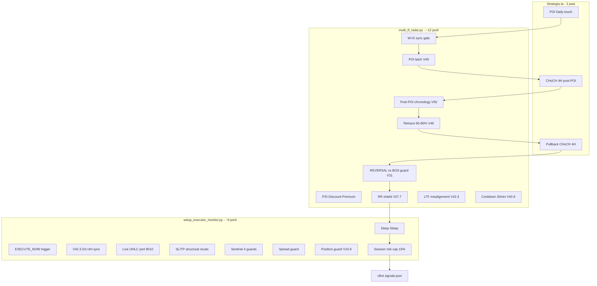

# Plan deblocare W→D→4H + Catalog porți

> **Data:** 2026-09-10  
> **Branch:** `cursor/v36-3-radar-live-sync`  
> **Strategie:** W→D→4H strict — **fără 1H** (confirmat)  
> **Scop document:** analiză înainte de implementare — de ce există atâtea porți și ce putem simplifica

---

## 1. Strategia ta (simplă, corectă)

În termeni SMC, fluxul ideal are **3 pași**:

```
┌─────────────────────────────────────────────────────────────────┐
│  PAS 1 — D1: Prețul ajunge în zona POI Daily (FVG / magnet)     │
│  PAS 2 — 4H: Așteptăm CHoCH structural aliniat cu bias D1       │
│  PAS 3 — 4H: Intrăm pe pullback-ul CHoCH-ului (retrace în zonă) │
└─────────────────────────────────────────────────────────────────┘
```

Asta e tot. Orice logică în plus trebuie să servească **exact** unul din acești 3 pași — altfel e zgomot.

---

## 2. Ce am construit de fapt (mult mai complicat)

În cod, același flux trece prin **două module** și **~20 de verificări** adăugate incremental (V31, V37, V40, V42, V49, V52, W+D sync, etc.) — fiecare patch a rezolvat un bug real, dar **s-a acumulat**.



**Concluzie:** strategia e simplă; **implementarea** a devenit un lanț defensiv lung din cauza bug-urilor trecute (semnale fantomă, EXECUTE fără SL, CHoCH înainte de POI, flip fals pe pullback intern).

---

## 3. Catalog porți — pe limba traderului

Legenda:

| Etichetă | Semnificație |
|----------|--------------|
| **ESENȚIALĂ** | Implementează direct unul din cei 3 pași ai strategiei |
| **UTILE** | Protecție rezonabilă; poate rămâne dacă nu blochează excesiv |
| **SUSPECTĂ** | Adăugată ca patch; blochează des fără beneficiu clar |
| **DE ELIMINAT / RELAXAT** | Propunere simplificare |

---

### 3.1 Radar — înainte de scan 4H

| Poartă | Fișier | Ce face | Verdict |
|--------|--------|---------|---------|
| **POI scan active** | `multi_tf_radar.py` | Fără touch POI (sau latch), **4H nu se scanează deloc** | **ESENȚIALĂ** — Pas 1 |
| **Direction valid** | `multi_tf_radar.py` | Setup fără `direction` buy/sell → skip | **ESENȚIALĂ** — baseline |
| **Live price (8010)** | `multi_tf_radar.py` | Fără cBot → nu avem preț live | **UTILE** — infra, nu strategie |
| **W+D sync gate** | `multi_tf_radar.py` | Dacă Weekly ≠ Daily în zona W → `WAITING_W_D_SYNC`, **zero EXECUTE** | **SUSPECTĂ** — strategia ta e W→D→4H, dar gate-ul poate ține setup-uri blocate permanent |
| **P/D guard (Discount/Premium)** | `multi_tf_radar.py` | Long doar sub equilibru ADR, Short doar peste | **UTILE** — SMC corect, dar poate bloca `execution_ready` când prețul e deja în POI |
| **Daily bias synthetic (V24.6)** | `multi_tf_radar.py` | Fără FVG natural pe D1 → blochează EXECUTE până la CHoCH 4H real | **UTILE** — anti-semnal fals |

---

### 3.2 Radar — detecție CHoCH 4H

| Poartă | Fișier | Ce face | Verdict |
|--------|--------|---------|---------|
| **Post-POI chronology (V50)** | `multi_tf_radar.py` | CHoCH 4H contează **doar după** `poi_first_touch_time` | **ESENȚIALĂ** — Pas 2 corect |
| **Filtru direcție vs D1** | `multi_tf_radar.py` | CHoCH bearish respins pe setup bullish | **ESENȚIALĂ** — aliniere D→4H |
| **Major swings only (V68)** | `smc_detector` + radar | Micro-pivoți nu generează CHoCH | **ESENȚIALĂ** — fix recent SMC |
| **Purge opposite impulse** | `multi_tf_radar.py` | CHoCH bearish vechi invalidat de rally bullish | **UTILE** — anti-zombie |
| **BOS vs CHoCH (V31)** | `multi_tf_radar.py` | REVERSAL: doar CHoCH ca trigger; CONTINUATION: acceptă BOS | **UTILE** — dar executorul nu acceptă BOS (vezi 3.4) → ** inconsistență** |

---

### 3.3 Radar — intrare pe pullback (Pas 3)

| Poartă | Fișier | Ce face | Verdict |
|--------|--------|---------|---------|
| **Retrace 60–80% (V46)** | `multi_tf_radar.py` | Prețul trebuie în banda Premium/Discount a impulsului CHoCH | **ESENȚIALĂ** — Pas 3 (dar banda fixă 60–80% poate fi prea strictă) |
| **POI latch pentru entry (V49)** | `multi_tf_radar.py` | `in_poi_entry` cere POI touch latched **sau** preț în POI acum | **ESENȚIALĂ** — leagă Pas 1 de Pas 3 |
| **RR shield (V37.7)** | `multi_tf_radar.py` | Blochează EXECUTE dacă RR structural < 1:2 | **UTILE** — risk management, nu SMC pur |
| **LTF misalignment (V42.3)** | `multi_tf_radar.py` | 4H CHoCH direction ≠ D1 → dezarmare | **ESENȚIALĂ** — dar duplică filtre D1 |

---

### 3.4 Radar — armare EXECUTE_NOW

| Poartă | Fișier | Ce face | Verdict |
|--------|--------|---------|---------|
| **Arm POI gate (V49)** | `_arm_execute_now()` | Fără POI touch/latch → nu setează EXECUTE_NOW | **ESENȚIALĂ** |
| **Cooldown 30 min (V40.9)** | `_arm_execute_now()` | După respingere executor → radar refuză re-arm 30 min | **SUSPECTĂ** — o respingere SL/TP poate „ucide" setup-ul |
| **W+D block la arm** | `_arm_execute_now()` | Refuză armare dacă W≠D | **SUSPECTĂ** — dublă cu gate-ul din 3.1 |
| **Flush JSON instant** | `_arm_execute_now()` | Scrie EXECUTE_NOW imediat sub lock | **UTILE** — evită race cu executor |

---

### 3.5 Executor — după EXECUTE_NOW

| Poartă | Fișier | Ce face | Verdict |
|--------|--------|---------|---------|
| **Deep Sleep** | `setup_executor_monitor.py` | Dacă activ → **zero procesare**, return total | **DE VERIFICAT VPS** — poate explica „0 execuții 3 săptămâni" |
| **Trigger activ (V54)** | `setup_executor_monitor.py` | Cere `EXECUTE_NOW is True` (strict bool) | **ESENȚIALĂ** |
| **V42.3 structural sync** | `setup_executor_monitor.py` | Cere `radar_4h_choch_detected` + direcție = D1 | **SUSPECTĂ** — respinge BOS CONTINUATION chiar dacă radar a armat |
| **Live OHLC fail-hard** | `setup_executor_monitor.py` | Fără D1+H4 live de la 8010 → retry infinit | **UTILE** — dar blochează dacă cBot instabil |
| **SL/TP recalc live** | `setup_executor_monitor.py` | Recalculează SL 4H + TP D1 la execuție | **ESENȚIALĂ** — nu tranzacționa cu SL stale |
| **SL/TP fail → pop EXECUTE_NOW** | `setup_executor_monitor.py` | Șterge semnalul + cooldown radar | **SUSPECTĂ** — prea agresiv |
| **Sentinel (4 guards)** | `setup_executor_monitor.py` | RR, SL cap, capital, `h4_structure_locked` | **UTILE** — dar Guard#4 era bug (fix V19.14b) |
| **Spread / Position / Risk cap** | `setup_executor_monitor.py` | Protecții broker/session | **UTILE** — operațional |

---

## 4. De ce s-a blocat după eliminarea 1H

Eliminarea 1H (`commit 0ba1d73`) **nu a stricat codul** — a schimbat **viteza și toleranța** trăgaciului:

| Înainte (cu 1H) | După (doar 4H) |
|-----------------|----------------|
| CHoCH pe 1H în câteva ore | CHoCH pe 4H în 16–32h |
| Entry pe FVG 1H (zonă mică) | Entry pe retrace 60–80% impuls 4H (zonă strictă) |
| `multi_entry_plan: 1H + 4H` | Doar `4H` — o singură șansă de trigger |
| Mai puține porți pe LTF | Aceleași porți W+D, P/D, V42.3, RR — dar LTF mai lent |

**Simptom tipic:** vezi alertă Telegram „CHoCH 4H detectat", dar **niciodată** `EXECUTE_NOW=True` — pentru că Pas 2 e OK, dar Pas 3 (retrace 60–80%) sau o poartă downstream (V42.3, W+D, cooldown) blochează.

---

## 5. Propunere simplificare (păstrând strategia ta)

### 5.1 Nucleu minim (3 porți strategice + 2 protecții)

```
1. POI Daily touch/latch          → activează scan 4H
2. CHoCH 4H post-POI, dir = D1   → confirmare structurală
3. Preț în zona pullback CHoCH   → EXECUTE_NOW
   + SL/TP live la execuție      → protecție execuție
   + cBot 8010 online            → infra
```

### 5.2 Porți de relaxat / eliminat (prioritate)

| # | Poartă | Acțiune propusă | Motiv | Status |
|---|--------|-----------------|-------|--------|
| 1 | **V42.3 cere CHoCH chiar pentru BOS CONT** | Acceptă BOS când `strategy_type=continuation` | Inconsistență radar↔executor | **DECIS** — Faza B |
| 2 | **Cooldown 30 min după orice respingere** | Cooldown doar pe erori non-transient; V42.3 disarm fără cooldown | Setup valid pierdut permanent | **DECIS** — Faza B |
| 3 | **W+D sync — block total EXECUTE** | Păstrează monitor + status, dar nu bloca dacă D bias clar în POI | Prea multe setup-uri în WAITING_W_D_SYNC | **DECIS 2026-10-03** — warn-only |
| 4 | **Retrace 60–80% fix** | 55–85% sau preț în FVG CHoCH 4H | Banda prea îngustă pe 4H | **DECIS 2026-10-03** — V46.1 |
| 5 | **JSON stale 1H** | Normalizare la load: `multi_entry_plan→['4H']` | Artefacte post-migrare |
| 6 | **Deep Sleep** | Verificare VPS + documentare `/resume` | Poate opri executor complet |

### 5.3 Porți de păstrat (merită efortul)

- Post-POI chronology V50
- Filtru direcție D1 = 4H
- POI latch V49
- SL/TP live la execuție
- Major swings (fix SMC recent pe branch)

---

## 6. Plan de implementare (faze)

### Faza A — Diagnostic (read-only, 1 sesiune)

**Pe VPS Windows:**

```powershell
# Deep sleep activ?
Get-Content data\deep_sleep_state.json

# Ultimele blocări executor
Select-String -Path logs\*.log -Pattern "DEEP SLEEP|V42.3|V49 POI|W+D|EXECUTE_NOW ABORT|EXEC SKIP" | Select-Object -Last 80

# Câte setup-uri au CHoCH dar fără EXECUTE?
# (inspect monitoring_setups.json manual)
```

**Output așteptat:** lista top 3 motive de blocare reale (nu teoretice).

### 6.1 Faza A — rulare automată (repo)

Pe VPS (sau local cu `data/` populat):

```powershell
cd "C:\Users\Administrator\Desktop\Glitch in Matrix\trading-ai-agent apollo"
python scripts/faza_a_skip_diagnostic.py
```

Scriptul citește `data/deep_sleep_state.json`, ultimele linii relevante din `logs/*.log` (dacă există) și `monitoring_setups.json`, apoi tipărește **top 3** motive probabile (`last_radar_skip_reason`, CHoCH fără EXECUTE, W+D, etc.).

**Rulare dev (2026-10-03):** fără `monitoring_setups.json` / `deep_sleep_state.json` locale; loguri arhive — activitate repetată `[W+D SYNC]` GBPUSD/USDCAD (monitor, nu executor abort). Pe VPS: rulează scriptul după pull pentru top 3 reale.

---

### Faza B — Fix-uri quick-win (cod)

| Task | Fișier | Efort |
|------|--------|-------|
| V42.3 acceptă BOS pe CONTINUATION | `setup_executor_monitor.py` | Mic |
| Disarm V42.3 fără cooldown 30 min | `setup_executor_monitor.py` | Mic |
| Normalizare JSON stale 1H la load | `monitoring_json_io.py` | Mic |
| Telemetrie `last_radar_skip_reason` | `multi_tf_radar.py` | Mic |
| Aliniere D1 SMC recent cu radar | verificare `direction` din scanner | Mediu |

---

### Faza C — Simplificare radar (dacă diagnosticul confirmă)

| Task | Fișier | Efort |
|------|--------|-------|
| Relaxare bandă retrace V46 (test A/B) | `multi_tf_radar.py` | Mediu |
| W+D gate → monitor only (nu block exec) | `multi_tf_radar.py` | Mediu |
| Audit `pd_guard` — nu bloca scan, doar exec | `multi_tf_radar.py` | Mediu |

---

### Faza D — Validare

```bash
pytest tests/test_4h_radar_canonical.py tests/test_d1_bias_canonical.py -v
```

**VPS:** restart monitoare → urmărește un setup real de la POI touch până la `signals.json`.

---

## 7. Fișiere cheie

| Rol | Path |
|-----|------|
| Scanare Daily | `daily_scanner.py`, `smc_detector/scan_setup.py` |
| Radar 4H | `multi_tf_radar.py` |
| Porți alerte | `radar_gates.py` |
| Executor | `setup_executor_monitor.py` |
| Stare setups | `monitoring_setups.json` |
| Bias D1 canonic | `smc_detector/d1_authority.py` |
| Audite referință | `docs/AUDIT_MULTI_TF_RADAR_DEEP.md`, `docs/AUDIT_SETUP_EXECUTOR_DEEP.md` |
| Plan strategic | `docs/W_D_4H_MASTER_PLAN.md` |

---

## 8. Decizii încheiate (2026-10-03)

| # | Întrebare | Decizie | Efect în cod |
|---|-----------|---------|--------------|
| 1 | W+D gate | **Doar avertisment** — nu blochezi EXECUTE când D bias + POI sunt clare | `multi_tf_radar`: status `WAITING_W_D_SYNC` + Telegram warn; fără disarm/arm block |
| 2 | Retrace V46 | **55–85% SAU preț în FVG CHoCH 4H** (suficient una) | `_RETRACE_ENTRY_MIN/MAX`; Pas 3 acceptă FVG structural ca alternativă la bandă |
| 3 | RR shield V37.7 | **Doar avertisment Telegram** — EXECUTE permis | `_rr_shield_blocks_execute` → log + alert, `return False` |
| 4 | Diagnostic VPS | **Acum** (acces RDP) | Faza A — script `scripts/faza_a_skip_diagnostic.py` + secțiunea 6.1 |

### 8.1 Implicații

**W+D warn-only:** Setup-urile rămân vizibile în `WAITING_W_D_SYNC` pentru context macro, dar radarul poate arma `EXECUTE_NOW` dacă D1 + POI + Pas 3 sunt satisfăcute. Counter-trend W1 rămâne marcat (`LOW_W1_COUNTER_TREND`).

**Retrace V46.1:** Banda Premium/Discount se lărgește la 55–85%; dacă prețul stă în FVG-ul CHoCH 4H (structural) cu POI latched, Pas 3 este valid fără bandă.

**RR warn-only:** Semnalele sub RR 1:2 nu mai sunt oprite de radar; operatorul primește avertisment Telegram. Sentinelă executor rămâne neschimbată.

**Diagnostic VPS:** Confirmă sau infirmă ipotezele (retrace, W+D, RR, Deep Sleep) înainte de tuning suplimentar (Faza C).

---

## 9. Rezumat executiv

| Aspect | Situație |
|--------|----------|
| **Strategia** | Simplă și corectă: POI D → CHoCH 4H → pullback |
| **Codul** | ~20 porți acumulate din patch-uri defensive |
| **1H removal** | A încetinit LTF, nu a rupt pipeline-ul |
| **Blocaj probabil** | Pas 3 (retrace strict) + V42.3 + cooldown + eventual Deep Sleep |
| **Direcție** | Simplificare controlată — păstrăm nucleul SMC, relaxăm porțile SUSPECTE |

---

*Plan + decizii sec. 8 (2026-10-03). Implementare Faza B pe branch `cursor/v36-3-radar-live-sync`.*
