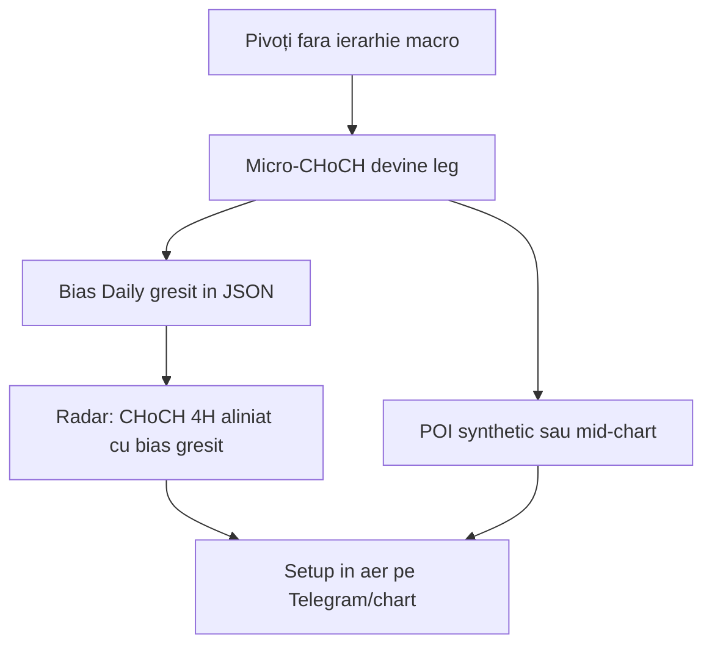
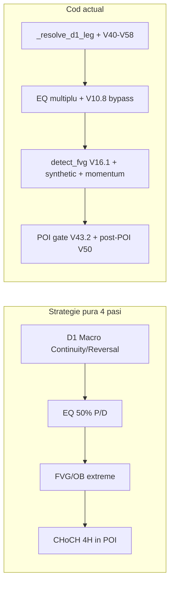
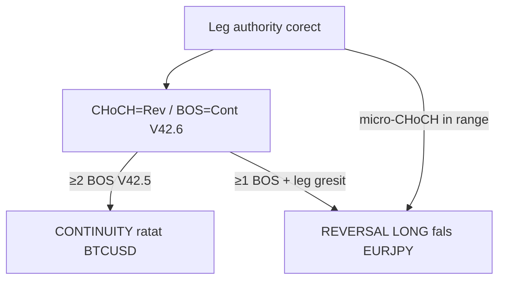
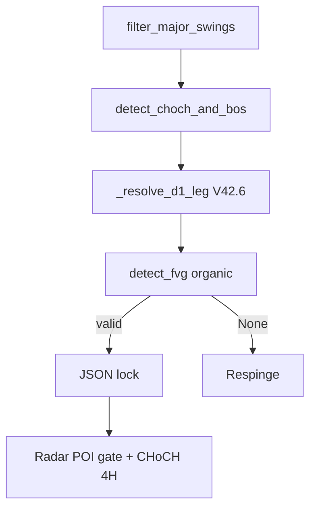
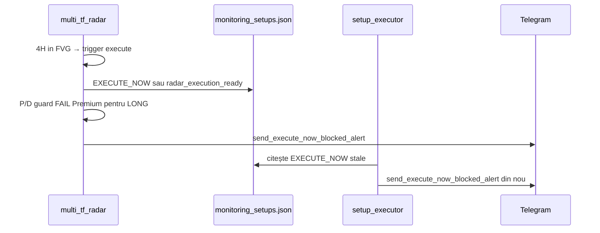
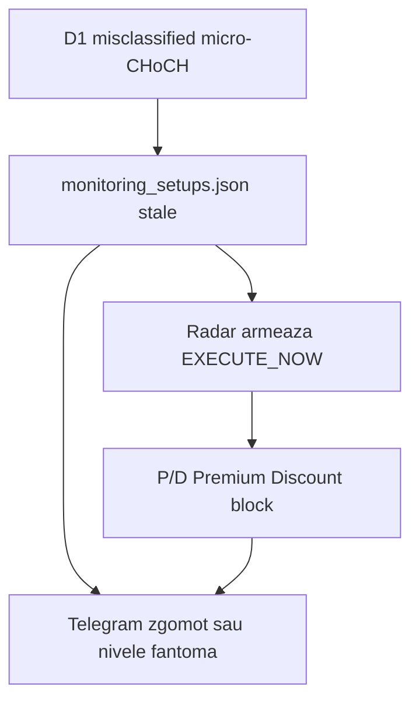
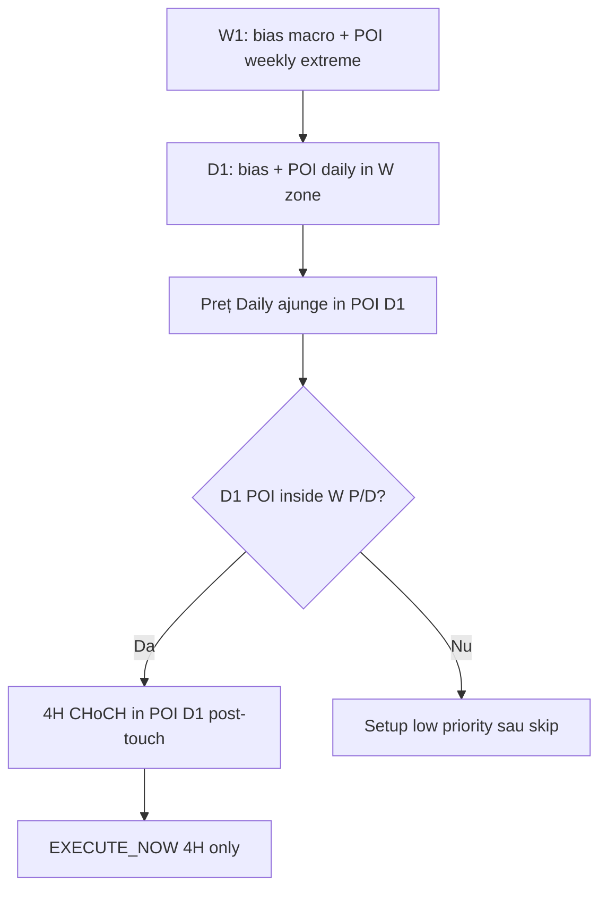

# Audit de aliniere SMC + Plan de perfecționare — Glitch in Matrix by ФорексГод

**Tip:** Audit read-only + **plan de implementare** (post-review)  
**Data audit:** 2026-07-13 · **Ultima actualizare plan:** 2026-07-20  
**Status plan:** **Faza B DONE local** (2026-07-20) — P0 + Faza A + JSON identity lock; **deploy VPS + wipe B3** pending  
**Scope:** `smc_detector.py`, `multi_tf_radar.py`, `daily_scanner.py` (cache)  
**Context:** Verificare față de cei 4 pași logici ai strategiei de bază. Planul V59 (patch LH/reclaim) este **oprit** — direcția este **perfecționare minimă** pe baza auditului, nu straturi noi.

**Principiu build:** modificăm **doar** ce produce erori vizibile (EURJPY LONG fals, GBPUSD stale, setup-uri în Premium). Pasul 4 (radar) rămâne neschimbat dacă review-ul confirmă alinierea.

---

## Verdict executiv

| Pas | Strategie pură (intenție) | Aliniere cod actual | Deviație majoră |
|-----|---------------------------|---------------------|-----------------|
| **1** | Impuls macro D1 clar → Continuity vs Reversal | Parțial | `_resolve_d1_leg` + V40/V42/V57/V58 suprapun reguli; impulsul nu e „High absolut → Low absolut” |
| **2** | 50% Equilibrium; LONG doar în Discount | Parțial | FVG filtrat la selecție; **preț curent LONG peste 50% nu e blocat** (REVERSAL skip complet) |
| **3** | POI (FVG/OB) doar în zone extreme P/D | Parțial | V16.1 filtrează FVG la `middle` vs EQ; fallback sintetic + momentum + buffer 20% |
| **4** | CHoCH 4H doar după touch POI Daily | **Da (cu latch)** | Scan LTF **adormit** fără POI; nu numără CHoCH zilnic în aer |

**Concluzie:** mașinăria a acumulat straturi V8–V58 care **departesc** parțial strategia simplă. Problemele EURJPY/GBPUSD provin mai ales din **Pasul 1** (clasificare D1), nu din radar LTF. **Root cause:** botul etichetează setup-uri fără a citi bias-ul prin povestea structurală HH/HL/LH/LL — vezi secțiunea dedicată mai jos.

---

## Reguli SMC canonice (referință — nu negociabile la build)

| Eveniment structural | Semnal | Strategy type | Condiție |
|---------------------|--------|---------------|----------|
| Trend **bearish** (LH + LL majori) → body-close **peste** ultim high major | **CHoCH bullish** | **REVERSAL** | Schimbare de caracter |
| Trend **bullish** confirmat (HL majori) → body-close **peste** ultim high | **HH → BOS bullish** | **CONTINUITY** | Continuare — **NU reversal** |
| Trend **bullish** → body-close **sub** ultim low major | **CHoCH bearish** | **REVERSAL** | Schimbare de caracter |
| Trend **bearish** confirmat (LH majori) → body-close **sub** ultim low | **LL → BOS bearish** | **CONTINUITY** | Continuare |
| Spike în range **fără** structură opusă validă | **Zgomot** | **Fără setup** | Nu e nici CHoCH, nici BOS |

**Eroare de evitat:** „HH după HL = reversal” — **greșit**. HH după HL în uptrend = **BOS = CONTINUITY**.

**Regula V42.6 (păstrată):** ≥1 BOS aliniat post-leg CHoCH → CONTINUITY. CHoCH fără BOS post-leg → REVERSAL. Aceasta funcționează **doar** dacă leg-ul și pivoții sunt macro-validați (nu pe zgomot local).

---

## Cum etichetează `smc_detector` AZĂ vs cum TREBUIE

### Problema centrală

Botul **nu citește bias-ul** parității prin secvența HH → HL → LH → LL ca pe chart. Etichetează după **ultimul eveniment local** + patch-uri V40–V58. De aici setup-urile **„în aer”** și CHoCH-uri LTF pe bias greșit.

### Ce stochează un pivot

`SwingPoint` are doar: `index`, `price`, `swing_type` (`high`/`low`), `candle_time`. **Fără** câmp `HH|HL|LH|LL`.

- `detect_swing_highs/lows()` → pivoți **geometrici** (fractal 3+3 body).
- **HH** → doar la comparare momentană `swing > prev_high` → poate genera CHoCH/BOS.
- **LH / HL** → **mute** — nicio ramură, nu intră în poveste.
- `macro_trend_from_swings()` numără LH/HL separat → **secundar**, adesea `neutral` (EURJPY).

### Pe ce bază etichetează un setup AZI

| Câmp | Sursa reală azi | Ce ar trebui (SMC pur) |
|------|-----------------|------------------------|
| **direction** (LONG/SHORT) | `current_trend` = direcția ultimului semnal din `_resolve_d1_leg()` | Bias din secvență macro pe **pivoți majori** |
| **strategy_type** | V42.6: BOS post-leg → CONTINUITY; altfel REVERSAL | CHoCH=Rev / BOS=Cont pe structură **majoră** validată |
| **CHoCH vs BOS** | `prev_trend` + HH/LL vs pivot anterior **immediat** | Același motor, dar pe pivoți **majorii** filtrați |
| **POI** | FVG organic sau **synthetic/momentum** (V24.6/V8.2) | Doar FVG/OB organic în extreme P/D |
| **Radar LTF** | `required_direction` din JSON → direction guard 4H | Moștenește bias D1 — garbage in, garbage out |

### Lanțul „setup în aer”



| Tip „în aer” | Simptom | Cauză |
|--------------|---------|-------|
| **Bias în aer** | LONG pe distribuție bearish | Micro-CHoCH @ 181.53, LH macro ~186 ignorat |
| **POI în aer** | Magnet fără FVG real | Synthetic / momentum / preserve JSON stale |
| **Trigger în aer** | CHoCH 4H valid local, invalid macro | Direction guard pe bias JSON greșit |

**Radar (Pas 4) e relativ curat** — POI gate V43.2 + post-POI V50. Nu repară D1 greșit; doar propagă.

---

## PASUL 1 — Direcția macro (D1): Continuity vs Reversal

### 1.1 Cum definește codul „impulsul major Daily” astăzi?

**Nu există o singură definiție „High absolut → Low absolut”.** Sunt **4 motoare paralele**:

#### A) Semnal structural — `detect_choch_and_bos()` (L1371–1583)

- Parcurge pivoți body (`detect_swing_highs/lows`, fractal 3+3 Daily).
- **HH** (`swing.price > prev_high`) + body-close confirmat → CHoCH sau BOS bullish.
- **LL** (`swing.price < prev_low`) + body-close → CHoCH sau BOS bearish.
- Impulsul unui CHoCH este implicit: `swing_broken.price` → `break_price` (folosit la EQ în `detect_fvg`, L1148–1153).

#### B) Leg authority — `_resolve_d1_leg()` (L2335–2544)

- Alege **leg CHoCH** via `_find_leg_choch()`.
- **Continuation:** dacă există ≥1 BOS în aceeași direcție **după** leg → `strategy_type = 'continuation'`, semnal = ultimul BOS (L2522–2536).
- **Reversal:** dacă nu există BOS post-leg → `strategy_type = 'reversal'`, semnal = leg CHoCH (L2538–2544).
- Intervine și: V40 breakdown, V45/V58 reclaim, V43.4 distribution, V57/V58 post-leg flip, hist flip.

#### C) Active Dealing Range (ADR) — `build_active_dealing_range()` (L1599+)

- Impuls **post-anchor** (index semnal): perechi HH→HL (bullish) sau LH→LL (bearish) din swing-uri după leg.
- Definește `container_high/low`, `current_swing_high/low` pentru clip POI și breach — **nu** neapărat extrem absolut al graficului.

#### D) Equilibrium în `scan_for_setup()` (L4011–4029)

| Strategy | Funcție | Impuls măsurat |
|----------|---------|----------------|
| **Reversal** | `calculate_equilibrium_reversal()` | Ultim swing **înainte** de CHoCH → preț break CHoCH (leg pre-CHoCH) |
| **Continuity** | `calculate_equilibrium_continuity()` | Ultim swing **după** CHoCH → break BOS (impuls post-CHoCH) |

**Aliniere strategie pură:**  
- Separarea Reversal (leg vechi) vs Continuity (impuls curent) la **equilibrium** — **DA**, concept corect V8.2.  
- „Impuls major” ca singur High/Low absolut al distribuției — **NU**; e ancorat pe ultimul semnal + pivoți locali.

---

### 1.2 Cum stabilește Continuity vs Reversal?

**Pipeline principal în `scan_for_setup()`:**

```
detect_choch_and_bos()
  → filter_internal_range_signals() [V40]
  → _resolve_d1_leg() → (latest_signal, strategy_type, current_trend, leg_choch)
  → [V58 macro gates]
  → resolve_d1_poi() → FVG/POI
```

**Regula efectivă V42.6:**

```2522:2544:smc_detector.py
        if len(same_dir_bos) >= 1:
            latest_signal = same_dir_bos[-1]
            strategy_type = 'continuation'
            ...
            return latest_signal, strategy_type, current_trend, leg_choch
        ...
        return leg_choch, 'reversal', leg_choch.direction, leg_choch
```

| Condiție | Rezultat |
|----------|----------|
| Leg CHoCH + ≥1 BOS același sens post-leg | **CONTINUITY** |
| Leg CHoCH fără BOS post-leg | **REVERSAL** |
| Fără leg / neutral | setup respins sau bias fallback (daily_scanner) |

**Deviații față de SMC simplu:**

1. **Un singur BOS** post-leg suficient pentru Continuity (V42.6 a relaxat de la ≥2).
2. **V8.2 MOMENTUM** (L3881+): ≥3 BOS consecutive → FVG sintetic momentum, ocolește POI organic.
3. **V40 range lock** poate forța bearish indiferent de micro-CHoCH bullish.
4. **V57/V58** flip/hist flip când leg invalid — override manual al Continuity/Reversal.
5. **`determine_daily_trend()`** folosește același `_resolve_d1_leg` dar adaugă straturi BOS sequence + swing voting — poate diverge de `scan_for_setup`.

**Caz EURJPY:** micro CHoCH bullish devine **leg** → fără BOS post-leg → etichetat **REVERSAL** long, deși macro vizual e bearish. Problema e la **Pasul 1**, nu la radar.

---

## PASUL 2 — Harta de preț (Premium / Discount via Equilibrium 50%)

### 2.1 Există regula 50% Equilibrium?

**Da — în mai multe locuri, cu formule diferite:**

| Loc | EQ = 50% din |
|-----|----------------|
| `detect_fvg()` L1148–1153 | `swing_broken` → `break_price` al semnalului |
| `calculate_equilibrium_reversal()` | Swing pre-CHoCH → break CHoCH |
| `calculate_equilibrium_continuity()` | Swing post-CHoCH → break BOS |
| `validate_fvg_zone()` | `(macro_high + macro_low) / 2` documentat |
| `_evaluate_v43_daily_zone()` (radar) | `(adr_hl + adr_ll)/2` LONG sau `(adr_ll + adr_lh)/2` SHORT din JSON |

### 2.2 Filtrare FVG la selecție (Pasul 3 overlap)

În `detect_fvg()` — **activă, strictă pe middle FVG:**

```1157:1168:smc_detector.py
        if equilibrium is not None and impulse_size > 0:
            for fvg in all_fvgs:
                if orderflow_direction == 'bullish':
                    if fvg.middle < equilibrium:
                        pd_valid_fvgs.append(fvg)
                else:
                    if fvg.middle > equilibrium:
                        pd_valid_fvgs.append(fvg)
```

LONG: doar FVG cu **middle sub 50%** impulsului semnalului. SHORT: middle peste 50%.

### 2.3 Barieră nativă: interzice LONG dacă prețul curent e în Premium?

**Nu — nu există barieră strictă universală.**

#### A) `validate_fvg_zone()` în `scan_for_setup` — **DEZACTIVAT ca gate** (V10.8)

```4036:4052:smc_detector.py
            # V10.8: validate_fvg_zone este INFORMATIV — nu mai blocăm nicio strategie.
            ...
            if not is_valid_zone:
                print(f"[V10.8 INFO: FVG în afara zonă ... — continuăm oricum]")
                # ✅ V10.8: NICIUN return None
```

Buffer aplicat: bullish `equilibrium * 1.20`, bearish `equilibrium * 0.80` — și tot nu blochează.

#### B) Filtru preț curent — `calculate_premium_discount_zones()` (L4845–4890)

| Strategy | Filtru preț curent |
|----------|-------------------|
| **REVERSAL** | **SKIP complet** (V15.2) — „CHoCH+FVG confirmă structural” |
| **CONTINUITY** | Respinge doar la status **READY** dacă LONG > **85%** din range daily sau SHORT < **15%** |
| **MONITORING** | **Bypass total** P/D pe preț curent (V26.0) |
| **MOMENTUM** | Skip P/D |

**Aliniere strategie pură:**  
- EQ 50% pentru **alegerea FVG** — parțial aliniat.  
- **Interzicerea cumpărării când preț > 50%** — **NU** pentru Reversal; foarte slab pentru Continuity (doar extreme 85% la READY).

---

## PASUL 3 — Magnetul (Imbalance-uri mari Daily: FVG / Order Blocks)

### 3.1 Unde și cum sortează POI?

**Flux în `scan_for_setup()`:**

1. `resolve_d1_poi()` (L1832) — orchestrator V43.
2. Opțional **preserve** POI stocat din JSON dacă preț în ADR (`should_preserve_stored_poi`).
3. Altfel `detect_fvg()` → selecție V16.1.
4. Fallback **synthetic** `_build_v246_synthetic_fvg()` dacă continuation fără FVG (L1926–1929).
5. Fallback **momentum** synthetic dacă ≥3 BOS (L3881+).

**Sortare FVG valid (`detect_fvg`, L1170–1195):**

1. Filtru P/D pe `fvg.middle` vs equilibrium (Pasul 2).
2. Preferă FVG **post-semnal** (`index >= choch.index`).
3. V43 continuation: clip în ADR (`_fvg_within_adr`).
4. Sort: **cel mai recent** (index max), apoi **cel mai mare gap**.
5. Respinge „POI zombie” dacă conflict cu LH/HL ADR (continuation).

**Order Blocks:** `detect_order_block()` (L766+) — ultima lumânare opusă înainte de impuls; folosit pentru entry/SL dacă `ob_score >= 7` (L4914+). **Nu** e filtrul principal de selecție POI Daily — FVG domină via `resolve_d1_poi`.

### 3.2 FVG-uri doar în Discount (LONG) / Premium (SHORT)?

**Parțial DA la selecție, cu excepții:**

| Mecanism | Comportament |
|----------|--------------|
| V16.1 `middle < EQ` / `> EQ` | **DA** — filtrează FVG-urile din zona greșită |
| `validate_fvg_zone` buffer 20% | Permite FVG până la EQ×1.20 (LONG) — zonă mai largă decât 50% strict |
| FVG detection wick | Gap detectat cu **wick** `high/low` (L999–1020), nu body — inconsistență față de pivoți body |
| Fără FVG valid P/D | **Synthetic equilibrium zone** (45–60% range) — POI artificial, nu imbalance organic |
| Momentum ≥3 BOS | **Întreg range swing** sau ultimele 20 bare — **nu** extreme Discount/Premium |
| Scan `[start_idx - 20 : end]` | Include FVG-uri **înainte** de semnal cu 20 bare — pot fi mid-chart |

**Aliniere strategie pură:**  
- Intenția „magnet doar în adâncimea Discount / vârf Premium” — **implementată la selecție FVG**, dar **subminată** de synthetic fallback, momentum, preserve JSON, și wick-FVG.

---

## PASUL 4 — Trăgaciul (confirmare CHoCH 4H în zonă)

### 4.1 Scanarea 4H/1H e blocată până la POI Daily?

**DA — cu excepția latch-ului post-touch (V47.1).**

În `multi_tf_radar.analyze_setup()` (L1992–2082):

```python
daily_zone_validated = _v43_zone['validated']   # = in_poi (preț/wick în caseta POI)
_poi_scan_active = daily_zone_validated or setup_data.get('radar_panda_active')
```

| `_poi_scan_active` | Comportament |
|--------------------|--------------|
| **False** | `tf_1h`, `tf_4h` = `_empty_tf_waiting()` — **zero analiză CHoCH reală** |
| **True** | Rulează `analyze_timeframe()` pe 1H și 4H |

Mesaj explicit când gate închis (L2027–2029):

```
⏳ [V43.2 POI GATE] ÎNCHISĂ — wick/preț în afara POI [...]
LTF CHoCH ignorat până la touch POI + zonă instituțională ADR corectă
```

**`validated = in_poi`** (L507) — touch în caseta POI din JSON; `pd_passed` e calculat separat și **nu** blochează deschiderea scanului LTF.

### 4.2 După POI: cum se filtrează CHoCH 4H?

În `analyze_timeframe()` (L1606–1630):

- **V50 POST-POI:** dacă `poi_touch_latched` sau `daily_in_poi`, păstrează doar CHoCH/BOS **după** `poi_first_touch_time`.
- **V47:** prioritate CHoCH; BOS doar dacă `allow_bos_4h=True` (continuation, POI activ).
- **Direction guard:** ignoră CHoCH contrar bias Daily.

**EXECUTE_NOW (V46):** necesită POI + retrace 60–80% pe impuls CHoCH/BOS LTF — separat de simpla detectare.

### 4.3 Codul caută CHoCH 4H zilnic fără POI?

**NU** — pentru setup-uri din `monitoring_setups.json`:

- Fără touch POI Daily → radar **nu descarcă/analizează** structura 4H/1H (placeholder WAITING).
- Header V36.5 confirmă: P/D blochează **EXECUTE**, nu scan — dar **V43.2 POI gate** blochează efectiv scanul LTF.

**Excepție:** după primul touch, `radar_panda_active` / `poi_touch_latched` menține scan activ chiar dacă prețul iese din casetă (V47.1).

**Aliniere strategie pură:**  
- **Da** — trăgaciul LTF e condiționat de magnet Daily (POI touch).  
- Nu e „adormit permanent”, dar e **inactiv până la POI** — conform intenției strategiei secvențiale.

---

## Diagramă — flux simplu vs flux actual



---

## Unde s-a complicat mașinăria (rezumat deviații)

1. **Pasul 1 supra-instrumentat:** V40, V42.5 leg, V43.4, V57/V58 flip, momentum BOS — clasificarea D1 nu mai e „CHoCH=reversal, BOS=continuation” pur.
2. **Pasul 2 diluat:** V10.8 elimină blocarea FVG vs EQ; V15.2 skip P/D pe preț pentru Reversal; V26 bypass MONITORING.
3. **Pasul 3 ocolit:** synthetic FVG, momentum zone, preserve POI JSON, wick gaps vs body pivots.
4. **Pasul 4 relativ curat:** POI gate + post-POI chronology — cel mai apropiat de strategia secvențială.

---

## Fișiere și funcții cheie (referință rapidă)

| Pas | Fișier | Funcții |
|-----|--------|---------|
| 1 | `smc_detector.py` | `detect_choch_and_bos`, `_resolve_d1_leg`, `build_active_dealing_range`, `scan_for_setup` |
| 2 | `smc_detector.py` | `calculate_equilibrium_*`, `validate_fvg_zone`, `calculate_premium_discount_zones` |
| 3 | `smc_detector.py` | `detect_fvg`, `resolve_d1_poi`, `detect_order_block` |
| 4 | `multi_tf_radar.py` | `analyze_setup`, `_evaluate_v43_daily_zone`, `analyze_timeframe`, `_filter_structural_post_poi` |

---

## Lecții din istoric — de ce „CHoCH=Reversal / BOS=Continuity pur” nu e suficient singur

Am avut deja regula pură (sau aproape) și a produs **probleme diferite** în funcție de prag și de leg authority:

| Versiune | Regulă | Problema observată |
|----------|--------|-------------------|
| **V42.5** | CONTINUITY doar cu **≥2 BOS** post-leg | **BTCUSD** bearish lung + 1 BOS → REVERSAL greșit; **EURUSD** 1 BOS curat → nu trecea CONTINUITY |
| **V42.6** (live) | **≥1 BOS** post-leg → CONTINUITY | Repară BTCUSD/EURUSD, dar **EURJPY** micro-CHoCH fără BOS → REVERSAL LONG fals |
| **V44.2** | `classify_setup_type()` | **Revertit** — a stricat detectarea setup-urilor |
| **Bug sticky leg** | `_find_leg_choch()` | **USDCAD** ține leg bearish vechi deși există CHoCH bullish recent |
| **Audit Fibonacci** | — | Problema reală a fost **lipsa BOS (Continuity)**, nu filtrul P/D prea strict |

**Concluzie:** regula CHoCH/BOS e corectă SMC **doar dacă leg-ul macro e ales corect înainte de etichetare**. Fără fix pe leg authority, oscilăm între „prea puține setup-uri” și „setup-uri greșite”.



---

## Soluția propusă — SMC Structural Read (consolidată 2026-07-16)

**Obiectiv:** reconstruiește **firul logic de bază** — bias din structură majoră → CHoCH/BOS corect → POI organic → radar LTF pe bias valid. **Fără** patch-uri V57/V58 / numărare LH / synthetic POI.

**Principiu:** nu adăugăm straturi noi; **înlocuim** zgomotul și patch-urile cu **3 piloni** + Faze A–D + JSON lock.

### Pilon 1 — Pivoți majori (Leg Authority)

**Funcție nouă:** `filter_major_swings()` — pivot major doar dacă impulsul a produs LL/HH cu body-close. Zgomot eliminat înainte de `detect_choch_and_bos()`. Integrare în `scan_for_setup`, `determine_daily_trend`, `infer_d1_strategy_type`. V40.1 BTC izolat.

### Pilon 2 — CHoCH/BOS pur + V42.6 + lock JSON

Elimină V40/V57/V58 din `_resolve_d1_leg()`. Rescrie `_find_leg_choch()`. Păstrează V42.6. Lock identitate în `daily_scanner` + wipe cache stale.

### Pilon 3 — POI organic only

Zero synthetic/momentum/preserve stale. Fără FVG organic → `return None`.

### Radar + P/D (referință)

Păstrează V43.2 POI gate, V45 wick panda (radar), V50, V46. Pas 2 P/D amânat post-Faza D.

---

## Plan de execuție — Faze A → D

### Faza A — `smc_detector.py` (Piloni 1–3) — **DONE local 2026-07-20**

| ID | Task | Status |
|----|------|--------|
| A1 | `filter_major_swings()` + integrare înainte de `detect_choch_and_bos` | DONE |
| A2 | Simplificare `_resolve_d1_leg()` — șterge V40/V57/V58; păstrează V42.6 | DONE |
| A3 | Rescrie `_find_leg_choch()` — fix sticky leg | DONE |
| A4 | Elimină synthetic/momentum POI (`resolve_d1_poi`, `scan_for_setup`) | DONE |
| A5 | **Păstrează** `filter_internal_range_signals()` (V40.1 BTC macro ceiling) — nu șterge | KEPT |
| A6 | Aliniere via `macro_trend_from_swings` + `_resolve_d1_leg` în `determine_daily_trend` / `infer_d1_strategy_type` | DONE |

**Validare locală (Faza D parțial):**

```text
EURJPY  → bullish / CONTINUATION
GBPUSD  → bullish / REVERSAL
BTCUSD  → bearish / REVERSAL   ← nu mai e false LONG
EURUSD  → bullish / CONTINUATION
```

`pytest tests/test_d1_leg_invalidation.py` — 6/6 passed.

### Faza B — `daily_scanner.py` + JSON — **DONE local 2026-07-20**

| ID | Task | Status |
|----|------|--------|
| B1 | `_apply_setup_identity_lock()` | DONE |
| B2 | Câmpuri `major_structure_floor/ceiling`, `leg_choch_*`, `setup_identity_locked` | DONE |
| B3 | Wipe cache + rescan | **Operațional VPS** (după deploy) |

**Cod:** `daily_scanner.py` — lock identitate în `save_monitoring_setups()`; eliminat ramura `preserve_stored_poi` din `_apply_v43_poi_persistence`.

**B3 pe VPS (one-time după deploy P0+A+B):**

```bash
cp monitoring_setups.json monitoring_setups_backup_$(date +%Y%m%d).json
echo '{"setups":[],"last_updated":""}' > monitoring_setups.json
python3 daily_scanner.py
# restart radar + executor
```

### Faza C — `multi_tf_radar.py` (minimal)

Fără refactor POI gate; purge misclassified opțional.

### Faza D — Validare

```bash
python scripts/audit_structural_classification.py --symbol EURJPY GBPUSD BTCUSD EURUSD --d1-bars 300 --debug
```

---

## Scope minimal vs nice-to-have

| Must fix (Faza A–B) | Nice-to-have (post-Faza D) |
|---------------------|----------------------------|
| Pilon 1: `filter_major_swings` | Pas 2: gate P/D pe preț curent |
| Pilon 2–3 + JSON lock | Wick/body aliniere FVG |
| Faza D: EURJPY, GBPUSD, BTCUSD, EURUSD | — |

---

## Așteptări post-implementare

| Metrică | Acum | Țintă |
|---------|------|-------|
| EURJPY LONG fals | Da | Nu |
| GBPUSD stale Telegram | Da | Aliniat după rescan |
| BTCUSD/EURUSD CONTINUITY | OK V42.6 | Păstrat |
| Setup-uri „în aer” | Da | Nu |
| POI synthetic | Da | Respins |
| Număr setup-uri | Mai multe | Mai puține, corecte pe chart |

---

## Decizii — rezolvate vs deschise

### Rezolvate (consens 2026-07-16)

1. **V59 / numărare LH oprit** — Pilon 1 (pivoți majori).
2. **V42.6 păstrat** — ≥1 BOS = CONTINUITY.
3. **HH după HL = CONTINUITY (BOS)**, nu REVERSAL.
4. **V57/V58/V40 lock de șters** după Pilon 1.
5. **Synthetic/momentum POI eliminat** — fără fallback.
6. **W1 informativ**; **radar POI gate păstrat**.
7. **Ordine:** Faza A → B → D → C minimal.

### Deschis

1. **Pas 2 P/D** pe preț curent — după Faza D.

## Flux țintă post-fix



---

## Fișiere de atins la implementare

| Prioritate | Fișier | Funcții |
|------------|--------|---------|
| P0 | `smc_detector.py` | `filter_major_swings` (NOU), `_find_leg_choch`, `_resolve_d1_leg`, `resolve_d1_poi`, `scan_for_setup` |
| P0 | `daily_scanner.py` | `_apply_setup_identity_lock` (NOU), merge JSON |
| Test | `tests/`, `scripts/audit_structural_classification.py` | EURJPY, GBPUSD, BTCUSD, EURUSD |

---

## Incident producție 2026-07-20 (Luni) — confirmat live

**Context:** După planul consolidat din 17 iulie, sistemul a rulat în producție fără Faza A implementată. Incidentele de mai jos confirmă root cause-ul din audit (Pasul 1 D1 + JSON stale + Telegram decoupled).

### Rezumat incidente

| # | Simbol / tip | Simptom | Severitate |
|---|--------------|---------|------------|
| I1 | EURUSD | ~40 mesaje BUY în weekend; chart bearish | Critical |
| I2 | BTCUSD | Scan Luni: LONG; W1 BEARISH COUNTER; LH daily nelichidat | Critical |
| I3 | USDCHF | Spam `EXECUTE NOW BLOCAT` — LONG în Premium (`0.808 > EQ 0.804`) | High |
| I4 | USDJPY | CHoCH 4H @ 162.337 corect; Entry/SL/TP ~157.5 (stale); RR 1:7.62 fals | High |
| I5 | General | Zero execuții reale — doar alerte zgomot / nivele irelevante | Critical |

### I1 — EURUSD spam BUY (weekend)

- Sistemul a emis repetat semnale **BUY** pe paritate **bearish** pe chart.
- Cauză: bias D1 greșit (micro-CHoCH ca leg) propagat în JSON → radar aliniază 4H bullish la bias invalid.
- Contribuitor spam: mix alerte CHoCH (dedup reset la re-intrare POI L657), `EXECUTE NOW BLOCAT` (dedup 1h/simbol), eventual latch EXECUTE_NOW.

### I2 — BTCUSD LONG pe structură bearish

- Telegram: header **CHoCH REVERSAL**, Strategy **CONTINUATION**, D1 **BOS**, W1 **BEARISH ⚠️ COUNTER**.
- Utilizator: LH daily **nelichidat** — reversal bullish invalid macro.
- Cauză: aceeași clasificare D1 defectă + etichete din surse diferite (`signal_type` 4H vs `strategy_type` JSON).

### I3 — EXECUTE NOW BLOCAT (USDCHF)



- Mesajul spune „Radar: confirmat ✅” — text **hardcodat** în `telegram_notifier.py` L912, indiferent de blocaj real.
- Utilizator: Telegram **doar la execuție reușită** + **un singur CHoCH 4H** per break.

### I4 — USDJPY nivele stale + RR fals (15:34 Luni)

| Câmp | Valoare alertă | Problema |
|------|----------------|----------|
| Preț live / CHoCH | ~162.40 / 162.337 | Corect |
| Entry / SL / TP | 157.545 / 157.998 / 157.510 | **~500 pips** sub preț — JSON de la scan D1 vechi |
| RR afișat | 1:7.62 | Câmp `risk_reward` JSON vechi |
| RR real (din Entry/SL/TP afișate) | ~1:0.08 | ~3.5 pips reward / ~45 pips risk |

**Root cause cod:** `send_4h_structural_alert()` citește `entry_price`, `stop_loss`, `take_profit`, `risk_reward` din `setup_data` JSON fără recalcul live (`telegram_notifier.py` L417-420). Comentariul din `smc_detector.py` L4603-4608 spune că RR se recalculează la EXECUTE_NOW — alerta CHoCH **ignoră** asta.

**Semnal structural:** W1 BULLISH + SELL = COUNTER; D1 BOS + header CHoCH + Strategy CONTINUATION = contradictoriu.

### Lanț cauzal comun



### Decizie post-incident

1. **V59 oprit** — fără patch LH counting.
2. **P0 imediat** — hygiene Telegram + EXECUTE_NOW (înainte de Faza A).
3. **Faza A–D** — SMC Structural Read rămâne fix structural definitiv.
4. **Wipe** `monitoring_setups.json` pe VPS după P0 + Faza B.

---

## Faza P0 — Hygiene Telegram + EXECUTE_NOW (2026-07-20)

**Prioritate:** imediată — oprește sângerarea în producție fără a aștepta Faza A.

**Status:** **IMPLEMENTAT LOCAL 2026-07-20** · `py_compile` OK · pytest `test_v52_pd_guard_latch` + `test_4h_alert_gates` 4/4 · **deploy VPS pending**

| ID | Task | Fișier | Status |
|----|------|--------|--------|
| P0-1 | Elimină `send_execute_now_blocked_alert` din radar | `multi_tf_radar.py` | DONE |
| P0-2 | Silent `_notify_execute_now_blocked` în executor — doar log | `setup_executor_monitor.py` | DONE |
| P0-3 | Nu arma `_arm_execute_now` când `pd_guard_passed=False` | `multi_tf_radar.py` | DONE |
| P0-4 | Disarm EXECUTE_NOW + `radar_execution_ready` când P/D eșuează | `multi_tf_radar.py` | DONE |
| P0-5 | CHoCH dedup strict — `poi_cycle_anchor`, fără reset la flicker POI | `multi_tf_radar.py` | DONE |
| P0-6 | Normalizare dedup direction `buy/long/BUY` | `telegram_alert_dedup.py` | DONE |
| P0-7 | CHoCH/1H alert fără Entry/SL/TP/RR stale din JSON | `telegram_notifier.py` | DONE |

---

## Clarificare A1 — `filter_major_swings` și LH/HL

Formularea scurtă „pivot major doar după LL/HH” e **filtru de zgomot**, nu ignorarea LH/HL.

| Pas | Ce face |
|-----|---------|
| **1. Validare pivot** | Swing High major = impuls descendent cu body-close **sub** ultimul Swing Low (LL confirmat). Swing Low major = impuls ascendent cu body-close **peste** ultimul Swing High (HH confirmat). Restul = zgomot eliminat. |
| **2. Etichetare SMC** | Pe pivoții majori filtrați, `detect_choch_and_bos()` produce **HH, HL, LH, LL** ca secvență completă. |

LH/HL sunt pullback-urile din poveste — apar la Pas 2, nu se filtrează separat.

---

---

## Research & opinie — W1 sincron cu D1, POI ierarhic, 4H-only (2026-07-17)

**Întrebare:** Dacă băgăm W sincron cu Daily, POI pe W, Daily ajunge în POI aliniat cu W, execuție doar 4H (fără 1H) — crește probabilitatea fără să complicăm iar proiectul?

**Verdict scurt:** Direcția e **strategic corectă SMC top-down**, dar **periculoasă dacă o facem înainte de fix-ul D1** sau ca „încă un strat de filtre”. Recomandare: **ierarhie W→D→4H**, nu filtre paralele; **1H eliminat după** D1 e curat; W **nu blochează** setup-uri la început — doar **boost de confidence** până la validare.

---

### Ce există AZI în cod (research)

| Componentă | Fișier | Comportament actual |
|------------|--------|---------------------|
| **W1 bias** | `smc_detector.calculate_w1_bias()` | 52 bare W1, același `detect_choch_and_bos()` ca D1 (aceleași bug-uri micro-leg) |
| **W1 pe setup** | `daily_scanner.py` L389–518 | Fetch W1, attach `w1_bias`, log ALINIAT / COUNTER-TREND |
| **W1 gate** | `smc_detector.apply_w1_gate()` | **Strict informativ** — `LOW_W1_COUNTER_TREND`, **zero respingere** |
| **POI Daily** | `resolve_d1_poi()` + radar V43.2 | Magnet D1; scan LTF adormit până la touch POI |
| **Radar 1H + 4H** | `multi_tf_radar.analyze_setup()` | Ambele scanate în POI; **4H prioritar** |
| **Gate 1H** | `_is_4h_aligned_for_1h_entry()` V43.2 | EXECUTE_NOW_1H **blocat** fără 4H aliniat |
| **Ghost 1H** | `_apply_h1_chronology_guard()` V43.8 | CHoCH 1H respins dacă anterior POI touch |

**Concluzie research:** W1 e deja în pipeline, dar **decorativ**. Radarul e deja **4H-first**; 1H e „sniper” secundar cu multe guard-uri anti-fals. POI pe W **nu există** — doar bias textual.

---

### Propunerea ta — reformulată ca flux SMC (fără filtre moarte)



| Pas | Rol | Echivalent strategie |
|-----|-----|----------------------|
| **W** | Context macro — „povestea mare” | HTF bias + magnet weekly în Premium/Discount |
| **D** | Setup emis — trebuie aliniat W | POI daily **în interiorul** zonei W |
| **Așteptare** | Daily touch POI (existent V43.2) | Deja implementat |
| **4H** | Trăgaci unic | CHoCH + retrace 60–80% V46 |
| **Fără 1H** | Elimină zgomot + ghost triggers | Simplificare radar |

Asta **nu** e „încă 10 filtre” — e **o ierarhie clară**: W context → D acțiune → 4H execuție.

---

### Avantaje (de ce are sens)

1. **Probabilitate mai mare** — classic top-down: trade în direcția W, entry pe D, trigger pe 4H.
2. **POI dublu ierarhic** — W = zonă largă instituțională; D = magnet precis; preț „cade” din W în D.
3. **Eliminare 1H** — codul deja preferă 4H; 1H aduce V43.8 stale, H1 gate, double scan, SL pe 1H vs 4H conflict.
4. **Mai puțin zgomot Telegram** — un singur trigger TF la execuție.
5. **Aliniat cu SL structural** — `calculate_entry_sl_tp()` e deja ancorat pe **4H CHoCH** (repair log USDCHF).

---

### Riscuri (de ce am complicat proiectul data trecută)

| Risc | Detaliu |
|------|---------|
| **W moștenește bug D1** | `calculate_w1_bias()` folosește același motor fără `filter_major_swings` → W greșit = filtru greșit |
| **Dublu POI = complexitate** | W FVG + D FVG + ADR + synthetic = iar straturi dacă nu e **containment** simplu |
| **W1 date rare** | 52 bare ≈ 1 an; POI weekly foarte lat; așteptare „sync W+D” poate dura săptămâni |
| **Contradicție cu decizia anterioară** | „W strict informativ” vs W ca gate — trebuie decizie explicită |
| **Mai puține setup-uri** | W+D sync + fără 1H = mult mai selectiv (poate fi bine) |
| **Refactor radar mare** | Scoate 1H = atinge executor, Telegram, status enums, tests |

---

### Opinia mea — recomandare în 3 faze (nu big-bang)

#### Faza 0 — OBLIGATORIU ÎNAINTE (plan curent SMC Structural Read)

Fix D1: `filter_major_swings` + POI organic + fără synthetic.

**Fără asta, W sync e filtru pe date greșite** — repeti EURJPY la scară weekly.

#### Faza 1 — W sync „soft” (confidence, nu gate)

- Refactor `calculate_w1_bias()` să folosească **același pipeline** ca D1 post-fix (major swings).
- Când W bias == D bias → `confidence = HIGH_W_D_ALIGNED` (sau upgrade de la NORMAL).
- Când W ≠ D → păstrează `LOW_W1_COUNTER_TREND` (ca acum) — **nu respinge**.
- **Zero POI W** încă — doar bias sync.

**Efort:** mic · **Risc:** mic · **Valoare:** vezi pe Telegram care setup-uri au alignment HTF.

#### Faza 2 — POI ierarhic W ⊃ D (după validare Faza 0+1)

- La scan Daily: calculează **W POI** (FVG organic weekly în extreme P/D — aceeași regulă V16.1).
- Emit setup D **doar dacă** `poi_daily` e în interiorul zonei W P/D (containment geometric simplu: middle D în range W EQ).
- Radar neschimbat: tot touch POI **Daily** deschide panda; W POI e **pre-filter la emisie**, nu gate radar.

**Regulă anti-complexitate:** un singur check `daily_poi_inside_weekly_zone()` — **nu** V59, **nu** straturi noi.

#### Faza 3 — 4H-only execution (opțional, după 2–4 săptămâni live)

- Elimină scan 1H din `analyze_setup()`.
- Elimină `EXECUTE_NOW_1H`, `_apply_h1_chronology_guard`, cascade V43.2 H1 gate.
- Păstrează 4H + V46 retrace + POI gate.
- Executor: doar `priority_timeframe = 4H`.

**Efort:** mediu · **Beneficiu:** simplificare reală (contrar „mai multe filtre”).

---

### Ce NU recomand

| Propunere | De ce nu acum |
|-----------|---------------|
| W ca **gate hard** (respinge setup D contrar W) | Complică + contrazice decizia „W informativ”; face proiectul iar rigid (V42.5 problem) |
| POI W **și** POI D **și** POI 4H simultan | 3 magneti = confuzie; 4H rămâne trigger, nu POI separat |
| W + fix D1 + scoate 1H **în același commit** | Prea mult; imposibil de debug regresii |
| POI W cu synthetic fallback | Repetă greșeala V24.6 la alt TF |

---

### Răspuns direct la întrebările tale

| Întrebare | Răspuns |
|-----------|---------|
| W sincron cu D crește probabilitatea? | **Da**, dacă W e citit corect (după fix D1) și folosit ca **context**, nu 10 filtre |
| Căutăm POI pe W? | **Da, Faza 2** — ca **container macro**; D POI trebuie să stea în interior |
| Daily ajunge în POI și sync cu W? | **Da** — W validează la **emisia** setup-ului; touch POI D rămâne trigger radar (V43.2) |
| 4H execuție, scoatem 1H? | **Da, recomand Faza 3** — codul e deja 4H-first; 1H e sursă de ghost triggers |
| Complicăm iar proiectul? | **Doar dacă sărim Faza 0** sau adăugăm gate-uri fără să ștergem 1H dead code |

---

### Decizie propusă pentru document (de confirmat)

1. **Păstrăm** SMC Structural Read (Faza A–D) ca **prioritate #1**.
2. **Adăugăm** roadmap W→D→4H în **3 faze soft** (confidence → POI containment → 4H-only).
3. **W nu respinge** setup-uri în Faza 1–2 — doar rank + opțional skip la emisie dacă D POI în afara W (Faza 2, configurabil).
4. **1H** — marcat deprecated; eliminare după validare live 4H-only pe 2–4 săptămâni.

---

### Fișiere atinse (viitor — după Faza 0)

| Fază | Fișiere |
|------|---------|
| 1 | `smc_detector.py` (`calculate_w1_bias` + shared pipeline), `daily_scanner.py` (confidence) |
| 2 | `smc_detector.py` (`resolve_w1_poi` sau extensie scan), `daily_scanner.py` (containment check) |
| 3 | `multi_tf_radar.py`, `setup_executor_monitor.py`, `telegram_notifier.py`, enums `PullbackStatus` |

---

*Audit 2026-07-13 · Plan SMC Structural Read 2026-07-16 · Research W1+D1+4H 2026-07-17 · Incident producție + Faza P0 2026-07-20.*
