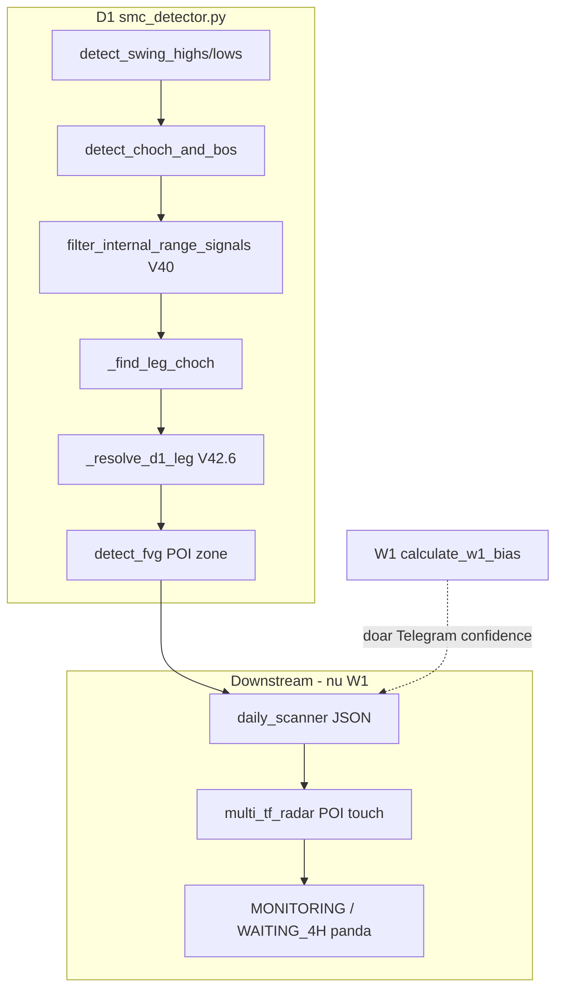
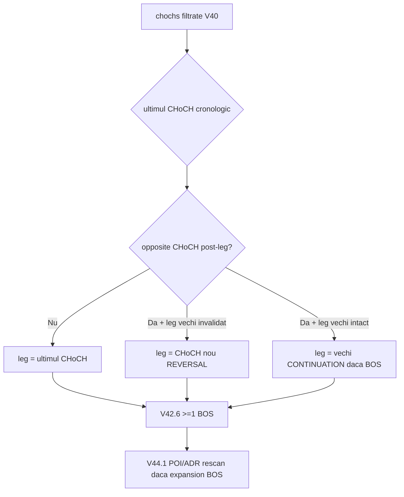
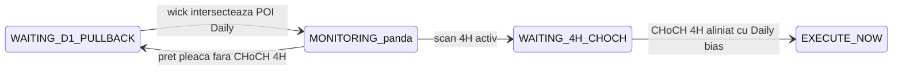

# Plan implementare — Audit structural SMC (V45)

> **Proiect:** Apollo / Glitch in Matrix  
> **Branch:** `cursor/v36-3-radar-live-sync`  
> **Baseline commit:** `5cb68ac` (V42.6 — revert V44.2 + ≥1 BOS = CONTINUATION)  
> **Data plan:** 2026-06-24  
> **Status:** De implementat

---

## Context — de ce există acest plan

1. Etichetele **REVERSAL / CONTINUITY** pe Telegram/JSON erau greșite (BTCUSD, USDCHF, USDCAD).
2. Commit **V44.2** (`classify_setup_type`) a fost **revertit** — a stricat detectarea setup-urilor.
3. **V42.6** live: un singur BOS aliniat post-leg → CONTINUATION (`len(same_dir_bos) >= 1`).
4. **V44.1** live: mută **POI + ADR** după expansion BOS — **nu** schimbă leg-ul CHoCH autoritar.
5. **W1 = 100% informativ** — nu intră în clasificarea D1.
6. **Radar:** când POI Daily e atins (inclusiv cu **wick**), trebuie să intre în **pândă** și să aștepte **CHoCH 4H** aliniat cu Daily.

---

## Arhitectură — patru straturi (nu le amesteca)

```
Strat 1: _find_leg_choch     → direcție D1 (LONG/SHORT) — BUG: leg sticky (Faza 3b)
Strat 2: _resolve_d1_leg     → REVERSAL vs CONTINUATION (V42.6 live)
Strat 3: V44.1               → POI/ADR mutat live după BOS expansion (live)
Strat 4: multi_tf_radar      → wick POI → pândă → CHoCH 4H (Faza 4)
```




---

## Stare actuală (post-commit 5cb68ac)


| Componentă                      | Status         | Problemă rămasă                                                         |
| ------------------------------- | -------------- | ----------------------------------------------------------------------- |
| `detect_choch_and_bos()` ~L1767 | Corect parțial | Body-close V36.0 OK; wick-only = skip silențios                         |
| `_resolve_d1_leg()` ~L2571      | V42.6 aplicat  | ≥1 BOS → CONTINUATION                                                   |
| `_find_leg_choch()` ~L2502      | Bug            | Ține leg vechi când CHoCH nou a flipat structura                        |
| `detect_fvg()` ~L927            | Corect parțial | ~205 linii cod mort L1300–1504; fallback wick contrazice modelul strict |
| W1 în `smc_detector.py`         | Izolat OK      | Nu e apelat din pipeline clasificare D1                                 |
| POI touch → radar pândă         | Parțial        | Doar preț punctual, nu wick; gate POI+P/D prea strict                   |


---

## Checklist implementare

- [ ] **Faza 1** — Curățare cod mort
- [ ] **Faza 2** — CHoCH/BOS body-close + sweep logging
- [ ] **Faza 3** — Fix `_find_leg_choch` + documentare V42.6
- [ ] **Faza 4** — POI wick touch → pândă → CHoCH 4H
- [ ] **Faza 5** — Izolare W1 (comment guards)
- [ ] **Faza 6** — Documentație reguli + script audit extins

---

## Faza 1 — Curățare cod mort și duplicări (prioritate critică)

**Problema:** În `smc_detector.py` L1300–1504 există un al doilea motor CHoCH/BOS plasat după `return None` în `detect_fvg()` — ~205 linii never executed.

**Acțiuni:**

- Șterge blocul L1300–1504 integral.
- Verifică `detect_structure_bos_driven()` ~L1581 — zero call-site → șterge dacă e dead code.
- Elimină blocul V44.1 L2705–2714 din `_resolve_d1_leg` — unreachable după V42.6.

**Fișier:** `smc_detector.py`

---

## Faza 2 — CHoCH vs BOS: body-close + liquidity sweep explicit

**Ce e deja corect** în `detect_choch_and_bos()`:

- Break confirmat doar când `close` depășește body_high/body_low al pivotului anterior.
- `prev_trend == 'bearish'` + body close bullish → **CHoCH**.
- `prev_trend == 'bullish'` + body close bullish → **BOS**.

**Gap:**

- Wick-only peste nivel → skip silențios, fără etichetă sweep.
- `detect_liquidity_sweep()` rulează doar post-setup în `scan_for_setup`.

**Patch:**

1. Helper privat `_body_close_breaks_level()` — o singură sursă de adevăr.
2. La wick prin nivel fără body close: **nu** emite CHoCH/BOS; log `[SWEEP] wick through body, close rejected @bar{N}`.
3. Docstring cu regula:

```
CHoCH = prima spargere body-close care schimbă prev_trend
BOS   = spargere body-close în aceeași direcție ca prev_trend
Sweep = wick > nivel DAR close NU confirmă → ignorat structural
```

**Nu modificăm:** swing detection pe wick geometric — pivotii rămân pe wick; break validation = body only.

---

## Faza 3 — strategy_type + leg CHoCH authority

### V42.6 live (păstrat)

```python
if len(same_dir_bos) >= 1:
    return latest_bos, 'continuation', leg_choch.direction, leg_choch
else:
    return leg_choch, 'reversal', leg_choch.direction, leg_choch
```

### V44.1 „range mutat” — ce face DEJA (live)

V44.1 **NU** schimbă leg-ul autoritar. Mută **POI + ADR** după ce leg-ul e ales:


| Componentă                            | Rol                      | Fișier             |
| ------------------------------------- | ------------------------ | ------------------ |
| `_expansion_bos_confirms_new_range()` | HL→HH / LH→LL            | `smc_detector.py`  |
| `resolve_d1_poi()` force rescan       | POI nou pe BOS expansion | `smc_detector.py`  |
| `_try_bos_new_range_evolution()`      | JSON archive + rehydrate | `daily_scanner.py` |
| `build_active_dealing_range()`        | ADR dinamic              | `smc_detector.py`  |


**Analogie:** V44.1 mută mobila (POI); `_find_leg_choch` decide apartamentul (direcția).

### Bug: leg sticky (`_find_leg_choch`)

```python
last = chochs[-1]                    # CHoCH bullish recent
for candidate in chochs older:
    if candidate.direction != last.direction:
        if _leg_choch_still_valid(...):  # close sub break bearish vechi
            return candidate           # leg BEARISH vechi — greșit
return last
```

Exemplu USDCAD: close sub break bearish → SHORT deși există CHoCH bullish recent.

### Fix Faza 3b — leg authority D1-only (fără W1)

1. **Leg default** = ultimul CHoCH confirmat din listă filtrată.
2. **Pullback noise** = CHoCH opus post-leg dar leg vechi încă valid → ignorat (BTC).
3. **Flip leg** = CHoCH opus + leg vechi invalidat → leg nou → **REVERSAL** + flip direcție.
4. V44.1 downstream neschimbat.




**Acțiuni:**

- Rescrie `_find_leg_choch()` conform regulilor 1–3.
- Docstring `_resolve_d1_leg`.
- Test audit: USDCAD/USDCHF flip la CHoCH bullish recent.

---

## Faza 4 — POI touch (WICK) → pândă radar → CHoCH 4H

### Reguli separate (nu le amesteca)


| Layer          | Regulă                                        | Unde                                |
| -------------- | --------------------------------------------- | ----------------------------------- |
| Structură D1   | CHoCH/BOS doar body close                     | `smc_detector.detect_choch_and_bos` |
| Activare radar | Wick intersectează POI Daily → **pândă**      | `multi_tf_radar` + `daily_scanner`  |
| Execuție LTF   | După CHoCH 4H aliniat Daily: Trigger A (CHoCH live) sau Trigger B (BOS post-CHoCH ratat) + pullback FVG | `analyze_timeframe` 4H |


### Gap-uri cod actual (V45.1 — implementat)

1. ~~POI wick~~ → `poi_utils.py` + scanner lifecycle.
2. ~~PAS 2 BOS-as-CHoCH~~ → eliminat; CHoCH real obligatoriu.
3. ~~CONTINUATION BOS shortcut~~ → `_allow_bos_4h=False`; Trigger B doar post-CHoCH.

### Gap-uri rămase (P1/P2)

1. `print_result` misleading Always-On VALIDATED.
2. `_strategy_type` dead read.
3. Forming bar H4 exclude (opțional, amânat).

### Flux țintă




**Regulă wick POI:**

```python
poi_touched = (candle_high >= poi_bottom and candle_low <= poi_top)
```

### Patch-uri

**4a. Helper comun POI**

- `_poi_box_intersects_wick(high, low, poi_bottom, poi_top) -> bool`
- `_poi_box_contains_price(price, ...) -> bool`

**4b. `multi_tf_radar.py`**

- Candle high/low de la cBot, nu doar preț live.
- `poi_wick_touched` → MONITORING / WAITING_4H_CHOCH.
- Post-touch: `allow_bos_trigger=False` — CHoCH 4H obligatoriu.
- EXECUTE_NOW blocat fără CHoCH 4H post-touch.
- P/D ADR = filtru calitate execuție, nu blochează intrarea în pândă.

**4c. `daily_scanner.py`**

- Lifecycle: wick atinge POI → MONITORING.
- JSON: `poi_wick_touched_at`.

**4d. FVG `smc_detector`**

- METHOD 1: 3-candle body strict.
- Elimină/restricționează METHOD 2 wick fallback.

**4e. Test audit**

- Wick în POI + close afară → MONITORING, fără EXECUTE până la CHoCH 4H.

---

## Faza 5 — Izolare W1 (100% informativ)

- Zero apeluri W1 din: `scan_for_setup`, `_resolve_d1_leg`, `determine_daily_trend`, `detect_choch_and_bos`, `detect_fvg`.
- Banner doc pe `calculate_w1_bias` / `apply_w1_gate`:

```python
# W1 POLICY: INFORMATIV ONLY — apelat exclusiv din daily_scanner.py pentru Telegram/confidence.
# NU apela din pipeline-ul D1 de clasificare.
```

---

## Faza 6 — Documentație și testare

### Document reguli (livrabile)

- `docs/SMC_DETECTOR_RULES_V45.md` — matrix CHoCH/BOS, V42.6, FVG, POI lifecycle, W1 out-of-scope.

### Extinde `scripts/audit_structural_classification.py`

- Mock wick break → zero CHoCH.
- 1 BOS → CONTINUATION.
- FVG 3-candle synthetic.
- Tabel per symbol: strategy_type, signal, POI bounds.

### Validare post-deploy

```bash
python scripts/audit_structural_classification.py --symbol BTCUSD EURUSD USDCHF USDCAD --debug
python daily_scanner.py
```

---

## Fișiere atinse


| Fișier                                       | Modificare                                               |
| -------------------------------------------- | -------------------------------------------------------- |
| `smc_detector.py`                            | Dead code, body-close, FVG strict, `_find_leg_choch` fix |
| `multi_tf_radar.py`                          | POI wick, pândă, CHoCH 4H obligatoriu                    |
| `daily_scanner.py`                           | Lifecycle wick touch, JSON fields                        |
| `scripts/audit_structural_classification.py` | Teste extinse                                            |
| `docs/SMC_DETECTOR_RULES_V45.md`             | Reguli SMC (Faza 6)                                      |


### Out of scope

- Reintroducere `classify_setup_type()`.
- W1 în clasificare D1.

### In scope

- Fix `_find_leg_choch` sticky leg (complementar V44.1, nu duplicat).

---

## Ordine implementare recomandată

1. Faza 1 — Curățare cod mort (risc zero)
2. Faza 6 parțial — Audit script baseline
3. Faza 3b — Fix `_find_leg_choch` (etichete REVERSAL/CONTINUITY + direcție)
4. Faza 4 — POI wick → pândă → CHoCH 4H
5. Faza 2 — Sweep logging
6. Faza 5 — W1 guards
7. Faza 6 complet — `SMC_DETECTOR_RULES_V45.md`

---

## Deploy VPS (după push)

```powershell
git pull origin cursor/v36-3-radar-live-sync
python daily_scanner.py
# restart multi_tf_radar + monitors
```

---

*Document generat din planul de audit SMC — Glitch in Matrix / Apollo.*