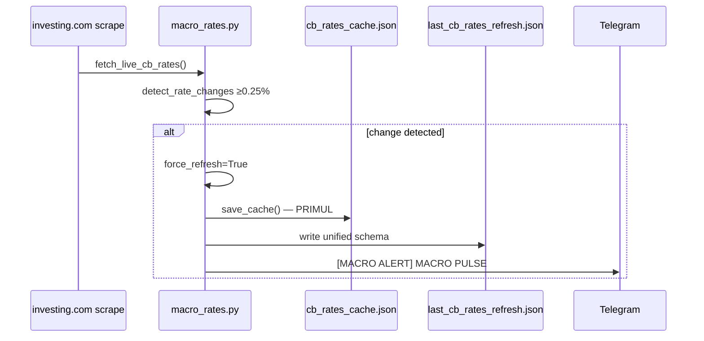

# System Production & Executor Audit

**Versiune:** 1.1  
**Data audit inițial:** 2026-07-01  
**Data aprobare:** 2026-07-01  
**Status:** **IMPLEMENTAT V48** (2026-07-01)  
**Cod:** implementat în `setup_executor_monitor.py`, `unified_risk_manager.py`, `macro_rates.py`, `auto_scanner_daemon.py`

---

## Rezumat executiv

| Domeniu | Verdict audit | Decizie aprobată |
|---------|---------------|------------------|
| **Feed live producție** | Parțial conform (8010 OK; spread guard mort; cache stale) | Fix spread guard pe `/price` + fail-hard OHLC pe EXECUTE_NOW |
| **Dobânzi macro** | Semi-live; conflict schema refresh | Schema unificată + cache actualizat **înainte** de alertă Telegram |
| **Setup executor** | Funcțional; lotaj dublu; cod mort | Sursă unică `unified_risk_manager`; purgatoriu funcții legacy |

**Lanț producție (post-fix planificat):**

```
IC Markets cTrader Desktop
  ├─ MarketDataProvider.cs :8010  → OHLC, bid/ask/spread snapshot
  ├─ TradeHistorySyncer.cs :8767  → balance, equity, poziții
  └─ PythonSignalExecutor.cs      → signals.json → ordine market

daily_scanner (8010) → monitoring_setups.json
multi_tf_radar (8010/price) → EXECUTE_NOW
setup_executor_monitor
  → fetch OHLC live (fail-hard)
  → SL pe TF executant (1H/4H) · TP pe D1 live
  → _final_safety_check()
  → _check_spread_guard()  ← ZĂVOR NOU
  → unified_risk_manager.validate_new_trade()  ← LOT UNIC
  → execute_trade()
```

---

## Plan de execuție aprobat

Directivele de mai jos sunt **obligatorii în producție**. Implementarea urmează **exact** aceste reguli, fără deviații.

---

### 1. Spread Guard — reparare și conectare (LIVE-P0-1 & EXEC-P0-1)

**Fișier țintă:** `setup_executor_monitor.py` → `_check_spread_guard()`

| Regulă | Specificație |
|--------|--------------|
| Endpoint | Elimină ruta inexistentă `/spread`. Interogare obligatorie: `GET http://localhost:8010/price?symbol={symbol}` |
| Conversie pips | Spread brut din JSON (`spread` — puncte broker) → pips: `spread_pips = spread_points × get_pip_size(symbol)` (sau echivalent conform formatului returnat de cBot; validare pe VPS) |
| Prag | `MAX_SPREAD_PIPS` citit din `SUPER_CONFIG.json` → cheie `spread_guard.max_spread_pips` (fallback 2.5 dacă lipsește) |
| Poziție în flux | **Zăvor critic** în calea `EXECUTE_NOW`, imediat **după** `_final_safety_check()` și **înainte** de `execute_trade()` |
| Fail-hard spread larg | Dacă `spread_pips > MAX_SPREAD_PIPS`: **ABORT** instant · `pop('EXECUTE_NOW')` + `pop('execute_now_trigger_tf')` · setare `last_rejection_reason` · alertă critică Telegram via `_notify_execute_now_blocked()` |
| Fail-hard feed indisponibil | Dacă `/price` eșuează (timeout, 404, JSON invalid): **ABORT** — același tratament ca spread prea larg (fără execuție silențioasă) |
| Rollover | Păstrează blocarea 00:00–00:15 UTC din implementarea existentă |

**Interzis:** skip guard când cBot offline; execuție cu spread necunoscut.

---

### 2. Fail-hard pe date stale (LIVE-P0-2 & EXEC-P0-2)

**Fișier țintă:** `setup_executor_monitor.py` → `_get_cached_data()` + apeluri pe calea EXECUTE_NOW

| Regulă | Specificație |
|--------|--------------|
| Cache stale interzis | Pe calea **EXECUTE_NOW**, dacă fetch-ul live de la broker eșuează → **return None** (sau raise controlat) — **fără** fallback la bare vechi din `_data_cache` |
| ABORT imediat | La date indisponibile: pop `EXECUTE_NOW` · alertă Telegram · log `[EXECUTE_NOW ABORT] live data unavailable {symbol} {TF}` |
| Parametru explicit | Introduce flag `require_live=True` (sau funcție dedicată `_get_live_data()`) apelat exclusiv din blocul EXECUTE_NOW; cache TTL rămâne permis doar pentru monitorizare pasivă / non-execuție |
| **TP — Daily exclusiv live** | `_resolve_execute_now_tp()` folosește **doar** `_get_cached_data(..., require_live=True)` pe **D1**. Fără TP dacă D1 live lipsește — fără fallback ATR/2×SL (deja parțial V40.8; se întărește) |
| **SL — timeframe executant** | `_resolve_execute_now_sl()` lipește SL strict de TF-ul care declanșează execuția: `execute_now_trigger_tf` = **`4H`** → bare H4 live; **`1H`** → bare H1 live. Fără amestec SL 4H când execută 1H |

**Interzis:** mesajul `CACHE STALE FALLBACK` pe path EXECUTE_NOW.

---

### 3. Unificarea managementului de risc (EXEC-P1-1 & EXEC-P1-2)

**Fișiere țintă:** `setup_executor_monitor.py`, `unified_risk_manager.py`, `ctrader_executor.py`

| Regulă | Specificație |
|--------|--------------|
| Eliminare lot local | Șterge complet din executor: `_pip_value_en = 8.33 if JPY else 10.0`, formula `_risk_budget_en / (_sl_pips_en * _pip_value_en)`, cap local `max(..., 10.0)` |
| Sursă unică de adevăr | **Toate** fazele (preview log, `entry1_lots` / `entry2_lots` în JSON, lot trimis broker) derivă din **`unified_risk_manager.validate_new_trade()`** |
| Risc implicit | Strict **`risk_per_trade_percent: 5.0`** din `SUPER_CONFIG.json` — fără override local în executor |
| Guard #3 sentinela | Limita **5.1%** rămâne **exclusiv** toleranță tehnică pentru comision broker (~0.7 pips/latură) — previne respingeri false la ordine legitime; **nu** extinde riscul intenționat peste 5% |
| Flux lot | Executor apelează `validate_new_trade()` (sau wrapper preview read-only) **înainte** de `execute_trade()`; `execute_trade()` primește `lot_size` din rezultatul URM — fără recalcul divergent |
| pip_value | Zero valori statice JPY=8.33 în executor; totul via `_get_pip_value()` din URM |

**Interzis:** log `Lots=X` în executor diferit de lotul efectiv trimis la broker.

---

### 4. Sincronizare instantanee dobânzi macro (MACRO-P0-1 & MACRO-P2-1)

**Fișiere țintă:** `macro_rates.py`, `auto_scanner_daemon.py`

| Regulă | Specificație |
|--------|--------------|
| Schema unificată | **Un singur writer** pentru `data/last_cb_rates_refresh.json`. Schema fixă obligatorie: |

```json
{
  "last_refresh_date": "YYYY-MM-DD",
  "last_refresh_timestamp": "ISO8601",
  "refreshed_at": "ISO8601",
  "source": "live|cache|fallback",
  "success": true,
  "rates": { "USD": 3.75, "...": "..." },
  "changes": [{ "ccy": "USD", "old": 3.50, "new": 3.75 }],
  "updated_by": "macro_rates.refresh_rates_daily"
}
```

| Eliminare conflict | `auto_scanner_daemon.save_last_cb_rates_refresh_date()` **nu mai scrie** fișier separat — doar apelează `refresh_rates_daily()` care scrie schema completă |
| Dedup zilnic | `get_last_cb_rates_refresh_date()` citește `last_refresh_date` din același fișier post-refresh |
| **Instant Trigger** | La detectare modificare rată (≥ `SIGNIFICANT_CHANGE_PCT` = 0.25%): ordine strictă: (1) `force_refresh=True` · (2) **`save_cache()` → `cb_rates_cache.json` actualizat** · (3) abia apoi `_send_rate_change_alert()` Telegram |
| Garanție `/rates` | Când user primește alerta și tastează `/rates`, cache-ul reflectă deja noile valori — **aceeași secundă** |
| Format alertă | Păstrează corp `MACRO PULSE — RATE CHANGE`; adaugă prefix vizibil **`[MACRO ALERT]`** + linii carry pairs afectate (GBPJPY etc.) |

**Interzis:** alertă Telegram înainte de persist cache; refresh multiplu în fereastra 08:00 din cauza suprascrierii schema.

---

### 5. Purgatoriul codului mort (EXEC-P2-*)

**Fișier țintă:** `setup_executor_monitor.py`

**Ștergere definitivă (aprobată):**

| Element | Tip |
|---------|-----|
| `_check_price_hit_entry()` | funcție legacy V3.x |
| `_symbol_already_at_broker()` | duplicat risk manager |
| `_save_executed_setup()` | dedup abandonat |
| `get_pair_config()` | neapelat |
| `_get_setup_key()` | neapelat |
| `EQUILIBRIUM_BUFFER_PIPS` | constantă neutilizată |
| Importuri moarte | `TradeSetup`, `CHoCH`, `FVG`, `get_4h_body_close_confirmation` |
| `self.executed_setups` load | dacă `_save_executed_setup` eliminat — curățare init |

**Păstrat și refactorizat (NU se șterge):**

| Element | Motiv |
|---------|-------|
| `_check_spread_guard()` | Reparat + conectat (§1) |
| `_check_news_guard()` | Opțional Sprint 2 — nu în scope purge §5 |
| `_final_safety_check()` | Sentinela activă |
| `_get_cached_data()` | Refactor cu `require_live` — nu ștergere |

---

## 1. Audit Live Data Feed (ICMarkets / cTrader)

### 1.1 Arhitectura surselor

| Port | cBot | Endpoint-uri | Consumatori Python |
|------|------|--------------|-------------------|
| **8010** | `MarketDataProvider.cs` | `/health`, `/data`, `/price`, `/swap_info`, `/historical` | `ctrader_cbot_client.py`, `daily_scanner.py`, `multi_tf_radar.py`, `setup_executor_monitor.py`, `macro_rates.py` |
| **8767** | `TradeHistorySyncer.cs` | `GET /` (JSON account + trades) | `ctrader_sync_daemon.py`, `trade_manager.py`, `unified_risk_manager.py` |
| **8768** | `EconomicCalendarBot.cs` | `/calendar` | `news_calendar_monitor.py` |

Spread live = câmp `spread` în răspunsul **`/price`** (`MarketDataProvider.cs` L125–147). **Nu există** `/spread`.

### 1.2 Stare curentă vs țintă

| Modul | Stare audit | Țintă post-execuție |
|-------|-------------|---------------------|
| `multi_tf_radar.get_current_price()` | ✅ Fail-hard 8010 | Neschimbat |
| `setup_executor_monitor._check_spread_guard()` | ❌ `/spread` mort, neconectat | ✅ `/price` + gate EXECUTE_NOW |
| `setup_executor_monitor._get_cached_data()` | ⚠️ Stale fallback | ✅ Fail-hard pe EXECUTE_NOW |
| `daily_scanner` | ✅ Live 8010 | Neschimbat |

### 1.3 Probleme rămase în afara scope-ului imediat

| ID | Problemă | Status plan |
|----|----------|-------------|
| LIVE-P0-3 | `btc_market_order.py` yfinance | Backlog post-Sprint 1 |
| LIVE-P0-4 | Scripturi `8767/price` | Backlog post-Sprint 1 |
| LIVE-P0-5 | `audit_monitoring_setups` entry_price fallback | Dev-only |
| LIVE-P0-6 | `position_monitor` swap 8767 | P1 backlog |

---

## 2. Verificare dobânzi (Macro Interest Rates)

### 2.1 Modul central: `macro_rates.py` (V38)

G8 rates: scrape investing.com → `data/cb_rates_cache.json` → `FALLBACK_RATES`. Swap IC Markets: 8010 `/swap_info`.

### 2.2 Stare vs țintă

| Aspect | Stare audit | Țintă aprobată (§4) |
|--------|-------------|---------------------|
| Alertă rate change | Există (`MACRO PULSE`) | Cache scris **înainte** de Telegram + prefix `[MACRO ALERT]` |
| Schema refresh JSON | Conflict daemon vs macro_rates | Schema unificată, single writer |
| Integrare trading | Informativ only | Neschimbat — rates nu gate EXECUTE_NOW |

### 2.3 Flux aprobat — Instant Trigger



---

## 3. Audit structural `setup_executor`

### 3.1 Flux EXECUTE_NOW — țintă aprobată

```
EXECUTE_NOW=True (radar)
  → _can_execute_execute_now()
  → _v423_structural_sync_ok()
  → auto h4_structure_locked=True
  → entry din radar_4h/1h_fvg_entry
  → OHLC live (require_live=True)
  → SL: _resolve_execute_now_sl() pe TF executant (1H sau 4H)
  → TP: _resolve_execute_now_tp() pe D1 live exclusiv
  → unified_risk_manager.validate_new_trade() — lot unic 5%
  → _final_safety_check() — Guard#3 max 5.1% (toleranță comision)
  → _check_spread_guard() — ZĂVOR /price 8010
  → ctrader_executor.execute_trade(lot_size=URM)
  → pop EXECUTE_NOW, _apply_multi_entry_post_fill()
```

### 3.2 Risk management — post-unificare

| Parametru | Sursă | Valoare |
|-----------|-------|---------|
| Risc per trade | `SUPER_CONFIG.json` → `risk_per_trade_percent` | **5.0%** |
| Guard #3 cap | `_final_safety_check()` | **5.1%** (toleranță comision) |
| Lot min/max | `unified_risk_manager` | 0.01 / 2.0 |
| pip_value | `unified_risk_manager._get_pip_value()` | Dinamic per instrument |
| Calcul lot în executor | — | **ELIMINAT** |

### 3.3 Cod mort — listă purge aprobată

Vezi **§5 Plan de execuție**. După implementare, fișierul scade cu ~150–200 LOC.

### 3.4 Vulnerabilități — rezolvare planificată

| ID | Rezolvare aprobată | Secțiune plan |
|----|-------------------|---------------|
| EXEC-P0-1 | Spread guard `/price` + gate | §1 |
| EXEC-P0-2 | Fail-hard OHLC + SL/TP rules | §2 |
| EXEC-P1-1 | Lot unic URM | §3 |
| EXEC-P1-2 | Eliminare pip_value static | §3 |
| EXEC-P2-* | Purgatoriu | §5 |

---

## 4. Tabel master: Probleme → Severitate → Soluție

| ID | Problemă | Sev. | Soluție aprobată | Status |
|----|----------|------|------------------|--------|
| **LIVE-P0-1** | Spread guard `/spread` inexistent | P0 | `/price` 8010 + pips via `get_pip_size` | ✅ APROBAT §1 |
| **LIVE-P0-2** | Cache OHLC stale | P0 | Fail-hard EXECUTE_NOW; fără stale fallback | ✅ APROBAT §2 |
| **EXEC-P0-1** | Spread guard neconectat | P0 | Gate înainte de `execute_trade()` | ✅ APROBAT §1 |
| **EXEC-P0-2** | SL/TP pe date vechi | P0 | Live obligatoriu; SL=TF exec; TP=D1 | ✅ APROBAT §2 |
| **EXEC-P1-1** | Lot dublu cap 10 vs 2 | P1 | Sursă unică URM | ✅ APROBAT §3 |
| **EXEC-P1-2** | pip_value static executor | P1 | Eliminat — doar URM | ✅ APROBAT §3 |
| **MACRO-P0-1** | Conflict schema refresh JSON | P1 | Schema unificată single writer | ✅ APROBAT §4 |
| **MACRO-P2-1** | Format alertă | P2 | `[MACRO ALERT]` + cache-before-TG | ✅ APROBAT §4 |
| **EXEC-P2-*** | Cod mort ~200 LOC | P2 | Purgatoriu listă §5 | ✅ APROBAT §5 |
| LIVE-P0-3 | btc yfinance | P0 | 8010 only | ⏳ Backlog |
| LIVE-P0-4 | 8767/price legacy | P0 | Migrare 8010 | ⏳ Backlog |
| EXEC-P1-3 | setup= lipsă execute_trade | P1 | Pasează dict setup | ⏳ Backlog |
| EXEC-P1-4 | entry2_risk mort | P2 | Config cleanup | ⏳ Backlog |

---

## 5. Ordine implementare (Sprint aprobat)

| Pas | Task | Fișier(e) | Ref. plan |
|-----|------|-----------|-----------|
| **1** | Fail-hard `_get_cached_data` + SL/TP rules | `setup_executor_monitor.py` | §2 |
| **2** | Fix + wire `_check_spread_guard` | `setup_executor_monitor.py` | §1 |
| **3** | Unificare lot URM | `setup_executor_monitor.py`, `ctrader_executor.py` | §3 |
| **4** | Purgatoriu cod mort | `setup_executor_monitor.py` | §5 |
| **5** | Schema macro + instant trigger | `macro_rates.py`, `auto_scanner_daemon.py` | §4 |
| **6** | `py_compile` + test manual VPS | — | §6 |

**Nu se trece la Pas 2 fără Pas 1 complet** (date live sunt prerequisit pentru SL/TP/spread).

---

## 6. Checklist verificare post-implementare

```bash
# Spread guard live
curl -s "http://localhost:8010/price?symbol=EURUSD"

# Fail-hard — oprește cBot temporar; EXECUTE_NOW trebuie ABORT + Telegram, fără CACHE STALE
grep -E "EXECUTE_NOW ABORT|SPREAD GUARD|CACHE STALE" setup_executor_monitor.log | tail -20

# Lot unic — log executor vs URM identic
grep -E "LOT CALCULATION|EXECUTE_NOW STRUCTURAL" setup_executor_monitor.log | tail -10

# Macro instant trigger
python3 scripts/refresh_cb_rates.py
cat data/cb_rates_cache.json | head -5
cat data/last_cb_rates_refresh.json

python3 -m py_compile setup_executor_monitor.py macro_rates.py unified_risk_manager.py ctrader_executor.py
```

**Criterii acceptare:**

- [ ] Spread > MAX → ABORT + pop EXECUTE_NOW + Telegram
- [ ] Fetch OHLC eșuat → ABORT, zero execuții cu cache vechi
- [ ] TP calculat doar cu D1 live; SL pe TF din `execute_now_trigger_tf`
- [ ] `entry1_lots` JSON = lot URM = lot broker
- [ ] Rate change → `cb_rates_cache.json` mtime ≤ alertă Telegram
- [ ] Funcții §5 absente din sursă; compile OK

---

## 7. Documente înrudite

| Document | Relație |
|----------|---------|
| [AUDIT_EXECUTOR_PRE_ETAPA4_V43.md](AUDIT_EXECUTOR_PRE_ETAPA4_V43.md) | Arhitectură 3 straturi pre-V48 |
| [CHOCH_TELEGRAM_ALERTS_AUDIT.md](CHOCH_TELEGRAM_ALERTS_AUDIT.md) | V47 alerte (upstream) |
| [V38_MACRO_RATES_CHANGELOG.md](../V38_MACRO_RATES_CHANGELOG.md) | Design macro rates |
| [CTRADER_CBOT_SETUP.md](../CTRADER_CBOT_SETUP.md) | Setup cBot 8010 |

---

## 8. Concluzie

Auditul inițial (v1.0) a identificat riscuri P0 în executor: spread guard nefuncțional, degradare silențioasă via cache OHLC, și lotaj dublu inconsistent. **Planul v1.1 este aprobat pentru execuție** cu cinci piloni obligatorii: zăvor spread pe `/price`, fail-hard date live, sursă unică de risc URM la 5%, sincronizare macro cache-before-alert, și purgatoriu cod legacy.

Implementarea codului începe **doar după** acest document; orice deviație necesită amendament explicit al planului.

---

*Audit v1.0: Composer · Aprobare strategică v1.1: utilizator + Composer · Gata pentru implementare.*
