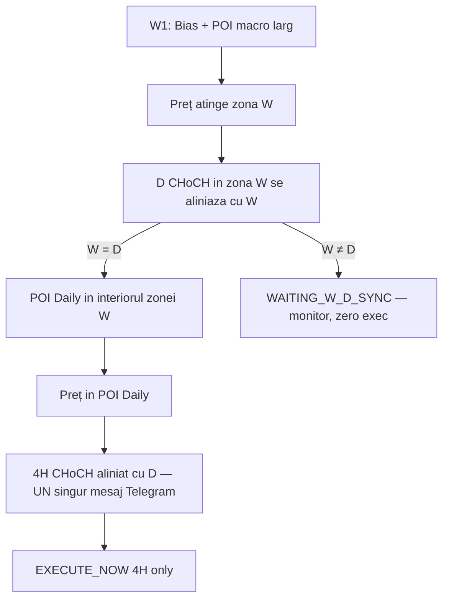
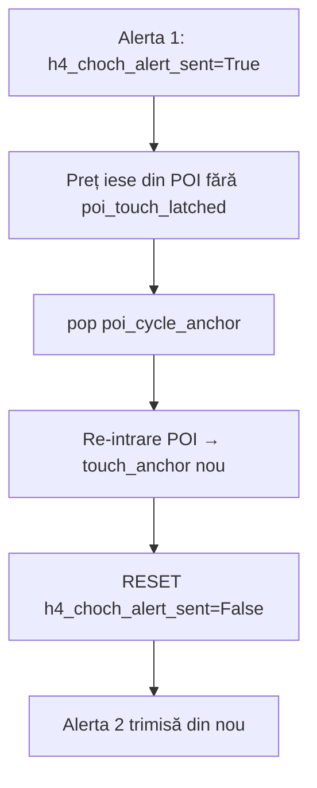

# Plan Master: W → D → 4H (fără 1H) + Fix Dedup 4H

**Branch:** `cursor/v36-3-radar-live-sync`  
**Ultim commit pushed:** `0ba1d73` (Faza 3 + 0b: fără 1H runtime + dedup alerte 4H)  
**Work in progress (local):** Faza 1 + Faza 2 (W1 POI + W+D soft sync gate)

**Documentație referință:** [SMC_ALIGNMENT_AUDIT_GIM.md](SMC_ALIGNMENT_AUDIT_GIM.md)

**Actualizat:** 2026-07-21 (după Faza 1 + 2 local)

> **Regulă:** Acest fișier se actualizează după fiecare edit de cod relevant (DONE / TODO / prompturi).

---

## Viziune (flux agreat)



| Layer | Rol | Semnal |
|-------|-----|--------|
| **W** | Context macro | Bias + zona largă de dezechilibru (FVG/OB weekly P/D) |
| **D in zona W** | Confirmare | CHoCH/BOS D in direcția W = pullback macro gata |
| **POI Daily** | Magnet precis | FVG/OB organic D, contained in W zone |
| **4H** | Trăgaci unic | CHoCH 4H in POI D post-touch + retrace 60–80% V46 |
| **1H** | **Eliminat** | Nu mai există in radar / executor / Telegram runtime |

**Regula W+D:** soft wait — setup salvat cu `WAITING_W_D_SYNC`, radar monitorizează, **zero EXECUTE_NOW** până D se aliniază in zona W.

---

## Ce e DONE (nu reimplementa)

| Item | Commit / fișier | Status |
|------|-----------------|--------|
| P0 Telegram — fără EXECUTE BLOCAT, alerte fără Entry/SL fantom | `2732106` | DONE (pushed) |
| P0 dedup direcții buy/long | `telegram_alert_dedup.py` | DONE |
| D1 major swings + POI organic | `smc_detector.py` Faza A | DONE |
| JSON identity lock | `daily_scanner.py` `_apply_setup_identity_lock` | DONE |
| CHoCH o dată per leg (A.1) | `3aeb2c1` | DONE (pushed) |
| D1 CONTINUITY vs REVERSAL + cascade POI | `1a8e616` | DONE (pushed) |
| Unicode `--debug` audit | `smc_detector.py` | DONE |
| **Faza 3 — Eliminare 1H, 4H-only (runtime)** | `0ba1d73` | DONE (pushed) |
| **Faza 0b — Dedup alerte 4H + POI flicker** | `0ba1d73` | DONE (pushed) |
| **Faza 1 — W1 Bias + POI macro** | local | DONE |
| **Faza 2 — W+D Soft Sync Gate** | local | DONE |

### Detaliu Faza 3 (2026-07-21) — DONE local

**Obiectiv:** W → D → 4H strict; zero analiză / alertă / execuție pe 1H in pipeline live.

| Fișier | Ce s-a făcut |
|--------|--------------|
| `multi_tf_radar.py` | `tf_1h` eliminat; garduri H1 / `EXECUTE_NOW_1H` eliminate; LTF strict 4H; guard la request H1 |
| `setup_executor_monitor.py` | `trigger_tf='4H'` forțat; `WAITING_1H_CHOCH` eliminat; SL/Entry/TP pe 4H+D1; plan multi-entry `('4H',)` |
| `telegram_notifier.py` | `send_1h_choch_alert()` + `_create_1h_chart()` șterse; card scan doar linie 4H; fără `df_1h` |
| `smc_detector.py` | `h1_choch` / `df_1h` eliminate din `TradeSetup` + `scan_for_setup()`; filtru GBP 2-TF 1H eliminat |
| `radar_gates.py` | Porți card/alertă 4H-only |
| `daily_scanner.py` | Fără download H1; fără `WAITING_1H_CHOCH` in statusuri active |
| `telegram_command_center.py` | Hint-uri / stats radar doar 4H |
| `realtime_monitor.py`, `backtest_1year.py`, `resend_active_setups.py` | Callers actualizați (fără `df_1h`) |
| `tests/test_4h_alert_gates.py`, `tests/test_ltf_choch_card.py` | Scenarii 1H eliminate / negate |

### Detaliu Faza 0b (2026-07-21) — DONE local

**Obiectiv:** Max 1 alertă Telegram 4H per ciclu POI / break_key; tranziție curată spre V46 retrace 60–80%.

| Fișier | Ce s-a făcut |
|--------|--------------|
| `telegram_alert_dedup.py` | `claim_4h_structural_alert(symbol, direction, break_key)` — file lock, cooldown **24h**; persistă in `data/telegram_4h_structural_alerts.json` |
| `multi_tf_radar.py` | `_emit_4h_structural_alert()` — claim înainte de Telegram; log `[4H DEDUP SKIP]` la duplicat |
| `multi_tf_radar.py` | POI flicker: nu mai `pop('poi_cycle_anchor')` după alertă; `h4_alert_cycle_complete=True` la emit |
| `multi_tf_radar.py` | Re-intrare POI cu ciclu complet → **nu** resetează `h4_choch_alert_sent` |
| `multi_tf_radar.py` | `_CHOCH_ALERT_FLUSH_KEYS` + `h4_alert_break_key`, `poi_cycle_anchor`, `h4_alert_cycle_complete` |
| `telegram_notifier.py` | CONTINUATION + CHoCH → header **„4H STRUCTURĂ CONFIRMATĂ (4H CHoCH)”** (nu INVERSARE) |
| `tests/test_4h_alert_dedup.py` | Nou: claim cooldown, POI flicker exit/re-entry, skip duplicate Telegram |
| `tests/test_4h_alert_gates.py` | Patch `claim_4h_structural_alert` in test existent |

**Verificare rulată (Faza 3 + 0b):**

```bash
python3 -m py_compile multi_tf_radar.py telegram_alert_dedup.py telegram_notifier.py \
        setup_executor_monitor.py smc_detector.py
python3 -m pytest tests/test_4h_alert_dedup.py tests/test_4h_alert_gates.py -q
# → 5 passed
python3 -m pytest tests/ -q
# → 48 passed
```

**Notă:** Faza 3 + 0b pushed in `0ba1d73` — gata pentru deploy VPS (Faza 0).

### Curățare 1H rămasă (non-runtime, opțional)

| Locație | Ce rămâne |
|---------|-----------|
| `scripts/audit_choch_alerts.py` | Logică `radar_1h_*`, `h1_choch_alert_sent` |
| `backtest_1year.py` | Comentarii + download H1 legacy |
| `btcusd_elite_scan.py`, `send_morning_scan_report.py` | Analiză/chart 1H |
| `chart_generator.py` | `create_1h_chart()` (nefolosit de Telegram) |
| `smc_detector.py` | Comentarii fractal „1H/sub” (algoritm, nu strategie) |

---

## Faze — ordine strictă de execuție

### Faza 0 — Deploy Faza 3 + 0b pe VPS (operational, ~30 min) — **NEXT**

**Gate înainte de cod nou (Faza 1, 2).**

```bash
# Local: commit + push Faza 3 + 0b
git add multi_tf_radar.py setup_executor_monitor.py telegram_notifier.py smc_detector.py \
        radar_gates.py daily_scanner.py telegram_command_center.py telegram_alert_dedup.py \
        realtime_monitor.py backtest_1year.py resend_active_setups.py \
        tests/test_4h_alert_gates.py tests/test_ltf_choch_card.py tests/test_4h_alert_dedup.py \
        docs/W_D_4H_MASTER_PLAN.md
git commit -m "W→D→4H: remove 1H runtime + 4H alert dedup (Faza 3 + 0b)."
git push

# VPS:
git pull
cp monitoring_setups.json monitoring_setups_backup_$(date +%Y%m%d).json
echo '{"setups":[],"last_updated":""}' > monitoring_setups.json
python3 daily_scanner.py
# restart radar + executor
```

**Verificare live:**
- Card Telegram fără linie 1H
- Max **1 alertă 4H** per setup / ciclu POI (EURJPY test)
- CONTINUATION → header „STRUCTURĂ CONFIRMATĂ (4H CHoCH)”
- Zero alerte 1H in 24h

---

### Faza 0b — Fix duplicate alerte 4H CHoCH — **DONE (local)**

**Problema live (rezolvată in cod):** EURJPY — alerte duplicate la 00:17 și 02:59.

**Root cause (documentat):**



**Fix aplicat:** claim file-lock 24h + POI flicker guard + flush keys JSON + header CONTINUATION.

---

### Faza 1 — W: Bias + Zona Macro (~2–3h) — **DONE (local)**

**Fișiere:** `smc_detector.py`, `daily_scanner.py`

1. `calculate_w1_bias()` — același pipeline D1 (`_resolve_w1_leg_pipeline` → `_resolve_d1_leg`, CHoCH-once-per-leg)
2. `resolve_w1_poi()` — FVG/OB organic weekly in P/D (fallback bandă P/D), zonă **largă**
3. JSON: `w1_poi_top`, `w1_poi_bottom`, `w_d_aligned` via `_trade_setup_to_monitoring_dict`
4. Bias fallback: propagă `w1_poi_*` când W1 disponibil

**Verificare:**

```bash
python3 -m pytest tests/test_w_d_sync.py -q
# → 7 passed
```

---

### Faza 2 — W+D Soft Sync Gate (~2–3h) — **DONE (local)**

**Fișiere:** `smc_detector.py`, `daily_scanner.py`, `multi_tf_radar.py`, `setup_executor_monitor.py`, `telegram_command_center.py`

```
IF preț NOT in w1_poi_zone     → WAITING_W_ZONE
ELIF w1_bias != d1_bias        → WAITING_W_D_SYNC (soft wait, zero exec)
ELIF daily_poi NOT in w1_poi   → WAITING_D1_PULLBACK (log low priority)
ELIF preț in daily_poi AND W=D → flux 4H normal
```

- `daily_poi_inside_weekly_zone()` — middle D POI in range W
- `apply_w_d_sync_gate()` — scanner + bias fallback anti-counter-trend
- Radar: `_arm_execute_now` + `_w_d_sync_blocks_execute` blocat dacă `WAITING_W_D_SYNC` / `w_d_aligned == False`
- Log silent: `[W+D SOFT SYNC] Așteptăm alinierea D1 în POI Weekly`

**Verificare rulată (Faza 1 + 2):**

```bash
python3 -m py_compile smc_detector.py daily_scanner.py multi_tf_radar.py
python3 -m pytest tests/ -q
# → 55 passed
python3 scripts/audit_structural_classification.py --symbol EURGBP GBPUSD EURUSD BTCUSD --d1-bars 300 --debug
# → EURGBP bearish, GBPUSD/EURUSD bullish, BTCUSD bearish (exit 0)
```


---

### Faza 3 — Eliminare 1H, 4H-only — **DONE (local)**

Vezi secțiunea **Detaliu Faza 3** de mai sus.

---

### Faza 4 — Validare live (48h) — **PENDING**

| Metric | Target | Depinde de |
|--------|--------|------------|
| Alerte 4H duplicate | Zero (1/ciclu POI) | Faza 0b ✅ cod + Faza 0 deploy |
| `WAITING_W_D_SYNC` | Vizibil JSON/Telegram, zero EXECUTE_NOW | Faza 2 ✅ |
| EXECUTE_NOW | Doar 4H, W=D, post POI touch | Faza 2 + live |
| Alerte 1H | Zero | Faza 3 ✅ |
| Audit | EURGBP, GBPUSD, EURUSD, BTCUSD — bias corect | Faza 0 deploy |

---

## Ce NU adăugăm

- V59 / LH counting
- Synthetic FVG W sau D
- 1H ca fallback
- Hard skip total pe W mismatch (soft wait agreat)
- Big-bang: toate fazele intr-un singur commit

---

## Checklist TODO

- [x] **Commit + push Faza 3 + 0b** — `0ba1d73`
- [ ] **Faza 0:** Deploy pe VPS + wipe JSON + rescan + restart
- [x] **Faza 0b:** Fix dedup 4H CHoCH (claim, POI flicker, flush keys, header) — **pushed**
- [x] **Faza 1:** W bias + `resolve_w1_poi()` + JSON fields — **DONE (local)**
- [x] **Faza 2:** `WAITING_W_D_SYNC` + containment W⊃D — **DONE (local)**
- [x] **Faza 3:** Eliminare 1H, 4H-only (runtime) — **pushed**
- [ ] **Faza 4:** audit + monitor 48h live
- [ ] *(Opțional)* Curățare 1H in scripturi/docs/backtest

---

## Ordinea de lucru recomandată

1. **Faza 0** — deploy VPS + wipe JSON + restart ← **acum**
2. **Faza 4** — monitor 48h (parțial, fără W gate)
3. **Faza 1** — W bias + POI zone
4. **Faza 2** — W+D soft gate
5. **Faza 4** — validare completă post Faza 2

---

## Prompturi sugerate la revenire

| Scop | Prompt |
|------|--------|
| Salvează tot WIP | *„Commit și push Faza 3 + 0b pe `cursor/v36-3-radar-live-sync`; actualizează W_D_4H_MASTER_PLAN.md.”* |
| Deploy VPS | *„Go Faza 0: push dacă lipsește, deploy VPS (wipe JSON, rescan, restart). Actualizează planul.”* |
| Weekly macro | *„Go Faza 1 din W_D_4H_MASTER_PLAN.md; actualizează planul după edit.”* |
| W+D gate | *„Go Faza 2 din W_D_4H_MASTER_PLAN.md; actualizează planul după edit.”* |
| Validare live | *„Go Faza 4: audit 48h EURGBP/GBPUSD/EURUSD/BTCUSD; actualizează planul.”* |
| Curățare rest 1H | *„Curăță 1H in scripts/backtest/chart_generator; actualizează planul.”* |
| Continuă planul | *„Go plan W→D→4H: primul checkbox nebifat; actualizează W_D_4H_MASTER_PLAN.md după fiecare edit.”* |

**Pornire recomandată acum:** *„Commit Faza 3 + 0b și go Faza 0 deploy VPS.”*
